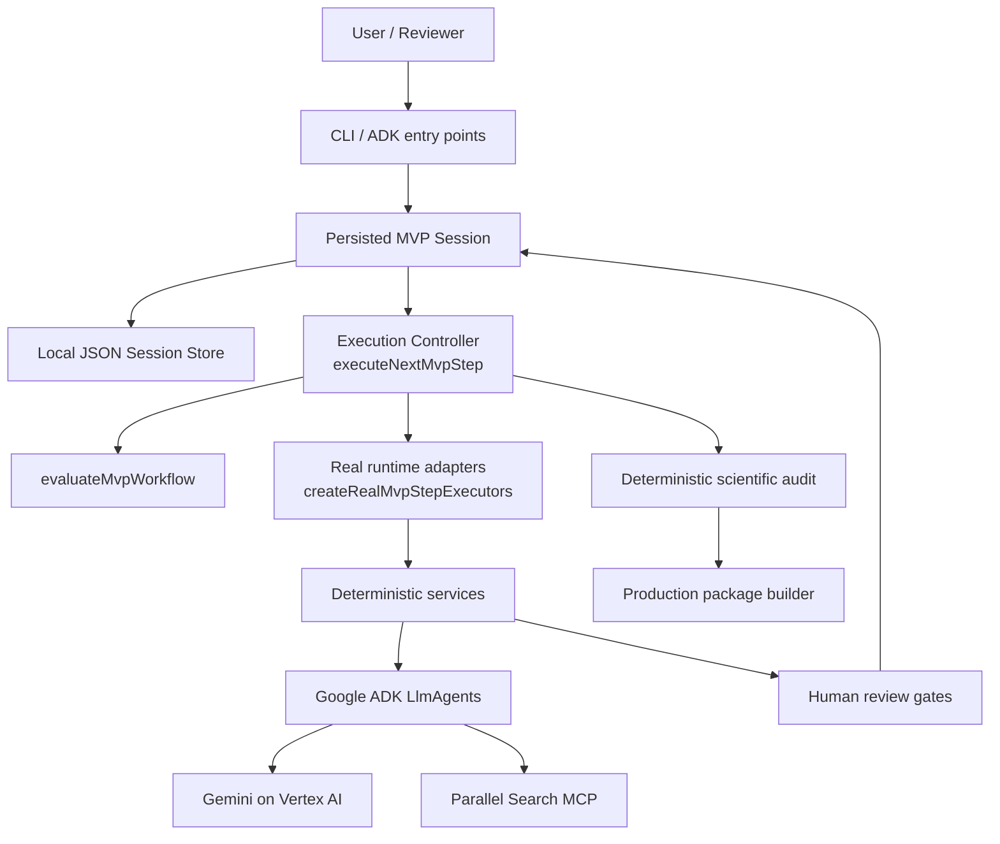

# Tital: The Evidence-Governed Scientific Film Director

Tital is an evidence-governed scientific film direction system for turning a scientific film idea into an auditable production package. It is designed around a simple principle:

> **Evidence → Story, not Story → Evidence.**

Tital is **not** a generic video generator and **not** a general-purpose chatbot. Its job is to preserve scientific provenance, uncertainty, visual integrity, and human review across the path from research to script, scenes, shots, and production decisions.

## Core Idea

Tital separates responsibilities that are often mixed together in AI applications:

- **Models propose content.** Gemini-based agents generate structured proposals.
- **Application code governs the workflow.** Deterministic TypeScript services validate provenance, assign trusted IDs/statuses, enforce approval gates, run the scientific audit, and build the production package.
- **Humans approve progression.** The workflow stops at review gates instead of silently auto-approving model output.

The implemented provenance chain is:

```text
FilmBrief
→ ResearchQuestion
→ SourceRecord
→ EvidenceRecord
→ ClaimRecord
→ ScriptLineRecord
→ SceneRecord
→ ShotRecord
→ VisualDecisionRecord
→ ScientificAuditReport
→ ProductionPackage
```

## Architecture



The controller is function-based rather than class-based. `src/services/executeNextMvpStep.ts` decides whether the next legal action is automation, human review, audit, or completion. `src/services/createRealMvpStepExecutors.ts` connects that controller contract to the real Tital services. The persisted session layer wraps this state machine without bypassing review gates.

## Current MVP Status

Implemented now:

- Structured `FilmBrief` generation through Google ADK + Gemini.
- Research-question generation.
- Live Parallel Search MCP source discovery through `parallelSourceAgent`.
- Structured evidence extraction, claim generation, scientific script generation, scene direction, shot direction, and visual-decision generation.
- Zod validation at model/service boundaries.
- Explicit human review services and approval gates, including selective record-level decisions at multi-record gates.
- Coverage-aware and provenance-connected workflow evaluation.
- Function-based execution control through `executeNextMvpStep`.
- Incremental real service wiring through `createRealMvpStepExecutors`.
- Rejection-aware progression: rejected records remain historical provenance while approved coverage can still progress the workflow.
- Local persisted MVP sessions across CLI invocations/restarts.
- Local session event history for creation, automation, exact reviewed record IDs, audit, and packaging.
- Deterministic scientific audit.
- Deterministic `ProductionPackage` construction using only the approved, provenance-connected production chain.
- A deterministic fallback that preserves the requirement for viewer-facing disclosure when a model omits disclosure on a medium/high visual-integrity risk proposal.
- Limited load-time normalization for a known legacy Evidence uncertainty representation without weakening strict validation for new Evidence.
- Unit tests designed to cover domain contracts, service gates, persistence, selective review, rejection recovery, provenance validation, orchestration, audit, packaging, real-executor wiring, and visual-disclosure governance without live model calls.

Important current limits:

- There is **no production React/web UI yet**; the governed product-session interface is currently CLI-oriented.
- Persistence is a **local JSON MVP store**, not a production database, multi-user project store, or cloud persistence layer.
- Review events do not yet include authenticated reviewer identity/signature.
- Upstream edits do not yet automatically propagate a formal `STALE` status through all downstream records.
- The current scientific audit is a deterministic MVP rule set, not the complete future scientific-integrity engine.
- Evidence extraction currently works from approved source records/search excerpts rather than a dedicated full-content retrieval stage for every source.

For a detailed implementation matrix, see [Current Status](./docs/CURRENT_STATUS.md). For planned work, see [Roadmap](./docs/ROADMAP.md).

## Live End-to-End MVP Validation

On **2026-08-15**, the persisted MVP completed its first live end-to-end scientific-film workflow using the evidence for Europa's subsurface ocean as the test project.

The run exercised:

```text
Film idea
→ FilmBrief
→ Research Questions
→ real Parallel MCP source discovery
→ Source review
→ Evidence review
→ Claim review
→ Script review
→ Scene review
→ Shot review
→ Visual Decision review
→ Scientific Audit
→ Production Package
```

Final state:

```text
stage: COMPLETE
productionPackageStatus: READY_FOR_PRODUCTION
blockedBy: []
```

Approved/rejected record counts at completion:

```text
ResearchQuestions  APPROVED 1 / REJECTED 5
Sources            APPROVED 4 / REJECTED 4
Evidence           APPROVED 5 / REJECTED 6
Claims             APPROVED 5 / REJECTED 1
ScriptLines        APPROVED 4
Scenes             APPROVED 2
Shots              APPROVED 5 / REJECTED 2
VisualDecisions    APPROVED 5
```

This was a manual CLI-driven live validation, not a deployed UI test. It proves that the current governed vertical slice can reach a production package while making real Gemini/Vertex AI and Parallel MCP runtime calls and stopping for explicit human decisions between automated stages.

See [MVP End-to-End Validation](./docs/MVP_E2E_VALIDATION.md).

## Next Major Milestone: Web UI

The next major product milestone is a minimal React/TypeScript UI around the existing governed workflow.

The UI should **not** duplicate workflow rules in frontend code. It should expose the existing persisted-session services and state machine so the user can:

```text
see current project stage
inspect pending records
approve/reject selected records
continue/regenerate
trace script/scene/shot decisions back to claims/evidence/sources
see uncertainty and scientific constraints
review audit findings
open the Production Package
```

The completed Europa run showed that CLI review and copied JSON are now the main usability bottleneck for further serious testing.

## Repository Layout

```text
.
├─ agent.ts
├─ parallel-agent.ts
├─ src/
│  ├─ agents/
│  ├─ cli/
│  ├─ domain/
│  ├─ integrations/
│  ├─ persistence/
│  ├─ services/
│  └─ utils/
├─ tests/
├─ docs/
├─ package.json
├─ tsconfig.json
└─ .env.example
```

Local MVP session data is written under `.tital/` by default and is gitignored.

See [Repository Structure](./docs/architecture/repository-structure.md) for the detailed map.

## Getting Started

### Prerequisites

- A Node.js version compatible with the repository dependency set. Versions used successfully during development include Node `22.18.0` and `24.13.0`; `package.json` does not currently declare a formal minimum Node version.
- npm.
- Google Cloud SDK for live Vertex AI runs.
- Application Default Credentials (ADC) for live Google model calls.

### Install

```bash
npm install
```

### Environment

`.env.example` is a configuration reference. The repository does **not** implement one universal project-level dotenv loader, so the safest live-development path is to set runtime variables in the shell that launches Tital.

Typical Vertex AI configuration:

```text
GOOGLE_CLOUD_PROJECT=scientific-film-director-agent
GOOGLE_CLOUD_LOCATION=global
GOOGLE_GENAI_USE_VERTEXAI=true
```

Authenticate ADC before live Vertex calls:

```bash
gcloud auth application-default login
```

If `GOOGLE_APPLICATION_CREDENTIALS` is set, ensure it points to a real credential file. A stale path can override normal ADC discovery and cause confusing authentication failures. See [Runtime Configuration](./docs/execution/runtime-configuration.md).

## Persisted Governed MVP Session

Start a project session from a film idea:

```bash
npm run mvp -- start "A five-minute film explaining the evidence for Europa's subsurface ocean"
```

This creates the FilmBrief and persists the session, but it does **not** auto-approve the brief.

Inspect status without calling a model:

```bash
npm run mvp -- status <session-id>
```

Apply the explicit human decision at the current gate. Without record IDs, the decision applies to every pending record at that gate:

```bash
npm run mvp -- review <session-id> approve
npm run mvp -- review <session-id> reject
```

For a gate with several candidates, review selected records by ID:

```bash
npm run mvp -- review <session-id> approve SRC-1 SRC-3
npm run mvp -- review <session-id> reject SRC-2
```

Run the next legal automated stage:

```bash
npm run mvp -- continue <session-id>
```

Inspect or list persisted sessions:

```bash
npm run mvp -- show <session-id>
npm run mvp -- list
```

The normal governed cycle is:

```text
continue
→ model/tool proposal generation
→ persist records requiring review
→ stop
→ explicit review
→ continue
```

Rejected records remain in the session history. If rejection removes required approved coverage, a later `continue` can generate replacement candidates instead of deleting or silently reusing the rejected record.

See [Persisted MVP Sessions](./docs/execution/persisted-mvp-session.md).

## Other Runtime Entry Points

Generate a FilmBrief directly:

```bash
npm run define -- "A film about the discovery of penicillin"
```

Generate research questions:

```bash
npm run research-questions
```

Run the baseline ADK agent harness:

```bash
npm run adk:run
```

Run the Parallel MCP agent harness:

```bash
npm run parallel:run
```

Live ADK/Gemini runs can consume Vertex AI quota/credits. `mvp start` and some `mvp continue` stages are live-runtime operations. `status`, `review`, `show`, `list`, unit tests, and type checking are local/deterministic.

## Testing

```bash
npm run typecheck
npm test
```

Tests use dependency injection/fakes where appropriate so orchestration, persistence, review selection, provenance rules, and deterministic governance can be validated without paid live model calls.

## Human Review and Statuses

Statuses are domain-specific rather than one universal enum. Common states include:

```text
DRAFT
REVIEW_REQUIRED
APPROVED
REJECTED
LOCKED
```

`SourceRecord` is different and also includes:

```text
DISCOVERED
```

`FilmBrief` does not currently define `REJECTED`; rejecting the brief at the generic MVP review command therefore fails clearly instead of inventing an unsupported state. Revise/restart an unacceptable brief.

Do not assume every generated record begins in `REVIEW_REQUIRED`. The service/domain schema is the source of truth for each record type.

## Documentation Index

### Project state
- [Current Status](./docs/CURRENT_STATUS.md)
- [MVP End-to-End Validation](./docs/MVP_E2E_VALIDATION.md)
- [Roadmap](./docs/ROADMAP.md)

### Overview
- [Product Overview](./docs/overview/product-overview.md)
- [Problem and Vision](./docs/overview/problem-and-vision.md)

### Architecture
- [System Architecture](./docs/architecture/system-architecture.md)
- [Agent Architecture](./docs/architecture/agent-architecture.md)
- [Workflow Architecture](./docs/architecture/workflow-architecture.md)
- [Repository Structure](./docs/architecture/repository-structure.md)

### Domain
- [Domain Models](./docs/domain/domain-models.md)
- [Provenance and Governance](./docs/domain/provenance-and-governance.md)
- [Review Workflow](./docs/domain/review-workflow.md)

### Execution
- [How Agents Run](./docs/execution/how-agents-run.md)
- [Orchestration](./docs/execution/orchestration.md)
- [Persisted MVP Sessions](./docs/execution/persisted-mvp-session.md)
- [Real Execution Path](./docs/execution/real-execution-path.md)
- [Runtime Configuration](./docs/execution/runtime-configuration.md)

### Development
- [Local Development](./docs/development/local-development.md)
- [Testing and Validation](./docs/development/testing-and-validation.md)
- [Contribution Guide](./docs/development/contribution-guide.md)

## Design Rule

When extending Tital, preserve this boundary:

```text
Model proposes
→ service validates
→ application assigns provenance/status
→ human reviews
→ next stage becomes eligible
```

Persistence does not weaken that boundary. It makes the governed state machine durable enough for an MVP project session.
