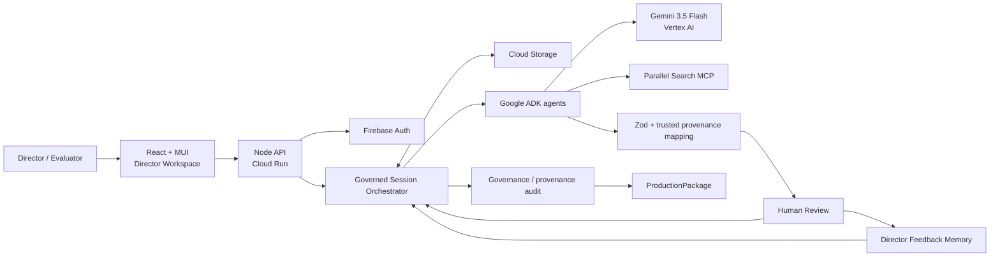

# Tital — Evidence-Governed Scientific Film Director

**Tital turns a scientific question into a human-governed, evidence-traceable film production package — from research and claims through script, scenes, shots, and visual decisions.**

> **Evidence → Story, not Story → Evidence.**

Hosted application: **https://tital-o7za4b3w5q-ts.a.run.app/**

Public visitors can explore a detached, read-only completed demo without signing in. Authorized users can enter the live Director Workspace to create, review, retry, and complete governed projects.

## All Things Agentic Hackathon

Tital is prepared for the **Collaborative Partner** track.

Mandatory Google stack:

- **Gemini 3.5 Flash** — `gemini-3.5-flash`;
- **Google Agent Development Kit (ADK), TypeScript**;
- **Vertex AI**;
- **Google Cloud Run**.

Additional production infrastructure:

- Google Cloud Storage for durable governed session state;
- Firebase Authentication / Firebase Admin for protected live workflows;
- GitHub Actions + Google Workload Identity Federation for keyless Cloud Run deployment;
- Parallel Search MCP for public-web source discovery.

Submission kit:

- [Devpost submission draft](./docs/hackathon/all-things-agentic/SUBMISSION.md)
- [Compliance matrix](./docs/hackathon/all-things-agentic/COMPLIANCE.md)
- [Architecture explanation](./docs/hackathon/all-things-agentic/ARCHITECTURE.md)
- [Architecture diagram (SVG)](./docs/hackathon/all-things-agentic/architecture.svg)
- [~4-minute demo script](./docs/hackathon/all-things-agentic/DEMO_SCRIPT.md)

### Verified Gemini 3.5 End-to-End Run

The authenticated Aurora production run completed end to end on the deployed Cloud Run service after the ADK diagnostics fix and external Vertex AI spend-cap remediation.

- Report: [Gemini 3.5 Aurora E2E report](./docs/submission/e2e-gemini-35-smoke-test/gemini-35-e2e-report.md)
- Curated evidence screenshots: [selected evidence folder](./docs/submission/e2e-gemini-35-smoke-test/selected/)
- Runtime proof: [`runtime-health-gemini-35-metadata.json`](./docs/submission/e2e-gemini-35-smoke-test/selected/runtime-health-gemini-35-metadata.json)

Verified production facts:

- commit `3ded520f568ff8d86f9af83134c3e77f146019a8`
- Cloud Run revision `tital-00030-8ht`
- runtime `gemini-3.5-flash` on `VERTEX_AI` through Google ADK
- Aurora Claims continuation succeeded from the preserved Evidence state
- final package reached `READY_FOR_PRODUCTION`
- governance/provenance audit passed with 0 issues
- final refresh preserved the completed package state

The repository includes a regression test that prevents Tital's LLM-agent files from silently drifting back to the older Gemini 2.5 model during submission hardening.
The deployed public runtime also reports its provider/backend, model identifier, Google ADK framework, Cloud Run revision, and release commit through `/api/health`; CI fails if the deployed commit or required model does not match the main-branch release.

## Why Tital exists

Scientific-film teams face a structural trust problem: research, narration, and cinematic choices often live in separate tools. A filmmaker should be able to ask:

> **Why are we saying or showing this?**

and receive a traceable answer through:

```text
Source
→ Evidence
→ Claim
→ Script Line
→ Scene
→ Shot
→ Visual Decision
→ Human decision
```

Tital is not a generic research chatbot and it is not a final-video generator. It is an **agentic scientific-film direction and production-planning system** that keeps evidence, uncertainty, provenance, human authority, and cinematic intent connected.

## Product workflow

```text
DEFINE
→ RESEARCH
→ EVIDENCE
→ CLAIMS
→ SCRIPT
→ SCENES
→ SHOTS
→ VISUAL_DECISIONS
→ AUDIT
→ PACKAGE
→ COMPLETE
```

Typed record chain:

```text
FilmBrief
→ ResearchQuestion
→ SourceRecord
→ EvidenceRecord
→ ClaimRecord
→ ScriptLineRecord
→ SceneRecord
→ ShotRecord
→ VisualDecisionRecord
→ Governance / provenance audit
→ ProductionPackage
```

## What makes it agentic

Tital does not hide a single prompt behind a chat window. Distinct ADK agents perform bounded tasks inside a persisted workflow:

| Agent | Governed action |
|---|---|
| Define Agent | turns a raw idea + authoritative project controls into a FilmBrief proposal |
| Research Question Agent | identifies the questions the film must answer |
| Source Discovery Agent | must call Parallel Search MCP before proposing sources |
| Evidence Extraction Agent | extracts supported evidence from approved source excerpts |
| Claim Agent | synthesizes claims only from approved evidence |
| Scientific Script Agent | converts approved claims into film-ready lines |
| Scene Director Agent | proposes scenes under scientific + Director Brief constraints |
| Shot Director Agent | proposes shots and explicit scientific visual-integrity constraints |
| Visual Decision Agent | proposes what production should show plus disclosure/risk |

Every generative stage stops at a human review boundary before downstream generative work may advance.

## Collaborative Partner loop

A project carries a persistent `DirectorBrief`:

```text
collaborationMode
pacing
cameraMovement
representationPreference
visualStyle
notes
avoid[]
```

The director can:

```text
Approve
Reject
Reject & try another + scoped instruction
Remember selected feedback for later cinematic proposals
Reject & continue with gap + explicit CoverageWaiver (when allowed)
```

Remembered feedback is project-scoped, visible in the Director Context rail, and is reused only when the director explicitly selects the memory option. A one-off replacement instruction remains scoped by default when that option is not selected. Reusable cross-project profiles are intentionally not implied.

Scientific evidence and uncertainty remain higher-priority constraints than creative preferences:

```text
scientific evidence / uncertainty / visual-integrity constraints
> approved production constraints
> human director guidance
> AI cinematic preference
```

This is why human review is a real control-flow boundary rather than a cosmetic thumbs-up/down label.

## Core governance contract

```text
model/tool proposes semantic content
→ deterministic domain validation
→ application assigns trusted identity/provenance/status
→ human review
→ deterministic coverage evaluation
→ next governed stage
```

Important invariants:

- models never approve their own output;
- application code owns trusted IDs and provenance links;
- rejected records remain persisted as history;
- rejection does **not** authorize silent regeneration;
- targeted retry is explicit and duplicate-resistant;
- progression uses approved provenance-connected coverage or an explicit human `CoverageWaiver`;
- stale downstream records can be invalidated when trusted upstream state changes;
- audit and package construction are deterministic application services;
- JSON remains canonical for machines while people get readable review/output surfaces.

### Trusted-reference hardening

Live runs showed that asking models to copy opaque UUID-like IDs can produce one-character or invented-reference failures. Tital therefore uses numbered semantic references when a model must point to supplied records:

```text
Claim        evidenceNumbers   → application maps to EvidenceRecord IDs
Script Line  claimNumbers      → application maps to ClaimRecord IDs
Scene        scriptLineNumbers → application maps to ScriptLineRecord IDs
Shot         scriptLineNumbers → application maps to scene-local ScriptLineRecord IDs
```

Single-parent links such as `sourceId`, `filmBriefId`, `sceneId`, and `shotId` are attached by deterministic application code rather than echoed by Gemini.

## Hosted architecture



Hackathon diagram: [docs/hackathon/all-things-agentic/architecture.svg](./docs/hackathon/all-things-agentic/architecture.svg)

Hosted persistence is conceptually:

```text
gs://<private-bucket>/<prefix>/users/<firebase-uid>/<session-id>.json
```

A public demo is **not** a direct view into a private user session. An authenticated operator can publish a completed `READY_FOR_PRODUCTION` project as a detached read-only snapshot in the base/public store.

## Public completed demo

The public Dinosaur project has been browser-validated without login and reached:

```text
COMPLETE
READY_FOR_PRODUCTION
```

Its approved production package contains:

- 5 Research Questions;
- 15 Sources;
- 24 Evidence records;
- 13 Claims;
- 11 Scientific Script lines;
- 5 Scenes;
- 9 Shots;
- 9 Visual Decisions.

The public evaluator experience exposes workflow progress, coverage, package metrics, governance/audit status, exports, and an Evidence → Story provenance trace.

## Performance engineering

Tital originally serialized independent external calls inside each already-authorized stage. It now uses bounded concurrency while preserving deterministic output order and all true stage/human dependencies.

Default:

```text
TITAL_EXTERNAL_CONCURRENCY=3
```

Allowed range is clamped to `1..8`.

Performance traces can include:

```text
stage wall time
external call count
external operation duration
internal measured work
success / failure
configured concurrency
slowest call / target
```

The UI reports **parallel overlap** as:

```text
sum(external-call durations) / measured stage wall time
```

That ratio is deliberately **not** described as a before/after speedup claim.

A hosted Sky baseline recorded approximately 2m29s of measured automated Continue-stage wall time, 39 external calls, zero external-call failures, and 2.28× aggregate external-work overlap. That legacy run predates project-creation timing; Benchmark V2 now records FilmBrief creation, configured concurrency, and more detailed Parallel timing for new sessions.

See:

- [Performance Investigation](./docs/PERFORMANCE.md)
- [Performance Benchmark V2](./docs/PERFORMANCE_BENCHMARK_V2.md)

## Parallel Search MCP

Source discovery uses the Parallel Search MCP endpoint and its `web_search` tool. The source agent is explicitly instructed to call the tool rather than answer from memory.

Tital then validates candidates and maps them into application-owned `SourceRecord`s. Invalid candidates do not silently become trusted workflow state.

Important current scientific boundary:

```text
source discovery ≠ full source verification
```

Evidence extraction currently works from approved source excerpts. Dedicated full-source retrieval/verification remains a scientific-quality roadmap item.

## Reproducible local spin-up

These steps are intentionally explicit for hackathon judging/review.

### Prerequisites

- Node.js with npm (the project is currently developed/tested on modern Node 24 tooling);
- a Google Cloud project with Vertex AI access for **live** agent calls;
- Google Cloud CLI (`gcloud`) for local Application Default Credentials;
- internet access for Parallel MCP source discovery.

Deterministic typecheck/tests/build do **not** require paid live model calls.

### 1. Clone and install exact dependencies

```bash
git clone https://github.com/amin076/tital.git
cd tital
npm ci
```

### 2. Configure Vertex AI for live calls

PowerShell:

```powershell
$env:GOOGLE_CLOUD_PROJECT="YOUR_GCP_PROJECT_ID"
$env:GOOGLE_CLOUD_LOCATION="global"
$env:GOOGLE_GENAI_USE_VERTEXAI="true"
$env:TITAL_EXTERNAL_CONCURRENCY="3"
```

macOS/Linux:

```bash
export GOOGLE_CLOUD_PROJECT="YOUR_GCP_PROJECT_ID"
export GOOGLE_CLOUD_LOCATION="global"
export GOOGLE_GENAI_USE_VERTEXAI="true"
export TITAL_EXTERNAL_CONCURRENCY="3"
```

The LLM model is code-owned in `src/config/models.ts` and set to:

```text
gemini-3.5-flash
```

### 3. Authenticate local Vertex calls

```bash
gcloud auth application-default login
```

If quotas/billing require a quota project:

```bash
gcloud auth application-default set-quota-project YOUR_GCP_PROJECT_ID
```

### 4. Validate without live model calls

```bash
npm run verify:submission
```

The individual commands remain available as `npm run typecheck`, `npm test`, and `npm run build`.

### 5. Run local development

Terminal 1:

```bash
npm run api:dev
```

Terminal 2:

```bash
npm run web:dev
```

Open the Vite URL printed by the terminal, normally:

```text
http://127.0.0.1:5173
```

Ordinary local development can run with authentication disabled unless the Firebase variables in `.env.example` are explicitly configured.

### 6. Production-like local run

```bash
npm run build
npm start
```

Default local production server:

```text
http://127.0.0.1:8787
```

### Optional ADK CLI entry points

Root agent:

```bash
npm run adk:run
```

Parallel source-discovery agent:

```bash
npm run parallel:run
```

## Hosted authentication and persistence

Firebase client login produces an ID token. Protected API calls send it as a Bearer token; the backend verifies the token with Firebase Admin and uses the decoded `uid` to select the user's Cloud Storage namespace.

Cloud Run uses its service identity / Application Default Credentials. Long-lived service-account JSON keys are not bundled into the application.

## CI/CD

Workflow:

```text
.github/workflows/ci-deploy-cloud-run.yml
```

Validated path:

```text
PR / push
→ npm ci
→ typecheck
→ deterministic tests
→ production build
→ GitHub OIDC
→ Google Workload Identity Federation
→ Cloud Run source deployment on enabled main pushes
→ deployed `/api/health` model/revision/release verification
```

The public landing surface reads the same safe runtime metadata and displays `gemini-3.5-flash`, Google ADK, Vertex AI, and Cloud Run. Authenticated project runtime records also expose auditable non-secret execution metadata: provider `Google`, backend `VERTEX_AI`, model identifier, framework, Cloud Run revision, release SHA, and execution timestamp. Private bucket paths and credentials are not exposed.

## Runtime failure handling

ADK event streams are inspected for provider error events before JSON parsing. If Vertex AI or ADK returns no content because of quota/billing, safety stop, timeout, authentication, or another provider runtime failure, Tital fails the stage closed, records an `AUTOMATION_FAILED` activity entry, preserves the last valid workflow state, and returns a safe actionable error to the UI. Deterministic malformed JSON, schema validation, and provenance failures still fail at the strict parser/schema boundary; Tital does not fabricate claims or silently fall back to another model.

## Production Package

When all governed coverage is resolved and the audit passes, Tital builds a production package with readable UI and:

- JSON download for machines/APIs;
- text download;
- browser Print / Save PDF report;
- approved-chain provenance;
- explicit coverage waivers;
- governance/provenance audit result.

## Audit scope

The deterministic audit checks governance/provenance integrity such as:

- broken or unsupported links;
- unapproved upstream records entering the trusted chain;
- visual-category consistency;
- required viewer disclosure rules.

It does **not** independently prove scientific truth, source authority, or expert quality of every human-approved record.

High-value future semantic checks include:

```text
UNCERTAINTY_DROPPED
SCIENTIFIC_CONSTRAINT_VIOLATION
proposition-aware unsupported-claim detection
source-authority / citation evaluation
```

## Live validation history

### Europa — 2026-08-15

First complete persisted backend/CLI workflow with real Gemini/Vertex AI and Parallel MCP.

### Black-hole film — 2026-08-16

Complete web-UI production package; exposed trusted parent-ID echo defects that were moved into application-owned mappings.

### Hosted Lorestan run — 2026-08-17

Cloud Run/Firebase/GCS run that exposed malformed Parallel candidate handling and Shot-to-ScriptLine reference reliability issues; both became deterministic fixes/tests.

### What Really Killed the Dinosaurs? — 2026-08-20

Complete hosted governed workflow through `READY_FOR_PRODUCTION`; later published as the detached public demo. Human-review failure modes from this run drove explicit retry/waiver semantics.

### Why is the Sky Blue? — 2026-08-20

Complete hosted workflow used to validate Director Brief behaviour and collect the first stage/call performance baseline.

## Current limits

- dedicated full-source retrieval/verification is not yet implemented;
- Cloud Run request concurrency remains conservative because session mutation does not yet have optimistic locking;
- deterministic audit is governance/provenance integrity, not scientific peer review;
- reusable cross-project Director Profiles are not yet implemented;
- advanced cinematic version comparison/locking remains future work;
- Tital produces a governed production package rather than rendering the final film.

## Documentation

- [Current Status](./docs/CURRENT_STATUS.md)
- [Director Control](./docs/DIRECTOR_CONTROL.md)
- [Performance Investigation](./docs/PERFORMANCE.md)
- [Performance Benchmark V2](./docs/PERFORMANCE_BENCHMARK_V2.md)
- [Project Handoff](./docs/PROJECT_HANDOFF.md)
- [Roadmap](./docs/ROADMAP.md)
- [Agent Architecture](./docs/architecture/agent-architecture.md)
- [Workflow Architecture](./docs/architecture/workflow-architecture.md)
- [Review Workflow](./docs/domain/review-workflow.md)
- [Failure Scenarios and Resilience](./docs/AGENT_FAILURE_SCENARIOS_AND_RESILIENCE.md)
- [Deployment and Operations](./docs/DEPLOYMENT_AND_OPERATIONS.md)
- [Testing and Validation](./docs/development/testing-and-validation.md)
- [All Things Agentic submission kit](./docs/hackathon/all-things-agentic/SUBMISSION.md)

## License

Apache-2.0. See [LICENSE](./LICENSE).
