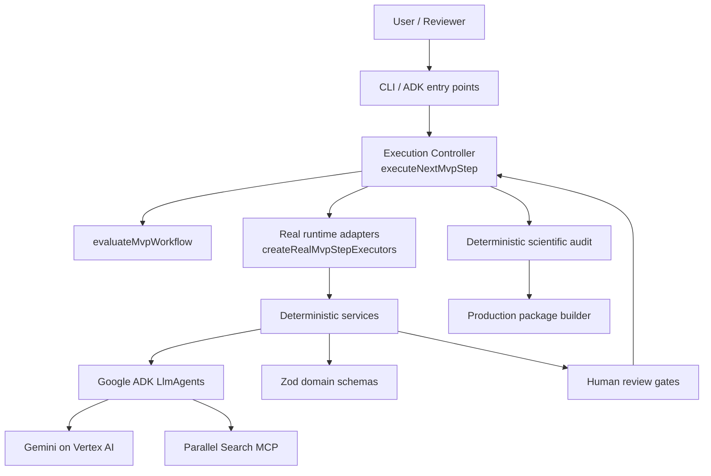

# Tital: The Evidence-Governed Scientific Film Director

Tital is an evidence-governed scientific film direction system for turning a scientific film idea into an auditable production package. It is designed around a simple principle:

> Evidence first, story second.

Tital is **not** a generic video generator and **not** a general-purpose chatbot. Its job is to preserve scientific provenance, uncertainty, visual integrity, and human review across the path from research to script, scenes, shots, and final production decisions.

## Core Idea

Tital separates three responsibilities that are often mixed together in AI applications:

- **Models propose content.** Gemini-based agents generate structured proposals.
- **Application code governs the workflow.** Deterministic TypeScript services validate provenance, assign IDs/statuses, enforce approval gates, and run the scientific audit.
- **Humans approve progression.** The workflow stops at review gates instead of silently auto-approving model output.

The implemented provenance chain is:

```text
FilmBrief
→ ResearchQuestion
→ SourceRecord
→ EvidenceRecord
→ ClaimRecord
→ ScriptLineRecord
→ SceneRecord
→ ShotRecord
→ VisualDecisionRecord
→ ScientificAuditReport
→ ProductionPackage
```

## Architecture



The controller is function-based rather than class-based. `src/services/executeNextMvpStep.ts` decides whether the next legal action is automation, human review, audit, or completion. `src/services/createRealMvpStepExecutors.ts` connects that controller contract to the real Tital services.

## Current MVP Status

Implemented now:

- Structured `FilmBrief` generation through Google ADK + Gemini.
- Research-question generation.
- Live Parallel Search MCP source discovery through `parallelSourceAgent`.
- Structured evidence extraction, claim generation, scientific script generation, scene direction, shot direction, and visual-decision generation.
- Zod validation at model/service boundaries.
- Explicit human review services and approval gates.
- Deterministic workflow evaluation through `evaluateMvpWorkflow`.
- Function-based execution control through `executeNextMvpStep`.
- Real service wiring through `createRealMvpStepExecutors`.
- Deterministic scientific audit.
- Deterministic `ProductionPackage` construction.
- Unit tests covering domain contracts, service gates, provenance validation, orchestration, audit, packaging, and real-executor wiring without live model calls.

Important current limits:

- There is **no production UI yet**; the implemented user-facing entry points are CLI/ADK-oriented.
- There is **no persistent database/state store yet**; MVP workflow state is represented by typed in-memory objects such as `MvpWorkflowState`.
- There is **not yet one persisted end-to-end CLI command** that automatically drives the whole project from idea to package. The controller and real service adapters exist, but human review gates are intentionally explicit.
- Source discovery initially produces `SourceRecord.status = DISCOVERED`; source review is a distinct step before approved evidence extraction.

## Repository Layout

```text
.
├─ agent.ts
├─ parallel-agent.ts
├─ src/
│  ├─ agents/
│  ├─ cli/
│  ├─ domain/
│  ├─ integrations/
│  ├─ services/
│  └─ utils/
├─ tests/
├─ docs/
├─ package.json
├─ tsconfig.json
└─ .env.example
```

See [Repository Structure](./docs/architecture/repository-structure.md) for the detailed map.

## Getting Started

### Prerequisites

- A recent Node.js runtime compatible with the dependencies in `package.json`.
- npm.
- Google Cloud SDK for live Vertex AI runs.
- Application Default Credentials (ADC) for live Google model calls.

### Install

```bash
npm install
```

### Environment

Use `.env.example` as the reference for the required runtime variables. You can set them in your shell or use tooling that loads a local `.env` file.

Typical Vertex AI configuration:

```text
GOOGLE_CLOUD_PROJECT=scientific-film-director-agent
GOOGLE_CLOUD_LOCATION=global
GOOGLE_GENAI_USE_VERTEXAI=true
```

Authenticate ADC before live Vertex calls:

```bash
gcloud auth application-default login
```

If `GOOGLE_APPLICATION_CREDENTIALS` is set, make sure it points to a real credential file. A stale path will override normal ADC discovery and can cause confusing authentication failures.

## Running the Current Entry Points

Generate a film brief:

```bash
npm run define -- "A film about the discovery of penicillin"
```

Generate research questions from the relevant CLI flow:

```bash
npm run research-questions
```

Run the baseline ADK agent harness:

```bash
npm run adk:run
```

Run the Parallel MCP agent harness:

```bash
npm run parallel:run
```

Live ADK/Gemini runs can incur Vertex AI cost. Unit tests and type checking do not require live Vertex or Parallel calls.

## Testing

```bash
npm run typecheck
npm test
```

Tests use dependency injection/fakes where appropriate so orchestration and provenance rules can be validated without paying for model calls.

## Human Review and Statuses

Statuses are model-specific rather than one universal enum. Common states include:

```text
DRAFT
REVIEW_REQUIRED
APPROVED
REJECTED
LOCKED
```

`SourceRecord` is different and also includes:

```text
DISCOVERED
```

Do not assume every generated record begins in `REVIEW_REQUIRED`. The service/domain schema is the source of truth for each record type.

## Documentation Index

### Overview
- [Product Overview](./docs/overview/product-overview.md)
- [Problem and Vision](./docs/overview/problem-and-vision.md)

### Architecture
- [System Architecture](./docs/architecture/system-architecture.md)
- [Agent Architecture](./docs/architecture/agent-architecture.md)
- [Workflow Architecture](./docs/architecture/workflow-architecture.md)
- [Repository Structure](./docs/architecture/repository-structure.md)

### Domain
- [Domain Models](./docs/domain/domain-models.md)
- [Provenance and Governance](./docs/domain/provenance-and-governance.md)
- [Review Workflow](./docs/domain/review-workflow.md)

### Execution
- [How Agents Run](./docs/execution/how-agents-run.md)
- [Orchestration](./docs/execution/orchestration.md)
- [Real Execution Path](./docs/execution/real-execution-path.md)
- [Runtime Configuration](./docs/execution/runtime-configuration.md)

### Development
- [Local Development](./docs/development/local-development.md)
- [Testing and Validation](./docs/development/testing-and-validation.md)
- [Contribution Guide](./docs/development/contribution-guide.md)

### Diagrams
- [System Overview](./docs/diagrams/system-overview.md)
- [Workflow Flow](./docs/diagrams/workflow-flow.md)
- [Provenance Chain](./docs/diagrams/provenance-chain.md)
- [Execution Controller](./docs/diagrams/execution-controller.md)
- [Repository Map](./docs/diagrams/repo-map.md)

## Design Rule

When extending Tital, preserve this boundary:

```text
Model proposes
→ service validates
→ application assigns provenance/status
→ human reviews
→ next stage becomes eligible
```

That boundary is the core of Tital's evidence-governed architecture.
