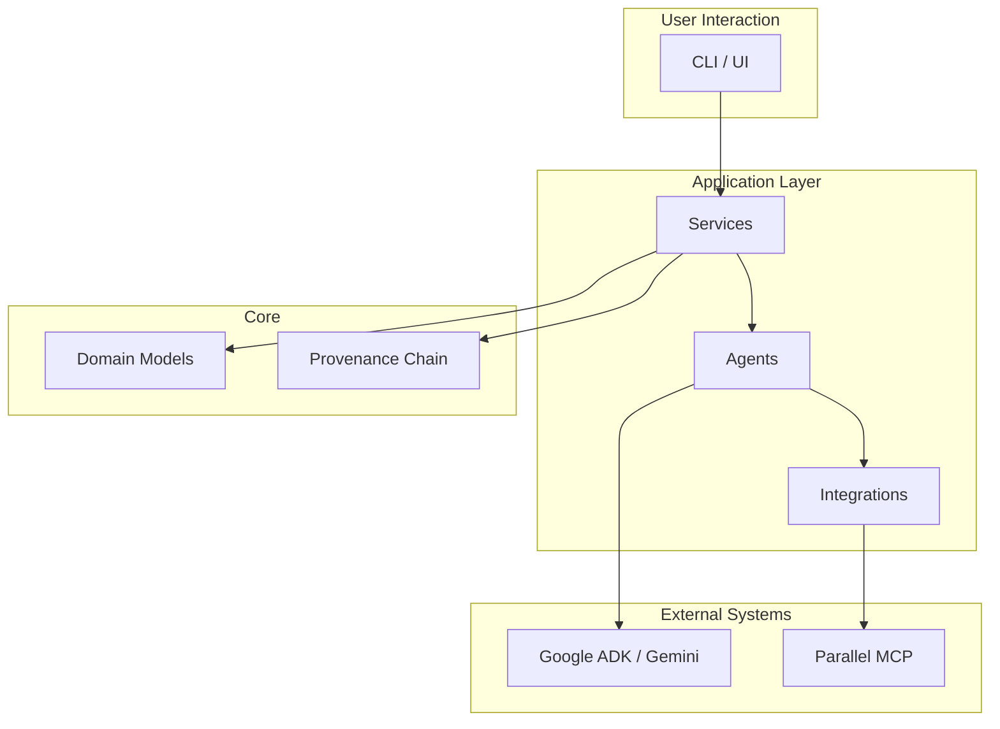

# Tital: The Evidence-Governed Scientific Film Director

Tital is an evidence-governed scientific film direction system. It is designed to assist in the creation of short scientific films by ensuring that all claims made in the film are backed by verifiable evidence and a clear provenance chain.

It is **not** a generic video generator or a general-purpose chatbot. Its core purpose is to guide the creative process of scientific filmmaking through a structured, auditable, and human-in-the-loop workflow.

## The Tital Difference: Provenance and Governance

The key differentiator for Tital is its focus on **provenance** and **governance**. Every creative decision and factual claim is part of a verifiable audit trail. This is achieved through:

-   **A Strict Provenance Chain:** From the initial idea to the final shot, every step is recorded as a distinct, validated data model.
-   **Human Review Gates:** AI-generated content is always treated as a *proposal* that must be approved by a human reviewer.
-   **Deterministic Logic:** The core workflow is orchestrated by auditable, deterministic code, not by the AI model.

## Core Architecture

Tital's architecture is designed to be modular and auditable.



-   **Services:** Orchestrate the workflow.
-   **Agents:** AI-powered creative assistants.
-   **Domain Models:** Zod schemas that define the data structure.
-   **Integrations:** Connect to external systems like Parallel Search.

For a more detailed explanation, see the [System Architecture documentation](./docs/architecture/system-architecture.md).

## Current MVP Status

This repository contains the Minimum Viable Product (MVP) for the Tital system. The following features are implemented:

-   **Core Workflow:** The full provenance chain from `FilmBrief` to `ProductionPackage` is defined.
-   **Define Step:** The initial "define" step, where a raw idea is turned into a structured `FilmBrief`, is fully implemented.
-   **Agent Architecture:** A standard architecture for creating and running `LlmAgent`s is in place.
-   **Domain Models:** Zod schemas for all domain models are defined.
-   **Unit Tests:** A comprehensive suite of unit tests for the services and domain models is implemented.
-   **Parallel MCP Integration:** A basic integration with the Parallel Search MCP is in place for evidence gathering.

## Getting Started

### Prerequisites

1.  **Node.js**: Version `v24.13.0` or higher.
2.  **Google Cloud SDK**: Installed and authenticated locally.
3.  **Application Default Credentials (ADC)**: Configured and verified.

### 1. Install Dependencies

```bash
npm install
```

### 2. Configure Your Environment

```bash
# On Linux/macOS:
cp .env.example .env

# On Windows PowerShell:
Copy-Item .env.example .env
```

### 3. Authenticate with Google Cloud

```bash
gcloud auth application-default login
```

## How to Run Tital

### Run a CLI Script

The primary way to interact with the Tital workflow is through the CLI scripts. For example, to run the "define" step:

```bash
npm run define -- "A film about the discovery of penicillin"
```

### Run an Agent Directly

You can also interact with agents directly using the ADK's execution harness:

```bash
npm run adk:run
```

## How to Test Tital

Run the full suite of unit tests:

```bash
npm test
```

Perform a static type check:

```bash
npm run typecheck
```

## Documentation Index

For more detailed information, please see the documentation in the `docs/` directory.

-   **Overview**
    -   [Product Overview](./docs/overview/product-overview.md)
    -   [Problem and Vision](./docs/overview/problem-and-vision.md)
-   **Architecture**
    -   [System Architecture](./docs/architecture/system-architecture.md)
    -   [Agent Architecture](./docs/architecture/agent-architecture.md)
    -   [Workflow Architecture](./docs/architecture/workflow-architecture.md)
    -   [Repository Structure](./docs/architecture/repository-structure.md)
-   **Domain**
    -   [Domain Models](./docs/domain/domain-models.md)
    -   [Provenance and Governance](./docs/domain/provenance-and-governance.md)
    -   [Review Workflow](./docs/domain/review-workflow.md)
-   **Execution**
    -   [How Agents Run](./docs/execution/how-agents-run.md)
    -   [Orchestration](./docs/execution/orchestration.md)
    -   [Real Execution Path](./docs/execution/real-execution-path.md)
    -   [Runtime Configuration](./docs/execution/runtime-configuration.md)
-   **Development**
    -   [Local Development](./docs/development/local-development.md)
    -   [Testing and Validation](./docs/development/testing-and-validation.md)
    -   [Contribution Guide](./docs/development/contribution-guide.md)
-   **Diagrams**
    -   [System Overview](./docs/diagrams/system-overview.md)
    -   [Workflow Flow](./docs/diagrams/workflow-flow.md)
    -   [Provenance Chain](./docs/diagrams/provenance-chain.md)
    -   [Execution Controller](./docs/diagrams/execution-controller.md)
    -   [Repository Map](./docs/diagrams/repo-map.md)
