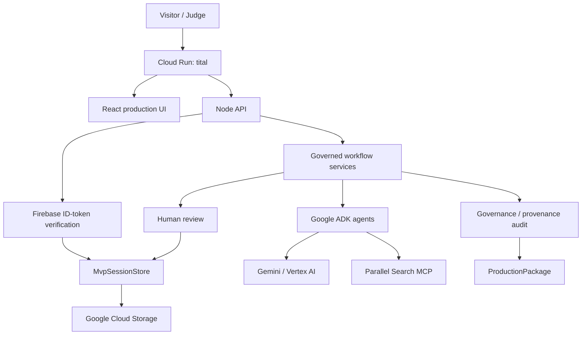

# Tital — Evidence-Governed Scientific Film Director

Tital turns a scientific-film idea into an auditable production package while preserving provenance, uncertainty, visual-integrity constraints, and explicit human review from research through script, scenes, shots, and visual decisions.

> **Evidence → Story, not Story → Evidence.**

North Star:

> **A filmmaker should be able to ask, “Why are we saying or showing this?” and receive a traceable answer through sources, evidence, claims, script, scenes, shots, and visual decisions.**

Tital is not a generic video generator or general-purpose research chatbot.

## Current status

Tital now has a hosted authenticated vertical slice in active hardening on `feat/public-authenticated-tital`.

Implemented and live-validated:

- React / TypeScript / Vite / MUI web UI;
- Node production server serving both UI and `/api/*`;
- Google ADK + Gemini / Vertex AI proposal generation;
- Parallel Search MCP source discovery;
- explicit human approve/reject gates;
- rejection-aware coverage recovery;
- deterministic governance/provenance audit;
- final `ProductionPackage`, traceability, JSON/text/PDF outputs;
- Cloud Run deployment;
- Cloud Storage durable session persistence across revisions;
- Firebase Email/Password sign-in;
- backend Firebase ID-token verification;
- per-user session namespaces using Firebase `uid`;
- public landing/demo shell;
- GitHub Actions CI/Cloud Run deployment workflow (WIF/IAM setup still pending validation);
- resilience fixes discovered during live hosted runs.

Detailed status: [docs/CURRENT_STATUS.md](./docs/CURRENT_STATUS.md)

## Product workflow

```text
DEFINE
→ RESEARCH
→ EVIDENCE
→ CLAIMS
→ SCRIPT
→ SCENES
→ SHOTS
→ VISUAL_DECISIONS
→ AUDIT
→ PACKAGE
→ COMPLETE
```

Record chain:

```text
FilmBrief
→ ResearchQuestion
→ SourceRecord
→ EvidenceRecord
→ ClaimRecord
→ ScriptLineRecord
→ SceneRecord
→ ShotRecord
→ VisualDecisionRecord
→ Governance / provenance audit
→ ProductionPackage
```

## Core governance contract

```text
Model/tool proposes
→ deterministic service validates
→ application assigns trusted identity/provenance/status
→ human reviews
→ deterministic workflow evaluates approved coverage
```

Important invariants:

- models never approve their own output;
- application code owns trusted IDs and provenance links;
- rejected records remain persisted as history;
- progression uses approved provenance-connected coverage, not arbitrary counts;
- audit and package construction are deterministic application services;
- JSON remains canonical for machines while humans get readable views.

### Trusted-reference hardening

Live runs showed that asking models to copy opaque UUID-like IDs can create one-character or invented-reference failures.

Tital now prefers numbered semantic references:

```text
Claim        evidenceNumbers   → application maps to EvidenceRecord IDs
Script Line  claimNumbers      → application maps to ClaimRecord IDs
Scene        scriptLineNumbers → application maps to ScriptLineRecord IDs
Shot         scriptLineNumbers → application maps to scene-local ScriptLineRecord IDs
```

Single-parent trusted links such as `sourceId`, `filmBriefId`, `sceneId`, and `shotId` are attached by application code rather than echoed by Gemini.

See [Agent Architecture](./docs/architecture/agent-architecture.md) and [Agent Failure Scenarios and Resilience](./docs/AGENT_FAILURE_SCENARIOS_AND_RESILIENCE.md).

## Hosted architecture



Local development uses `JsonMvpSessionStore`; hosted deployment uses `CloudStorageMvpSessionStore` when `TITAL_GCS_BUCKET` is configured.

Deployment details: [docs/DEPLOYMENT_AND_OPERATIONS.md](./docs/DEPLOYMENT_AND_OPERATIONS.md)

## Public access design

Target Hackathon experience:

```text
Anonymous visitor
→ public landing
→ completed read-only demo

Authorized judge
→ Firebase Email/Password sign-in
→ create/review/continue live Tital projects
```

The Cloud Run service remains in hardening until anonymous protected-route denial, curated demo, judge login, full hosted E2E, rollback, and cost/security checks pass.

## Parallel MCP resilience

Parallel source discovery uses:

```text
https://search.parallel.ai/mcp
```

A hosted run exposed a malformed source candidate with an empty title. Tital now validates provider/model candidates individually:

```text
valid batch envelope
→ validate each candidate
→ discard malformed candidates with warning
→ preserve valid candidates
→ fail only if zero valid candidates remain
```

Tital does not fabricate missing source metadata.

Important scientific limitation:

```text
source discovery ≠ full source verification
```

Evidence extraction currently works from approved source excerpts. Dedicated approved-source full-content retrieval/verification remains a post-release priority.

## Authentication and persistence

Firebase client login produces an ID token. Protected API calls send it as a Bearer token; the backend verifies it using Firebase Admin and uses decoded `uid` to select the user-specific session namespace.

Hosted session layout is conceptually:

```text
gs://<bucket>/<prefix>/users/<firebase-uid>/<session-id>.json
```

Cloud Storage persistence has been tested across Cloud Run revision replacement.

## Live validation history

### Europa — 2026-08-15

First complete persisted backend/CLI workflow with real Gemini/Vertex AI and Parallel MCP.

### Black-hole film — 2026-08-16

Complete web-UI project through final package, traceability, JSON/text/PDF outputs. It exposed trusted parent-ID echo defects that were subsequently moved into application-owned mappings.

### Hosted Lorestan run — 2026-08-17

Real Cloud Run/Firebase/GCS run exercising hosted authentication, persistence and multi-stage progression. It exposed and drove fixes for malformed Parallel candidate handling and Shot-to-ScriptLine reference reliability.

## Getting started locally

Install:

```bash
npm install
```

Typical PowerShell Vertex configuration:

```powershell
$env:GOOGLE_CLOUD_PROJECT="scientific-film-director-agent"
$env:GOOGLE_CLOUD_LOCATION="global"
$env:GOOGLE_GENAI_USE_VERTEXAI="true"
```

Authenticate ADC for live local Vertex calls:

```bash
gcloud auth application-default login
```

Local development:

```bash
npm run api:dev
npm run web:dev
```

Production-like local run:

```bash
npm run build
npm start
```

Default production-like local URL:

```text
http://127.0.0.1:8787
```

## Validation

Required before deployment:

```bash
npm run typecheck
npm test
npm run build
```

The normal suite is designed to avoid paid live Vertex/Parallel calls.

Testing policy: [docs/development/testing-and-validation.md](./docs/development/testing-and-validation.md)

## GitHub Actions / deployment automation

Workflow:

```text
.github/workflows/ci-deploy-cloud-run.yml
```

Intended path:

```text
PR/push
→ npm ci
→ typecheck
→ tests
→ production build
→ GitHub OIDC
→ Google Workload Identity Federation
→ Cloud Run source deployment
```

The preferred CI/CD design uses a dedicated deploy identity and short-lived WIF credentials rather than storing a Google service-account JSON key.

## Audit scope

The deterministic audit checks governance/provenance integrity, including broken links, unapproved upstream records, unsupported provenance, visual-category mismatch, and disclosure requirements.

Human-facing output calls this a **Governance & provenance audit**.

It does **not** independently prove scientific truth, source authority, or expert quality of every approved record.

Future semantic checks include:

```text
UNCERTAINTY_DROPPED
SCIENTIFIC_CONSTRAINT_VIOLATION
proposition-aware unsupported-claim detection
source-authority / citation evaluation
```

## Current major limits

- no dedicated full-source retrieval/verification stage;
- no optimistic locking for concurrent session mutation yet;
- no complete edit/replace + downstream staleness lifecycle;
- no generalized schema migration framework beyond targeted legacy migration;
- deterministic audit is not independent scientific peer review;
- Tital produces a governed production package rather than rendering the final film.

## Documentation

- [Current Status](./docs/CURRENT_STATUS.md)
- [Project Handoff](./docs/PROJECT_HANDOFF.md)
- [Roadmap](./docs/ROADMAP.md)
- [Agent Architecture](./docs/architecture/agent-architecture.md)
- [Agent Failure Scenarios and Resilience](./docs/AGENT_FAILURE_SCENARIOS_AND_RESILIENCE.md)
- [Deployment and Operations](./docs/DEPLOYMENT_AND_OPERATIONS.md)
- [Testing and Validation](./docs/development/testing-and-validation.md)
- [MVP E2E Validation](./docs/MVP_E2E_VALIDATION.md)

## License

Apache-2.0. See [LICENSE](./LICENSE).
