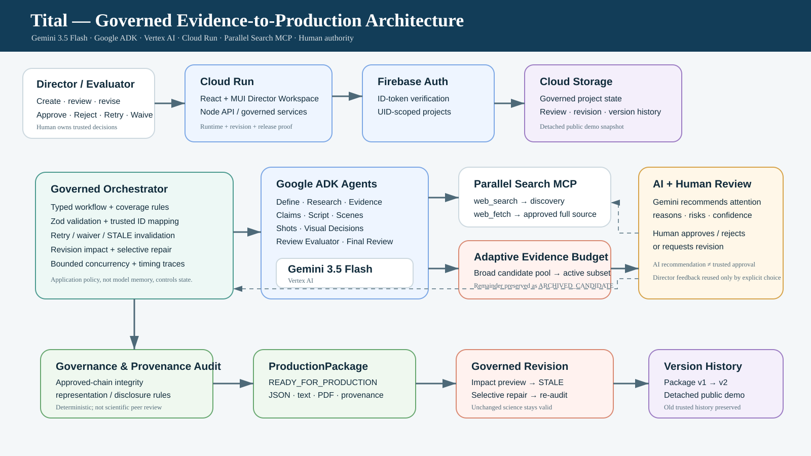
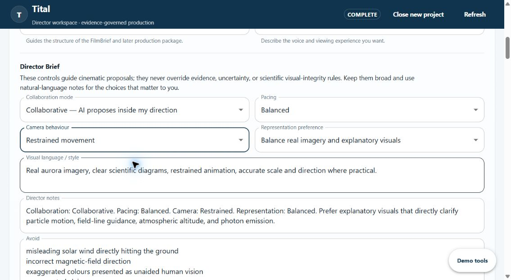
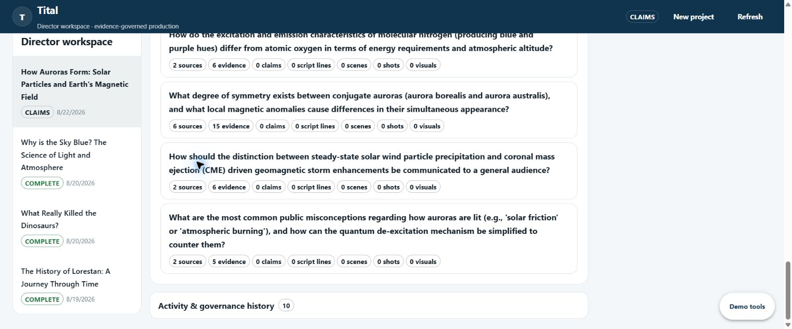
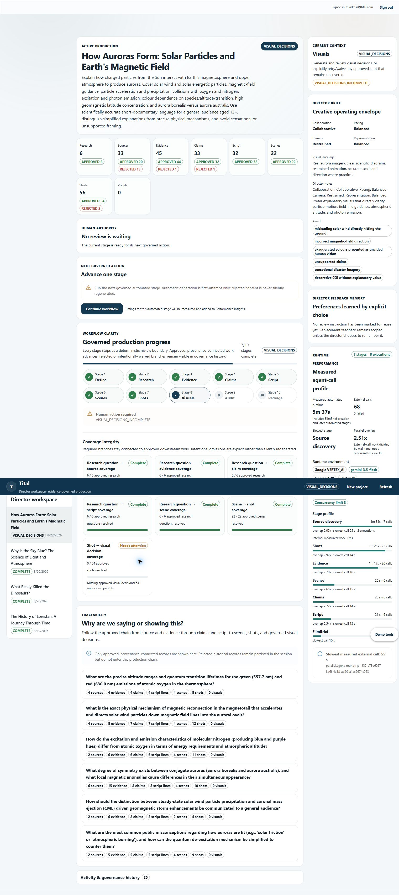
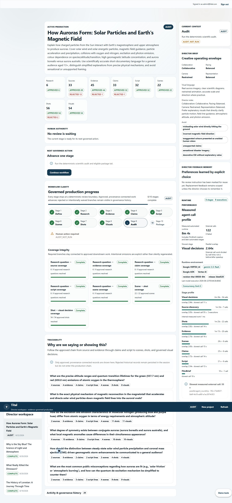
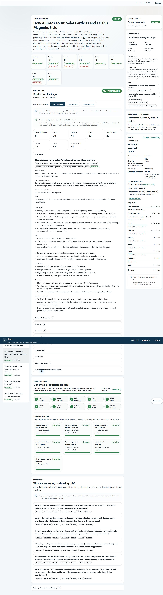

# Tital — Evidence-Governed Scientific Film Director

**Tital turns a scientific question into a traceable, human-governed and revisable film production package — from research and claims through script, scenes, shots and scientific visual decisions.**

> **Evidence → Story, not Story → Evidence.**

Hosted application: **https://tital-o7za4b3w5q-ts.a.run.app/**

Tital is not a generic research chatbot and it is not a final-video generator. It is a production-control workspace for scientific filmmaking: Gemini agents propose and evaluate semantic work, deterministic application code owns trusted state/provenance, and the human director owns every approval, omission and revision decision.

## Architecture at a glance



*The deployed architecture separates Gemini/Google ADK proposal and review work from deterministic workflow policy, human approval, provenance, audit, governed revision, and versioned production packages.*

For the detailed design, see [System architecture](./docs/architecture/system-architecture.md), [Agent architecture](./docs/architecture/agent-architecture.md), and [Workflow architecture](./docs/architecture/workflow-architecture.md).

## Verified product screenshots

These images come from the hosted Aurora end-to-end acceptance run and show real Tital workflow states rather than mockups.

### Director brief and production controls



*The director sets the scientific question, audience, format and creative operating envelope before downstream agents propose production work.*

### Evidence remains explicitly human-governed



*Evidence proposals remain reviewable records with explicit human approval/rejection; model output does not silently become trusted production state.*

### Scientific decisions can be rejected before they enter production



*Shot proposals that drift from approved science or visual-integrity constraints can be rejected while the governance history remains visible.*

### Visual decisions become audit-ready only after review



*Approved visual treatments preserve representation/disclosure rules before the deterministic governance and provenance audit runs.*

### Production package



*After the governed chain passes review and audit, Tital produces an exportable `READY_FOR_PRODUCTION` package rather than a final rendered film.*

> Newer feedback-driven tests also verified stage-aware AI review, Adaptive Evidence Budgeting, Final Production AI Review, and governed Script/Scene revision with selective repair. See [Feedback-driven E2E acceptance](./docs/submission/feedback-driven-e2e/README.md).

## Why this is more than a long AI chat

A chat can generate research notes, claims, narration or shot ideas. Tital adds the production system around those artifacts:

- persisted trusted state instead of chat-memory state;
- Source → Evidence → Claim → Script → Scene → Shot → Visual provenance;
- exact-URL full-source retrieval after human Source approval;
- optional stage-aware Gemini review at every human gate;
- explicit human approval/rejection and coverage-gap decisions;
- Adaptive Evidence Budget for large research pools;
- deterministic audit/package rules;
- whole-package Final AI Review;
- dependency impact preview, `STALE` history and selective repair;
- versioned production packages instead of destructive overwrite.

The core question Tital is designed to answer is:

> **Why are we saying or showing this, what evidence supports it, and what changes if we revise it?**

## Governed production chain

```text
FilmBrief
→ ResearchQuestion
→ SourceRecord
→ EvidenceRecord
→ ClaimRecord
→ ScriptLineRecord
→ SceneRecord
→ ShotRecord
→ VisualDecisionRecord
→ Governance / provenance audit
→ ProductionPackage
```

Every generative stage stops at a human decision boundary. Models do not own trusted IDs, parent links or approval status.

## Stage-aware AI-assisted human review

Every active human gate can optionally invoke an independent Gemini Review Evaluator:

```text
FilmBrief
ResearchQuestion
Source
Evidence
Claim
Script
Scene
Shot
Visual Decision
```

The rubric changes with the stage. Examples:

- **Source:** relevance, authority signals, duplication and weak-source risk;
- **Evidence:** full-source support, overstatement, uncertainty and contradiction;
- **Claim:** approved-Evidence support, scope and unsupported precision;
- **Script:** Claim fidelity, uncertainty, audience fit, pacing and unsupported additions;
- **Scene:** Script coverage, narrative purpose and Director Brief fit;
- **Shot:** Scene/Script fidelity, camera treatment and scientific visual constraints;
- **Visual:** Shot fidelity, disclosure and observation-vs-reconstruction integrity.

The reviewer returns advisory metadata such as:

```text
APPROVE_SUGGESTED | REJECT_SUGGESTED | REVIEW_REQUIRED
attention: LOW | MEDIUM | HIGH
confidence
reasons[]
risks[]
flags[]
```

AI may assist checkbox selection, but only an explicit human action changes trusted status.

> **AI recommendation ≠ human approval.**

Review is user-triggered rather than automatic so productions can balance a second semantic pass against model cost and latency.

## Full-source grounding with Parallel

Source discovery uses Parallel Search MCP `web_search`. After a human approves a SourceRecord, new Evidence extraction must call Parallel `web_fetch` on the **exact approved URL**.

```text
Parallel web_search
→ Source candidate
→ human Source approval
→ Parallel web_fetch exact approved URL
→ Evidence extraction
→ grounding metadata
→ governed Evidence review
```

Search excerpts remain discovery context and are not treated as the Evidence basis. Full-source grounding improves traceability; it does not claim to independently certify scientific truth or source authority.

## Adaptive Evidence Budget

A live five-minute Aurora production exposed a real scale problem:

```text
21 approved Sources
→ 123 full-source Evidence candidates
```

Sending all 123 through AI review, human review and every downstream generation step would increase latency, model context and human workload without necessarily improving a five-minute film.

Tital therefore separates **research breadth** from **active production Evidence**:

```text
123 research candidates
→ deterministic Adaptive Evidence Budget
→ 24 active for review
→ 99 ARCHIVED_CANDIDATE records preserved
→ 21 human-approved / 3 human-rejected
```

The same production verified `21/21` active Evidence Source branches using Parallel `web_fetch`.

Archived Evidence is retained as project research history; it is neither deleted nor counted as approved production Evidence.

See [Adaptive Evidence Budget](./docs/ADAPTIVE_EVIDENCE_BUDGET.md).

## Final Production AI Review

After a package reaches `READY_FOR_PRODUCTION`, a separate Gemini reviewer can inspect the **whole package** for issues that local stage review may miss, including:

- scientific drift or uncertainty loss;
- duplication;
- missing cross-stage coverage;
- audience-fit problems;
- narrative order and pacing;
- visual-integrity risk;
- Director Brief conflicts.

This reviewer is advisory only. The director decides whether a finding should become a governed revision.

A live Aurora package demonstrated the distinction clearly: deterministic governance/provenance audit passed with `0 issues`, while Final AI Review still found cross-stage narrative/coverage problems. Structural trust and semantic quality are intentionally separate checks.

## Governed revision, selective repair and version history

`READY_FOR_PRODUCTION` is a milestone, not a dead end. Current revision targets include:

- project duration;
- approved Source;
- approved Claim;
- approved **Script Line**;
- approved **Scene**;
- approved Shot;
- approved Visual Decision.

Before mutation, Tital shows deterministic dependency impact. Old records remain history and affected descendants become `STALE`.

A production smoke test revised one approved Script Line and previewed exactly:

```text
Script: 1
Scenes: 1
Shots: 2
Visuals: 2

Preserved:
Research Questions
Sources
Evidence
Claims
```

After applying a revision, Tital requires selective repair before audit/package completion. An `APPLIED` revision cannot skip directly to `AUDIT`, `PACKAGE` or `COMPLETE`; direct advance requests are blocked until repair has begun.

```text
ProductionPackage v1
→ RevisionRequest
→ deterministic impact preview
→ affected records STALE
→ repair affected branch
→ optional stage-aware AI review
→ explicit human re-review
→ re-audit
→ rebuilt/versioned ProductionPackage
```

Completed package history remains inspectable instead of being silently overwritten.

## Director control

A persistent `DirectorBrief` carries collaboration mode, pacing, camera movement, representation preference, visual style/notes and explicit avoid constraints.

Precedence remains:

```text
scientific evidence / uncertainty / visual-integrity constraints
> approved production constraints
> human director guidance
> AI cinematic preference
```

The director can approve, reject, request a scoped replacement, ask Gemini for a second review, intentionally waive a supported coverage gap, remember selected feedback for later cinematic proposals, and revise a completed package.

## Agent architecture

Tital uses specialized Google ADK TypeScript agents inside deterministic workflow services:

| Agent / role | Responsibility |
|---|---|
| Define Agent | idea + production controls → FilmBrief proposal |
| Research Question Agent | approved FilmBrief → research questions |
| Source Discovery Agent | approved RQ → Parallel source candidates |
| Evidence Extraction Agent | approved Source → exact-URL `web_fetch` → Evidence proposals |
| Review Evaluator | stage-aware advisory review at any active human gate |
| Claim Agent | approved active Evidence → Claims |
| Scientific Script Agent | approved Claims → Script Lines |
| Scene Director Agent | approved Script + Director Brief → Scenes |
| Shot Director Agent | approved Scene/Script + constraints → Shots |
| Visual Decision Agent | approved Shot → visual treatment/disclosure/risk |
| Final Production Reviewer | completed package → advisory cross-stage findings |

Trusted IDs, statuses, Adaptive Evidence Budget, coverage policy, revision impact, `STALE` propagation, audit and package/version construction remain application-owned rather than model authority.

## Hosted stack

- Gemini 3.5 Flash — `gemini-3.5-flash`
- Google Agent Development Kit (ADK), TypeScript
- Vertex AI
- Google Cloud Run
- Google Cloud Storage
- Firebase Authentication / Firebase Admin
- GitHub Actions + Workload Identity Federation
- Parallel Search MCP (`web_search` + `web_fetch`)
- TypeScript / Node.js / React 19 / Vite / Material UI / Zod / Vitest

## Performance and resilience

Independent external work uses bounded concurrency while true workflow/human dependencies remain sequential.

```text
TITAL_EXTERNAL_CONCURRENCY=3
TITAL_EVIDENCE_CONCURRENCY=1
```

Evidence uses a conservative concurrency default because each approved Source requires a Gemini turn plus Parallel `web_fetch`. Transient Vertex/ADK rate limits use bounded retry/backoff; billing/auth/safety/schema/provenance failures are not blindly retried.

Live testing also exposed a Cloud Run request-starvation condition during long model work; HTTP serving capacity and model-call concurrency are now treated separately.

See [Performance Investigation](./docs/PERFORMANCE.md).

## Verified feedback-driven acceptance run

The `Aurora Grounding Test` on 2026-08-24 verified the main feedback-driven features in the hosted application:

- full-source Evidence grounding;
- `123 → 24 active + 99 archived` Evidence budgeting;
- AI-assisted Evidence review with explicit human decisions;
- stage-aware Script, Scene, Shot and Visual review;
- coverage-gap dialog with explicit Retry/Waive choices;
- deterministic audit with `0 issues`;
- separate Final Production AI Review;
- Script revision target added after Final Review exposed a real need;
- impact preview of `1 Script → 1 Scene → 2 Shots → 2 Visuals`;
- selective repair with human re-review;
- repair-before-audit/package guard;
- re-audit and rebuilt `READY_FOR_PRODUCTION` package;
- revision activity/history preserved.

See [Feedback-driven E2E acceptance](./docs/submission/feedback-driven-e2e/README.md).

## Reproducible local setup

Prerequisites: Node.js/npm, Google Cloud project with Vertex AI access, `gcloud` ADC, and internet access for Parallel MCP.

```bash
git clone https://github.com/amin076/tital.git
cd tital
npm ci
```

Configure runtime:

```text
GOOGLE_CLOUD_PROJECT=YOUR_GCP_PROJECT_ID
GOOGLE_CLOUD_LOCATION=global
GOOGLE_GENAI_USE_VERTEXAI=true
TITAL_EXTERNAL_CONCURRENCY=3
TITAL_EVIDENCE_CONCURRENCY=1
```

Authenticate:

```bash
gcloud auth application-default login
gcloud auth application-default set-quota-project YOUR_GCP_PROJECT_ID
```

Validate without live model calls:

```bash
npm run verify:submission
```

Local development:

```bash
npm run api:dev
npm run web:dev
```

Production-like run:

```bash
npm run build
npm start
```

## Submission freeze policy

The product is now in **feature freeze for hackathon submission**. New features should not be added unless they fix a critical correctness/compliance problem. Remaining work is primarily:

- submission text and compliance verification;
- curated screenshots;
- demo recording/editing;
- final deployment/logged-out checks;
- critical bug fixes only.

## Documentation

- [Current status](./docs/CURRENT_STATUS.md)
- [System architecture](./docs/architecture/system-architecture.md)
- [Agent architecture](./docs/architecture/agent-architecture.md)
- [Workflow architecture](./docs/architecture/workflow-architecture.md)
- [Adaptive Evidence Budget](./docs/ADAPTIVE_EVIDENCE_BUDGET.md)
- [Performance](./docs/PERFORMANCE.md)
- [Feedback-driven E2E acceptance](./docs/submission/feedback-driven-e2e/README.md)
- [All Things Agentic submission kit](./docs/hackathon/all-things-agentic/README.md)

## Safe product boundary

Tital does **not** claim that:

- Gemini review replaces human approval;
- the deterministic audit proves scientific truth;
- full-source retrieval is equivalent to peer review;
- archived Evidence is approved production Evidence;
- the system renders the final film;
- every optional AI review pass is free or latency-neutral.

The strongest product claim is simpler:

> **Tital scales human judgment without giving AI the authority to replace it, while preserving the evidence and revision history behind scientific filmmaking decisions.**

## License

Apache-2.0. See [`LICENSE`](./LICENSE).
