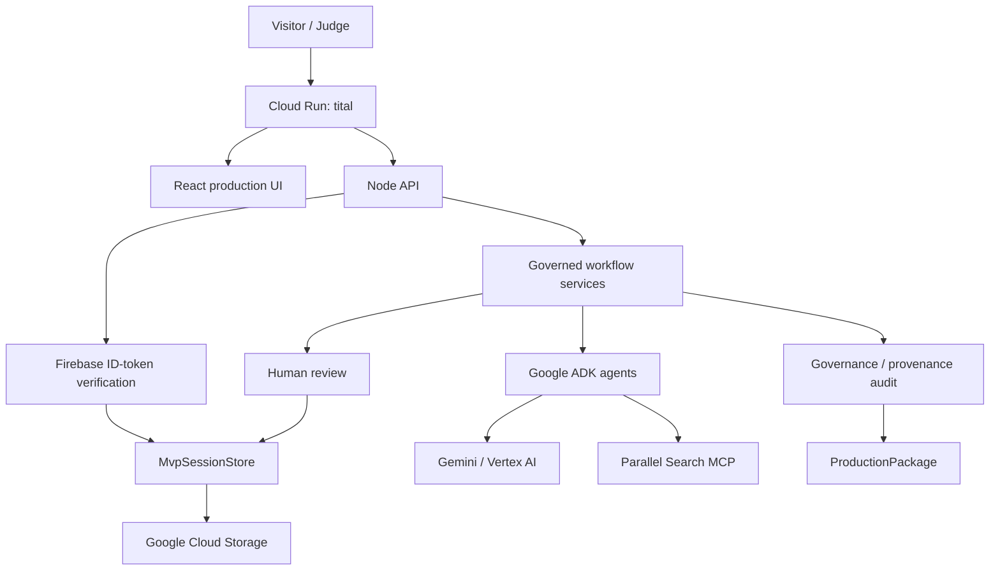

# Tital — Evidence-Governed Scientific Film Director

Tital turns a scientific-film idea into an auditable production package while preserving evidence provenance, uncertainty, visual-integrity constraints, explicit human review, and director control from research through shots and visual decisions.

> **Evidence → Story, not Story → Evidence.**

North Star:

> **A filmmaker should be able to ask, “Why are we saying or showing this?” and receive a traceable answer through sources, evidence, claims, script, scenes, shots, visual decisions, and human decisions.**

Tital is not a generic video generator or a general-purpose research chatbot. It produces governed scientific-film direction and a production package; it does not currently render the final film.

## Current status

Implemented and live-validated:

- React / TypeScript / Vite / MUI web UI;
- Node production server serving both UI and `/api/*`;
- Google ADK + Gemini / Vertex AI proposal generation;
- Parallel Search MCP source discovery;
- explicit human review gates;
- governed **Retry / Waive / Cancel** recovery when rejection creates a coverage gap;
- rejection history + duplicate-resistant targeted replacement;
- deterministic governance/provenance audit;
- final `ProductionPackage`, traceability, JSON/text/PDF outputs;
- Cloud Run deployment;
- Cloud Storage durable session persistence;
- Firebase Email/Password sign-in + backend ID-token verification;
- per-user session namespaces using Firebase `uid`;
- public landing/read-only demo shell;
- GitHub Actions CI/Cloud Run deployment using Workload Identity Federation;
- completed hosted dinosaur workflow through `READY_FOR_PRODUCTION`.

Current hardening also adds:

- a project-level **Director Brief** for human cinematic direction;
- director guidance injected into Scene, Shot, and Visual Decision proposals without overriding scientific constraints;
- application-owned cinematic decision provenance;
- bounded concurrency for independent external calls inside a stage;
- lightweight per-stage/per-external-call performance traces.

Detailed status: [docs/CURRENT_STATUS.md](./docs/CURRENT_STATUS.md)

## Product workflow

```text
DEFINE
→ RESEARCH
→ EVIDENCE
→ CLAIMS
→ SCRIPT
→ SCENES
→ SHOTS
→ VISUAL_DECISIONS
→ AUDIT
→ PACKAGE
→ COMPLETE
```

Record chain:

```text
FilmBrief
→ ResearchQuestion
→ SourceRecord
→ EvidenceRecord
→ ClaimRecord
→ ScriptLineRecord
→ SceneRecord
→ ShotRecord
→ VisualDecisionRecord
→ Governance / provenance audit
→ ProductionPackage
```

## Core governance contract

```text
Model/tool proposes
→ deterministic service validates
→ application assigns trusted identity/provenance/status
→ human reviews
→ deterministic workflow evaluates approved or explicitly waived coverage
```

Important invariants:

- models never approve their own output;
- application code owns trusted IDs and provenance links;
- rejected records remain persisted as history;
- rejection does **not** authorize silent regeneration;
- progression uses approved provenance-connected coverage or an explicit human `CoverageWaiver`;
- audit and package construction are deterministic application services;
- JSON remains canonical for machines while humans get readable views.

### Trusted-reference hardening

Live runs showed that asking models to copy opaque UUID-like IDs can create one-character or invented-reference failures. Tital therefore prefers numbered semantic references:

```text
Claim        evidenceNumbers   → application maps to EvidenceRecord IDs
Script Line  claimNumbers      → application maps to ClaimRecord IDs
Scene        scriptLineNumbers → application maps to ScriptLineRecord IDs
Shot         scriptLineNumbers → application maps to scene-local ScriptLineRecord IDs
```

Single-parent trusted links such as `sourceId`, `filmBriefId`, `sceneId`, and `shotId` are attached by application code rather than echoed by Gemini.

## Human review: rejection is a real decision

Tital used to have an important failure mode: if the only generated content for a required branch was rejected, coverage could look incomplete and the runtime could generate a semantically similar record with a new ID.

That behavior is now explicitly prohibited.

When rejection would remove the last candidate for required coverage, Tital requires the human to choose:

```text
Retry  → reject and request a targeted replacement
Waive  → reject and intentionally continue without that branch
Cancel → return to review
```

`CoverageWaiver` records preserve intentional omissions in governance history and the production package. Targeted retry filters duplicate candidates.

See [Review Workflow](./docs/domain/review-workflow.md).

## Human director control

Scientific evidence constrains what is safe to show, but it does not determine one uniquely correct framing, camera movement, rhythm, or visual language.

Tital therefore treats AI cinematic output as **recommendation**, not autonomous authorship.

A project can now carry a compact `DirectorBrief`:

```text
collaborationMode
pacing
cameraMovement
representationPreference
visualStyle
notes
avoid[]
```

Scene, Shot, and Visual Decision generation receives this guidance. New cinematic records can also preserve application-owned `decisionProvenance` describing whether a project Director Brief or scoped replacement instruction influenced the AI recommendation.

Precedence is explicit:

```text
scientific evidence / uncertainty / visual-integrity constraints
> approved production constraints
> human director guidance
> AI cinematic preference
```

The implemented model deliberately mixes a few structured controls with natural-language direction rather than exposing hundreds of sliders.

Research and design rationale: [Director Control and Human–AI Cinematic Decision Making](./docs/DIRECTOR_CONTROL.md)

## Performance

Static execution-path review found a clear bottleneck: independent external calls within a stage were being awaited serially. For example, source discovery for several approved Research Questions and Evidence extraction for several approved Sources happened one request at a time.

Tital now uses conservative bounded concurrency for independent work while preserving deterministic output order and all stage dependencies. Default external concurrency is `3`; `TITAL_EXTERNAL_CONCURRENCY` can tune it within `1..8`.

New automation events can persist lightweight timing traces:

```text
durationMs
externalCallCount
operations[]
  name
  targetId
  durationMs
  success
```

No before/after speed percentage is claimed yet because the earlier completed workflows did not contain comparable timing telemetry. A representative live rerun is required before reporting measured improvement.

Performance analysis: [docs/PERFORMANCE.md](./docs/PERFORMANCE.md)

## Hosted architecture



Local development uses `JsonMvpSessionStore`; hosted deployment uses `CloudStorageMvpSessionStore` when `TITAL_GCS_BUCKET` is configured.

Deployment details: [docs/DEPLOYMENT_AND_OPERATIONS.md](./docs/DEPLOYMENT_AND_OPERATIONS.md)

## Public access design

```text
Anonymous visitor
→ public landing
→ curated completed read-only demo

Authorized judge
→ Firebase Email/Password sign-in
→ create/review/continue live Tital projects
```

The public demo route is implemented, but authenticated user sessions live in user-scoped GCS prefixes while `/api/public/demo` reads the public/base store. A completed user project must therefore be safely promoted or converted to a sanitized immutable demo snapshot before `TITAL_DEMO_SESSION_ID` is enabled.

## Parallel MCP resilience

Parallel source discovery uses:

```text
https://search.parallel.ai/mcp
```

A hosted run exposed a malformed source candidate with an empty title. Tital now validates provider/model candidates individually, preserving valid candidates and failing only when no valid candidate remains.

Parallel's Search MCP already uses Search API `basic` mode tuned for low-latency agent loops. Tital's larger application-side performance issue was serializing multiple independent searches, not a missing Parallel mode flag.

Important scientific limitation:

```text
source discovery ≠ full source verification
```

Evidence extraction currently works from approved source excerpts. Dedicated approved-source full-content retrieval/verification remains a post-release scientific-quality priority.

## Authentication and persistence

Firebase client login produces an ID token. Protected API calls send it as a Bearer token; the backend verifies it using Firebase Admin and uses decoded `uid` to select the user-specific session namespace.

Hosted session layout is conceptually:

```text
gs://<bucket>/<prefix>/users/<firebase-uid>/<session-id>.json
```

Cloud Storage persistence has been tested across Cloud Run revision replacement.

## Live validation history

### Europa — 2026-08-15

First complete persisted backend/CLI workflow with real Gemini/Vertex AI and Parallel MCP.

### Black-hole film — 2026-08-16

Complete web-UI project through final package, traceability, JSON/text/PDF outputs. It exposed trusted parent-ID echo defects that were subsequently moved into application-owned mappings.

### Hosted Lorestan run — 2026-08-17

Real Cloud Run/Firebase/GCS run exercising hosted authentication, persistence and multi-stage progression. It exposed malformed Parallel candidate handling and Shot-to-ScriptLine reference reliability issues, both converted into deterministic fixes/tests.

### What Really Killed the Dinosaurs? — 2026-08-20

Complete hosted governed workflow through `READY_FOR_PRODUCTION`. It validated later-stage human review and exposed a general product requirement: rejecting the last candidate must not cause silent regeneration. That led to explicit Retry / Waive / Cancel coverage resolution and persisted `CoverageWaiver` history.

## Getting started locally

Install:

```bash
npm install
```

Typical PowerShell Vertex configuration:

```powershell
$env:GOOGLE_CLOUD_PROJECT="scientific-film-director-agent"
$env:GOOGLE_CLOUD_LOCATION="global"
$env:GOOGLE_GENAI_USE_VERTEXAI="true"
```

Authenticate ADC for live local Vertex calls:

```bash
gcloud auth application-default login
```

Local development:

```bash
npm run api:dev
npm run web:dev
```

Production-like local run:

```bash
npm run build
npm start
```

Default local URL:

```text
http://127.0.0.1:8787
```

Optional bounded external-call concurrency:

```powershell
$env:TITAL_EXTERNAL_CONCURRENCY="3"
```

## Validation

Required before deployment:

```bash
npm run typecheck
npm test
npm run build
```

The normal suite is designed to avoid paid live Vertex/Parallel calls.

Testing policy: [docs/development/testing-and-validation.md](./docs/development/testing-and-validation.md)

## GitHub Actions / deployment automation

Workflow:

```text
.github/workflows/ci-deploy-cloud-run.yml
```

Validated path:

```text
PR/push
→ npm ci
→ typecheck
→ tests
→ production build
→ GitHub OIDC
→ Google Workload Identity Federation
→ Cloud Run source deployment on enabled main pushes
```

This uses a dedicated deploy identity and short-lived WIF credentials rather than storing a Google service-account JSON key.

## Audit scope

The deterministic audit checks governance/provenance integrity, including broken links, unapproved upstream records, unsupported provenance, visual-category mismatch, and disclosure requirements.

Human-facing output calls this a **Governance & provenance audit**.

It does **not** independently prove scientific truth, source authority, or expert quality of every approved record.

High-value future semantic checks include:

```text
UNCERTAINTY_DROPPED
SCIENTIFIC_CONSTRAINT_VIOLATION
proposition-aware unsupported-claim detection
source-authority / citation evaluation
```

## Current major limits

- no dedicated full-source retrieval/verification stage;
- no optimistic locking for concurrent session mutation yet;
- no complete general edit + downstream-staleness lifecycle;
- no reusable cross-project Director Profile store yet;
- no generalized cinematic lock/unlock/version-comparison UX;
- no live before/after performance benchmark yet for the new bounded-concurrency path;
- public demo snapshot/promotion still requires final hardening;
- deterministic audit is not independent scientific peer review;
- Tital produces a governed production package rather than rendering the final film.

## Documentation

- [Current Status](./docs/CURRENT_STATUS.md)
- [Director Control](./docs/DIRECTOR_CONTROL.md)
- [Performance Investigation](./docs/PERFORMANCE.md)
- [Project Handoff](./docs/PROJECT_HANDOFF.md)
- [Roadmap](./docs/ROADMAP.md)
- [Agent Architecture](./docs/architecture/agent-architecture.md)
- [Workflow Architecture](./docs/architecture/workflow-architecture.md)
- [Review Workflow](./docs/domain/review-workflow.md)
- [Agent Failure Scenarios and Resilience](./docs/AGENT_FAILURE_SCENARIOS_AND_RESILIENCE.md)
- [Deployment and Operations](./docs/DEPLOYMENT_AND_OPERATIONS.md)
- [Testing and Validation](./docs/development/testing-and-validation.md)
- [MVP E2E Validation](./docs/MVP_E2E_VALIDATION.md)

## License

Apache-2.0. See [LICENSE](./LICENSE).
