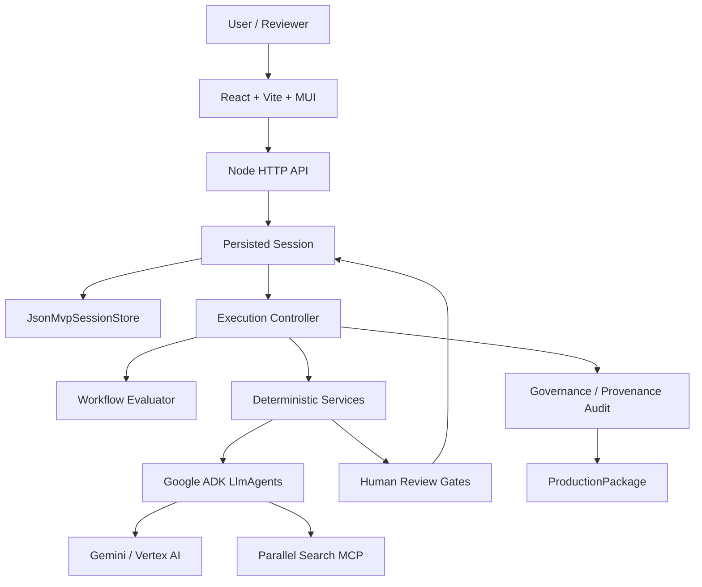

# Tital — Evidence-Governed Scientific Film Director

Tital turns a scientific-film idea into an auditable production package while preserving scientific provenance, uncertainty, visual-integrity constraints, and explicit human review from research through script, scenes, shots, and visual decisions.

> **Evidence → Story, not Story → Evidence.**

Tital is **not** a generic video generator and **not** a general-purpose research chatbot. Its job is to make scientific filmmaking decisions traceable.

The product's North Star is:

> **A filmmaker should be able to ask, “Why are we saying or showing this?” and receive a traceable answer through sources, evidence, claims, script, and visual decisions.**

## Current Status

Tital now has a complete local governed web vertical slice.

Implemented and live-validated:

- React / TypeScript / Vite / MUI web UI.
- Small Node HTTP API around existing governed session/application services.
- Local persisted project sessions across restarts.
- Google ADK + Gemini / Vertex AI proposal generation.
- Real Parallel Search MCP source discovery.
- Explicit human approve/reject gates.
- Rejection-aware coverage recovery.
- Approved provenance-connected progression.
- Deterministic governance/provenance audit.
- Deterministic final `ProductionPackage`.
- Human-readable final results.
- Provenance / traceability view.
- JSON export for machines/downstream workflows.
- Human-readable text export.
- Styled A4 print/save-PDF report.

The minimal web UI milestone was completed in PR #10.

The next major milestone is **Cloud Deployment Foundation**: hosted UI/API, durable cloud sessions, deployed Gemini/Vertex AI + Parallel MCP validation, and one hosted end-to-end run.

See [Current Status](./docs/CURRENT_STATUS.md), [Roadmap](./docs/ROADMAP.md), and [Post-MVP Review](./docs/POST_MVP_REVIEW.md).

## Product Workflow

User-facing phases:

```text
1. DEFINE
2. RESEARCH & VERIFY
3. DEVELOP
4. DIRECT
5. AUDIT & PACKAGE
```

Implemented record chain:

```text
FilmBrief
→ ResearchQuestion
→ SourceRecord
→ EvidenceRecord
→ ClaimRecord
→ ScriptLineRecord
→ SceneRecord
→ ShotRecord
→ VisualDecisionRecord
→ Governance / provenance audit
→ ProductionPackage
```

Execution stages:

```text
DEFINE
→ RESEARCH
→ EVIDENCE
→ CLAIMS
→ SCRIPT
→ SCENES
→ SHOTS
→ VISUAL_DECISIONS
→ AUDIT
→ PACKAGE
→ COMPLETE
```

## Core Governance Contract

Tital separates model creativity from application trust:

```text
Model proposes content
→ service validates proposal
→ application assigns trusted IDs / provenance / status
→ human reviews
→ workflow evaluates approved coverage
→ next stage becomes eligible
```

Important invariants:

- Models do not approve their own output.
- Application code owns trusted IDs and provenance links.
- Rejected records remain persisted as history.
- Workflow progression depends on approved provenance-connected coverage, not arbitrary record counts.
- Audit and final package construction are deterministic application services.
- JSON is canonical for machines; human-facing UI and reports use readable structured content.

## Architecture



The web/API layer is an adapter around the existing governed services. It does not duplicate workflow rules in React.

### Main repository layout

```text
.
├─ apps/
│  └─ web/                  # React/Vite/MUI UI
├─ src/
│  ├─ agents/               # specialized ADK LlmAgents
│  ├─ api/                  # small Node HTTP adapter
│  ├─ cli/                  # developer/session CLI
│  ├─ domain/               # Zod domain/proposal schemas
│  ├─ integrations/         # Parallel MCP integration
│  ├─ persistence/          # local persisted session store
│  ├─ services/             # deterministic workflow/application services
│  └─ utils/
├─ tests/
├─ docs/
├─ agent.ts
├─ parallel-agent.ts
├─ package.json
└─ tsconfig.json
```

## Implemented Agents

Tital uses specialized Google ADK `LlmAgent` proposal generators:

| Agent | Responsibility | External tool use |
|---|---|---|
| `defineAgent` | raw idea → structured FilmBrief proposal | Gemini |
| `researchQuestionAgent` | approved brief → research questions | Gemini |
| `parallelSourceAgent` | approved question → public-web sources | Gemini + Parallel Search MCP |
| `evidenceExtractionAgent` | approved source/question → Evidence proposals | Gemini |
| `claimGenerationAgent` | approved Evidence → Claims | Gemini |
| `scientificScriptAgent` | approved Claims → ScriptLines | Gemini |
| `sceneDirectorAgent` | approved ScriptLines → Scenes | Gemini |
| `shotDirectorAgent` | approved Scenes → Shots | Gemini |
| `visualDecisionAgent` | approved Shots → governed VisualDecisions | Gemini |

The audit and ProductionPackage builder are intentionally not LLM agents.

See [Agent Architecture](./docs/architecture/agent-architecture.md).

## Parallel MCP Integration

Tital uses a real ADK `MCPToolset` connected to:

```text
https://search.parallel.ai/mcp
```

`parallelSourceAgent` is instructed to call Parallel `web_search` before returning source candidates and not to invent URLs, excerpts, dates, or provider IDs.

Current important limitation:

```text
source discovery
≠
full source verification
```

Evidence extraction currently operates on approved `SourceRecord` excerpts. A post-MVP priority is controlled approved-source content retrieval before Evidence extraction.

## Human Review and Coverage

Between automated stages, Tital stops for explicit human decisions.

The workflow does not use a simple global threshold such as "20 approved Evidence records".

Instead it checks approved provenance-connected coverage. For example:

```text
every approved ResearchQuestion needs approved Source coverage
every approved Source needs approved Evidence coverage
every approved ResearchQuestion needs approved Claim coverage
every approved Scene needs approved Shot coverage
every approved Shot needs approved VisualDecision coverage
```

If a reviewer rejects generated children and a parent becomes uncovered, `Continue` can generate replacement proposals only for uncovered parents.

The web UI shows these coverage ratios directly.

## Audit Scope

The implemented deterministic audit checks governance/provenance conditions including repository-defined issue types such as:

```text
BROKEN_PROVENANCE
UNAPPROVED_UPSTREAM_RECORD
UNSUPPORTED_CLAIM
VISUAL_CATEGORY_MISMATCH
MISSING_VISUAL_DISCLOSURE
```

Human-facing output describes this as a **Governance & provenance audit**.

It does **not** independently prove the scientific truth, source authority, or expert quality of every human-approved record.

Future high-value rules include:

```text
UNCERTAINTY_DROPPED
SCIENTIFIC_CONSTRAINT_VIOLATION
```

## Live End-to-End Validation

### Europa — first complete persisted MVP

On **2026-08-15**, Tital completed its first persisted human-governed workflow using the evidence for Europa's subsurface ocean.

This CLI-driven run validated real Gemini/Vertex execution, real Parallel MCP source discovery, review gates, rejection-aware workflow behavior, deterministic audit, and final package construction.

See [MVP End-to-End Validation](./docs/MVP_E2E_VALIDATION.md).

### Black-hole film — complete web UI run

On **2026-08-16**, the React web UI drove a complete second project:

> **Unveiling the Invisible: How We Know Black Holes Exist**

Approved final production-chain counts:

```text
Research Questions   4
Sources             18
Evidence            24
Claims              10
Script Lines        12
Scenes               8
Shots               14
Visual Decisions    14
```

The run exercised project creation, selective approve/reject, rejection recovery, coverage progression, final results, traceability, and JSON/text/PDF outputs.

It also exposed two model-ID echo defects that were fixed so trusted Shot `sceneId` and VisualDecision `shotId` are now application-owned.

The tested styled PDF was improved from 38 pages to 31 pages through pagination changes.

The Black-hole review decisions were intentionally used as product-flow test decisions, not as expert scientific peer review. Do not present that run as independent scientific validation of the approved content.

## Getting Started

### Prerequisites

- Node.js compatible with the current dependency set. Development has successfully used recent Node 22/24 versions.
- npm.
- Google Cloud SDK for live Vertex AI calls.
- Application Default Credentials (ADC) for live Google model execution.

### Install

```bash
npm install
```

### Vertex AI environment

Typical PowerShell development configuration:

```powershell
$env:GOOGLE_CLOUD_PROJECT="scientific-film-director-agent"
$env:GOOGLE_CLOUD_LOCATION="global"
$env:GOOGLE_GENAI_USE_VERTEXAI="true"
```

Authenticate ADC for live Vertex calls:

```bash
gcloud auth application-default login
```

`.env.example` is a reference. The repository does not currently implement one universal project-level dotenv loader; shell environment variables remain the safest explicit live-development path.

## Run the Web Application

Use two terminals.

### Terminal 1 — API

```bash
npm run api:dev
```

Default API:

```text
http://127.0.0.1:8787
```

Health endpoint:

```text
GET /api/health
```

### Terminal 2 — Web UI

```bash
npm run web:dev
```

Default web URL:

```text
http://127.0.0.1:5173/
```

The Vite development server proxies `/api` requests to the local API.

## Local Persistence

Default persisted session directory:

```text
.tital/sessions/
```

Each project is stored as a validated JSON session file.

This is an MVP/local development store, not a production cloud database.

## CLI Session Workflow

The CLI remains useful for development/debugging.

Start:

```bash
npm run mvp -- start "A short scientific film explaining the evidence for Europa's subsurface ocean"
```

List:

```bash
npm run mvp -- list
```

Status:

```bash
npm run mvp -- status <session-id>
```

Review all pending records at the current gate:

```bash
npm run mvp -- review <session-id> approve
npm run mvp -- review <session-id> reject
```

Review selected records:

```bash
npm run mvp -- review <session-id> approve <record-id-1> <record-id-2>
npm run mvp -- review <session-id> reject <record-id-3>
```

Continue:

```bash
npm run mvp -- continue <session-id>
```

Show the full session:

```bash
npm run mvp -- show <session-id>
```

Live continuation can consume Vertex AI / partner quota or credits.

## Validation

Normal local validation:

```bash
npm run typecheck
npm test
npm run web:build
```

The standard automated test suite is designed to avoid live paid model/tool calls.

## Current Limits

Not yet production-complete:

- no public hosted deployment;
- local JSON store instead of cloud-durable persistence;
- no authenticated project ownership/reviewer identity;
- no multi-user concurrency model;
- no general schema migration framework;
- no complete edit/replace + downstream staleness lifecycle;
- no dedicated full-content retrieval stage for every approved source;
- audit is governance/provenance integrity, not independent scientific peer review;
- no final video rendering engine.

These are post-MVP roadmap items, not missing parts of the already-demonstrated local governed vertical slice.

## Next Major Milestone

**Cloud Deployment Foundation**

Target:

```text
public hosted Tital URL
→ hosted web UI
→ hosted API
→ durable cloud sessions
→ deployed Gemini / Vertex AI
→ deployed Parallel MCP
→ one complete hosted E2E run
```

After deployment, the next scientific-strengthening priority is controlled approved-source full-content retrieval / verification before Evidence extraction.

See [Roadmap](./docs/ROADMAP.md).

## License

Apache-2.0. See [LICENSE](./LICENSE).
