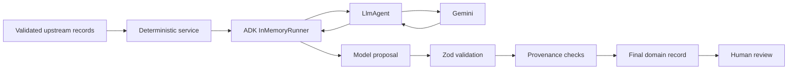
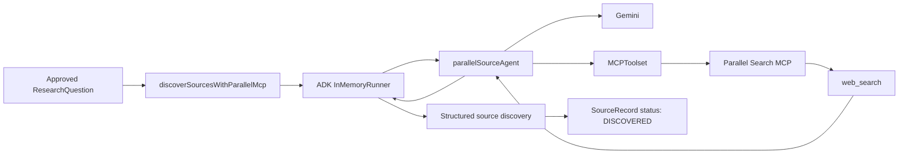

# Agent Architecture

Tital uses Google Agent Development Kit (ADK) `LlmAgent` instances as **specialized proposal generators** inside a deterministic application workflow. Agents do not own trusted workflow state. They generate structured scientific or creative proposals that application services validate, attach to provenance, and place behind human review gates.

## Implemented Agents

The current `src/agents/` directory contains these specialized agents:

| Agent | Main responsibility | External tool use |
|---|---|---|
| `defineAgent` | Convert a raw film idea into a structured scientific-film brief proposal | Gemini only |
| `researchQuestionAgent` | Derive research questions from the approved film brief | Gemini only |
| `parallelSourceAgent` | Discover public-web sources for an approved research question | Gemini + Parallel Search MCP |
| `evidenceExtractionAgent` | Propose evidence records from an approved source/question pair | Gemini only |
| `claimGenerationAgent` | Propose claims supported by approved evidence | Gemini only |
| `scientificScriptAgent` | Convert approved claims into evidence-governed script lines | Gemini only |
| `sceneDirectorAgent` | Propose scenes from approved script lines | Gemini only |
| `shotDirectorAgent` | Propose shots, camera direction, visual category, constraints, and uncertainty | Gemini only |
| `visualDecisionAgent` | Propose the governed visual treatment for an approved shot | Gemini only |

The scientific audit and production-package builder are intentionally **not LLM agents**. They are deterministic application services.

## Standard Agent Pattern

A typical agent is a narrowly instructed ADK `LlmAgent`:

```ts
export const defineAgent = new LlmAgent({
  name: 'define_agent',
  model: 'gemini-2.5-flash',
  description: 'Agent for defining a structured film brief from a raw idea.',
  instruction: `...`,
  outputSchema: ModelOutputBriefSchema,
});
```

`defineAgent` uses ADK's `outputSchema` directly. Other workflow stages may return JSON text that is parsed and checked by a Zod proposal schema at the service boundary. The important invariant is not that every agent is configured identically; it is that **unvalidated model text never becomes trusted domain state**.

## Agent → Service Boundary



The service, not the model, is responsible for application trust. Depending on the stage it can:

- validate upstream records and approval state;
- reject cross-question or cross-scene provenance mismatches;
- reject model-generated references to IDs that were not supplied;
- create application-owned IDs;
- assign record status;
- validate the final record schema;
- stop progression until human approval.

## How Agents Run

Most live model services use ADK's `InMemoryRunner` around a concrete agent. Conceptually:

```ts
const runner = new InMemoryRunner({ agent: someAgent });
const run = runner.runEphemeral({
  userId: 'system',
  newMessage: { parts: [{ text: prompt }] },
});

for await (const event of run) {
  responseText += stringifyContent(event);
}
```

The accumulated model response is then parsed and validated before it is accepted by application code.

`InMemoryRunner` here is an ADK execution harness. It does **not** mean that Tital currently has a persistent project database or durable workflow store.

## Parallel MCP Agent

`parallelSourceAgent` is architecturally different because its ADK agent is given an `MCPToolset` connected to Parallel Search:

```text
https://search.parallel.ai/mcp
```

The runtime path is:



The application preserves the real `providerSearchId` returned by the provider when present. It must never replace that field with an application-generated run ID.

## Proposal Schemas vs Domain Schemas

Tital deliberately separates model proposals from trusted application records in many stages.

Example conceptual pattern:

```text
Agent proposal
    ↓
Proposal Zod schema
    ↓
Application provenance validation
    ↓
Application-owned ID + status
    ↓
Final domain Zod schema
```

This makes the trust boundary explicit. A model can propose text, uncertainty, strength, visual direction, or references to supplied upstream IDs; the application determines whether those references are legal and creates the final record.

## Agent Design Rules

When adding an agent:

1. Give it one narrow workflow responsibility.
2. Supply only the upstream information it is allowed to use.
3. Require structured output.
4. Define or reuse a Zod proposal schema.
5. Validate the proposal in a deterministic service.
6. Never trust model-created application IDs or approval statuses.
7. Reject invented upstream references.
8. Preserve uncertainty rather than silently increasing confidence.
9. Keep human review outside the model.
10. Add unit tests with an injected/fake model caller before running live Vertex AI.

## What Agents Do Not Do

Agents do not currently:

- persist project state;
- write directly to a database;
- approve their own output;
- decide arbitrary workflow transitions;
- render final video;
- replace the deterministic scientific audit.

Those boundaries are central to Tital's evidence-governed design.
