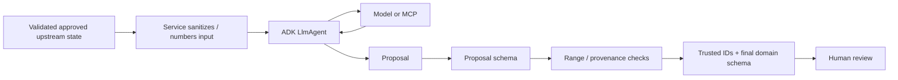

# Agent Architecture

Tital uses Google Agent Development Kit (ADK) `LlmAgent` instances as **specialized proposal generators** inside a deterministic application workflow. Agents do not own trusted workflow state. They generate structured scientific or creative proposals that application services validate, attach to trusted provenance, and place behind human review gates.

## Implemented agents

| Agent | Main responsibility | External tool use |
|---|---|---|
| `defineAgent` | Raw idea → FilmBrief proposal | Gemini |
| `researchQuestionAgent` | FilmBrief → Research Questions | Gemini |
| `parallelSourceAgent` | Discover public-web sources | Gemini + Parallel Search MCP |
| `evidenceExtractionAgent` | Approved source/question → Evidence proposals | Gemini |
| `claimGenerationAgent` | Approved evidence → Claims | Gemini |
| `scientificScriptAgent` | Approved claims → Script Lines | Gemini |
| `sceneDirectorAgent` | Approved script → Scenes | Gemini |
| `shotDirectorAgent` | Approved scene → Shots | Gemini |
| `visualDecisionAgent` | Approved shot → governed visual treatment | Gemini |

The governance/provenance audit and production-package builder are deterministic services, not LLM agents.

## Core trust rule

```text
Model proposes.
Application validates.
Application owns identity/provenance/status.
Human reviews.
Workflow progresses only when deterministic rules allow it.
```

A stronger reliability rule applies to upstream references:

> **Do not ask a model to echo trusted UUID-like record IDs when the application can provide numbered references instead.**

## Numbered-reference design

```text
approved records with trusted IDs
        ↓ application sanitizes
numbered model inputs: #1, #2, #3
        ↓
model proposal references [1, 3]
        ↓ deterministic range check
application maps [1, 3] → trusted IDs
        ↓
final domain record
```

Current mappings:

```text
Claim proposal        evidenceNumbers   → EvidenceRecord IDs
Script Line proposal  claimNumbers      → ClaimRecord IDs
Scene proposal        scriptLineNumbers → ScriptLineRecord IDs
Shot proposal         scriptLineNumbers → scene-local ScriptLineRecord IDs
```

For single-parent stages, the model does not return parent identity when application code can attach it directly.

## Standard service boundary



Services are responsible for validating upstream approval/provenance, sanitizing model context, parsing/validating output, mapping numbered references to trusted IDs, assigning application-owned identity/status, and preserving human review.

## Human director context for cinematic agents

`sceneDirectorAgent`, `shotDirectorAgent`, and `visualDecisionAgent` remain proposal generators. They receive optional application-supplied cinematic context derived from the project's `DirectorBrief`, project feedback that the director explicitly chose to remember, and—for a replacement retry—the current scoped instruction.

The prompt-level precedence rule is:

```text
1. approved science / provenance / uncertainty / visual-integrity constraints
2. approved production constraints
3. human Director Brief + explicitly remembered feedback + scoped director instruction
4. AI cinematic preference
```

This is important: director control does **not** mean the model may satisfy style by weakening scientific constraints.

The application, not the agent, adds `decisionProvenance` to Scene, Shot, and Visual Decision records. That provenance distinguishes AI recommendation from applied human guidance, including `learnedFeedbackCount`, without confusing recommendation origin with human approval.

### Explicit feedback memory

A retry instruction is one-off by default. The UI presents an off-by-default control to remember it. If selected, `resolveMvpReview` persists a `DirectorFeedback` record in the project session; later cinematic executors format those records as learned preferences. The current retry instruction is still passed separately so provenance can distinguish immediate guidance from prior feedback.

Remembered feedback is project-scoped, inspectable in the Director Context rail, capped by the domain schema, and removed when a completed session is promoted to the anonymous public demo. Tital does not implement a hidden cross-project Director Profile.

See [../DIRECTOR_CONTROL.md](../DIRECTOR_CONTROL.md).

## Retry is explicit, not autonomous self-correction

Rejected candidates are terminal history. Agents do not automatically regenerate because coverage became incomplete.

If a human explicitly chooses `RETRY`, `retryMvpCoverage` calls only the relevant stage/target and filters duplicates. Cinematic retries can receive the scoped director note that motivated the replacement.

If the human chooses `WAIVE`, no agent call is made for that gap; a `CoverageWaiver` records the intentional omission.

## Parallel MCP exception: partial external batches

Parallel source discovery is a tool-backed batch integration. One malformed candidate should not destroy otherwise valid provider results:

```text
validate response envelope
→ safe-parse each source candidate
→ discard malformed candidates with warning
→ preserve valid candidates
→ fail if no valid candidate remains
```

Tital does not fabricate missing source metadata.

## Bounded concurrency inside a stage

The workflow remains sequential **between dependent stages**, but independent agent/tool calls inside one stage can now run concurrently with a bounded worker pool.

Examples safe to parallelize after upstream approval:

```text
source discovery: Research Question A / B / C
Evidence extraction: Source A / B / C
Claims: RQ A / B / C
Scenes: RQ A / B / C
Shots: Scene A / B / C
Visual Decisions: Shot A / B / C
```

Results are combined in deterministic input order. Default external concurrency is conservative (`3`) and can be configured through `TITAL_EXTERNAL_CONCURRENCY` within `1..8`.

This does not make dependent stages parallel and does not bypass human gates.

## Lightweight runtime timing

Real runtime service calls can emit application timing operations such as:

```text
gemini.evidence_extraction
parallel.source_discovery
gemini.shot_generation
```

`advanceMvpSession` stores the relevant operation timings on the automation event. This is intended for real baseline measurement before further optimisation, not as a replacement for full distributed tracing.

External model operations now include non-secret runtime audit metadata: provider, ADK backend, model identifier, Google ADK, Vertex AI, Cloud Run service/revision, release SHA, and execution timestamp. Failed ADK/Vertex operations also record a safe failure category, provider error code when present, finish reason when present, and event count. Credentials, raw prompts, private bucket paths, and raw provider payloads are not persisted or rendered.

See [../PERFORMANCE.md](../PERFORMANCE.md).

## Error-handling rule

Use deterministic recovery only when the intended transformation is unambiguous:

- numbered reference → exact trusted ID: deterministic mapping;
- MEDIUM/HIGH visual disclosure missing: deterministic disclosure from governed context;
- malformed one-of-many external source candidate: discard while preserving valid candidates.

Fail closed when recovery would require guessing scientific meaning or provenance.

## Known live incidents that shaped the architecture

- model-echoed Shot `sceneId` mismatch → application assigns `sceneId`;
- model-echoed Visual Decision `shotId` mismatch → application assigns `shotId`;
- Parallel candidate with empty title aborted full batch → per-item validation/discard;
- Shot proposal referenced a ScriptLine ID not present in the Scene → numbered scene-local references;
- rejected Evidence regenerated with new IDs → first-attempt-only automatic generation;
- rejected Scene regenerated because required coverage disappeared → explicit Retry / Waive / Cancel coverage resolution;
- evidence uncertainty returned semantic-null strings → strict validation + legacy-load migration;
- MEDIUM/HIGH visual proposal omitted disclosure → deterministic disclosure fallback.

See [../AGENT_FAILURE_SCENARIOS_AND_RESILIENCE.md](../AGENT_FAILURE_SCENARIOS_AND_RESILIENCE.md).

## ADK execution pattern

Most stages run an `LlmAgent` through `InMemoryRunner`, inspect ADK response events for provider error metadata, accumulate textual content only after those checks, parse structured proposals, and validate them before trusted state is created. Durable project state is handled separately by Tital persistence.

If ADK emits an error event with no content, Tital no longer reports a generic empty JSON response. It classifies quota/billing, timeout, safety stop, authorization, and provider-runtime failures, records an `AUTOMATION_FAILED` session event, and leaves governed state unchanged so the same project can resume from the failed stage after the external blocker is fixed.

`defineAgent` uses ADK `outputSchema`. Other stages commonly parse JSON text through Zod proposal schemas. In every case, **unvalidated model text never becomes trusted application state**.

## Agent design rules

When adding or changing an agent:

1. Give it one narrow responsibility.
2. Supply only approved upstream information it is allowed to use.
3. Remove opaque trusted IDs from model context unless truly necessary.
4. For multi-parent selection, send numbered records and accept numbered references.
5. Require structured output and validate it with a proposal schema.
6. Range-check references deterministically.
7. Assign trusted IDs, provenance and statuses in application code.
8. Preserve uncertainty; never silently increase certainty.
9. Keep human review outside the model.
10. For cinematic agents, treat Director Brief, opted-in feedback, and scoped notes as guidance below scientific constraints.
11. Do not silently regenerate rejected content.
12. Turn every reproducible live failure into a regression test.
13. Preserve ADK/Vertex failure metadata without exposing prompts, credentials, or private infrastructure values.

## Research alignment

Google ADK structured output improves reliability but does not replace application-level trust/provenance enforcement. Tital therefore uses ADK for generation and deterministic application code for identity, governance and state transitions.

Official ADK TypeScript reference: https://adk.dev/api-reference/typescript/interfaces/LlmAgentConfig.html
