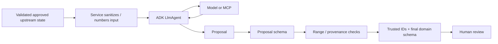

# Agent Architecture

Tital uses Google Agent Development Kit (ADK) `LlmAgent` instances as **specialized proposal generators** inside a deterministic application workflow. Agents do not own trusted workflow state. They generate structured scientific or creative proposals that application services validate, attach to trusted provenance, and place behind human review gates.

## Implemented agents

| Agent | Main responsibility | External tool use |
|---|---|---|
| `defineAgent` | Raw idea → FilmBrief proposal | Gemini |
| `researchQuestionAgent` | FilmBrief → Research Questions | Gemini |
| `parallelSourceAgent` | Discover public-web sources | Gemini + Parallel Search MCP |
| `evidenceExtractionAgent` | Approved source/question → Evidence proposals | Gemini |
| `claimGenerationAgent` | Approved evidence → Claims | Gemini |
| `scientificScriptAgent` | Approved claims → Script Lines | Gemini |
| `sceneDirectorAgent` | Approved script → Scenes | Gemini |
| `shotDirectorAgent` | Approved scene → Shots | Gemini |
| `visualDecisionAgent` | Approved shot → governed visual treatment | Gemini |

The governance/provenance audit and production-package builder are deterministic services, not LLM agents.

## Core trust rule

```text
Model proposes.
Application validates.
Application owns identity/provenance/status.
Human reviews.
Workflow progresses only when deterministic rules allow it.
```

A stronger reliability rule now applies to upstream references:

> **Do not ask a model to echo trusted UUID-like record IDs when the application can provide numbered references instead.**

This was adopted after live runs exposed one-character/invented-reference failures.

## Numbered-reference design

For multi-record model inputs, Tital now prefers:

```text
approved records with trusted IDs
        ↓ application sanitizes
numbered model inputs: #1, #2, #3
        ↓
model proposal references [1, 3]
        ↓ deterministic range check
application maps [1, 3] → trusted IDs
        ↓
final domain record
```

Current mappings:

```text
Claim proposal        evidenceNumbers   → EvidenceRecord IDs
Script Line proposal  claimNumbers      → ClaimRecord IDs
Scene proposal        scriptLineNumbers → ScriptLineRecord IDs
Shot proposal         scriptLineNumbers → scene-local ScriptLineRecord IDs
```

For single-parent stages, the model does not need to return the parent identity at all:

```text
EvidenceRecord       sourceId assigned by application
ResearchQuestion     filmBriefId assigned by application
ShotRecord           sceneId assigned by application
VisualDecisionRecord shotId assigned by application
```

ResearchQuestion/FilmBrief record IDs and all workflow statuses are also application-owned.

## Why this design exists

Models are good at semantic selection but should not be used as exact-copy machines for opaque application identifiers. A proposal such as `scriptLineNumbers: [2]` preserves the model's semantic choice while deterministic code owns the exact mapping to `SL-...`.

Out-of-range numbered references fail closed. The application never guesses a replacement ID.

## Standard service boundary



Services are responsible for:

- validating upstream schemas and approval state;
- ensuring same-question/same-scene provenance where required;
- rejecting duplicate or missing upstream records;
- sanitizing model context to remove trusted IDs when not needed;
- parsing JSON and validating proposal schemas;
- validating numbered-reference ranges;
- mapping numbered references to trusted IDs;
- assigning application-owned IDs/statuses;
- validating final domain records;
- preserving the human review gate.

## Parallel MCP exception: partial external batches

Parallel source discovery is a tool-backed batch integration. One malformed candidate should not destroy otherwise valid provider results.

Current handling:

```text
validate response envelope
→ safe-parse each source candidate
→ discard malformed candidates with warning
→ preserve valid candidates
→ fail if no valid candidate remains
```

Tital does not fabricate a missing source title, URL or excerpt.

## Error-handling rule

Use deterministic recovery only when the intended transformation is unambiguous:

- numbered reference → exact trusted ID: recover by deterministic mapping;
- MEDIUM/HIGH visual disclosure missing: derive deterministic disclosure from governed shot/category context;
- malformed one-of-many external source candidate: discard it while retaining valid candidates.

Fail closed when recovery would require guessing scientific meaning or provenance.

## Known live incidents that shaped the architecture

- model-echoed Shot `sceneId` mismatch → application assigns `sceneId`;
- model-echoed Visual Decision `shotId` mismatch → application assigns `shotId`;
- Parallel candidate with empty title aborted full batch → per-item validation/discard;
- Shot proposal referenced a ScriptLine ID not present in the Scene → numbered scene-local script-line references;
- evidence uncertainty returned semantic-null strings → strict new-record validation + legacy-load migration;
- MEDIUM/HIGH visual proposal omitted disclosure → deterministic disclosure fallback.

See [../AGENT_FAILURE_SCENARIOS_AND_RESILIENCE.md](../AGENT_FAILURE_SCENARIOS_AND_RESILIENCE.md) for the complete failure matrix.

## ADK execution pattern

Most stages run an `LlmAgent` through `InMemoryRunner`, accumulate response events, parse the returned structured proposal and validate it before trusted state is created.

`InMemoryRunner` is the agent execution harness; durable project state is handled separately by Tital persistence.

`defineAgent` uses ADK `outputSchema`. Other stages commonly parse JSON text through Zod proposal schemas. The invariant is the same: **unvalidated model text never becomes trusted application state**.

## Agent design rules

When adding or changing an agent:

1. Give it one narrow responsibility.
2. Supply only approved upstream information it is allowed to use.
3. Remove opaque trusted IDs from model context unless the model genuinely needs their semantic value (normally it does not).
4. For multi-parent selection, send numbered records and accept numbered references.
5. Require structured output and validate it with a proposal schema.
6. Range-check/model-reference selections deterministically.
7. Assign trusted IDs, provenance and statuses in application code.
8. Preserve uncertainty; never silently increase certainty.
9. Keep human review outside the model.
10. Turn every reproducible live failure into a regression test.

## Research alignment

Google ADK supports structured `outputSchema` for `LlmAgent`, but structured output does not replace application-level trust/provenance enforcement. Tital therefore uses ADK for generation and deterministic application code for identity, governance and state transitions.

Official ADK TypeScript reference: https://adk.dev/api-reference/typescript/interfaces/LlmAgentConfig.html
