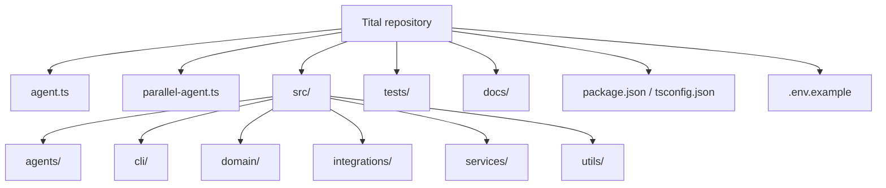
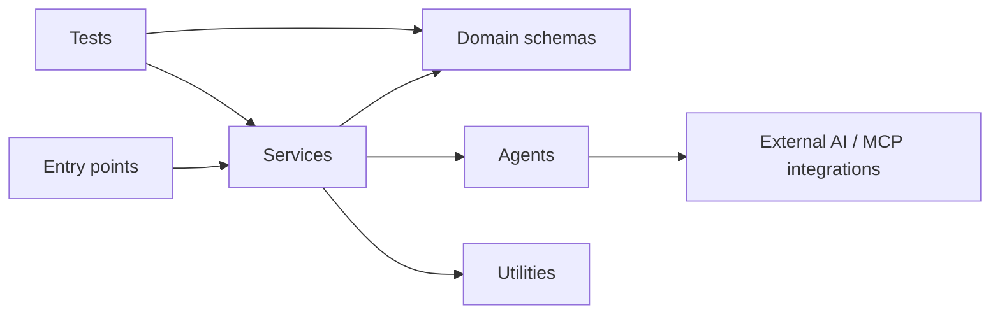

# Repository Structure

This document describes the tracked structure of the current Tital MVP and the responsibility of each major area.



## Root Files

### `agent.ts`

Baseline ADK root-agent entry point used by the ADK CLI harness.

### `parallel-agent.ts`

Entry point for running the Parallel-enabled source-discovery agent through the ADK tooling.

### `package.json`

Defines dependencies and current scripts such as:

```text
adk:run
parallel:run
define
research-questions
typecheck
test
```

### `.env.example`

Documents the expected Google Cloud / Vertex AI environment variables. It is a configuration reference; the repository should not be assumed to contain a custom `.env` loader unless one is explicitly added.

## `src/agents/`

Contains specialized Google ADK `LlmAgent` definitions:

```text
claimGenerationAgent.ts
defineAgent.ts
evidenceExtractionAgent.ts
parallelSourceAgent.ts
researchQuestionAgent.ts
sceneDirectorAgent.ts
scientificScriptAgent.ts
shotDirectorAgent.ts
visualDecisionAgent.ts
```

Agents propose structured content. They do not own trusted application IDs, approval state, or workflow progression.

## `src/domain/`

Contains Zod schemas and TypeScript types for:

- final workflow records;
- model proposal payloads;
- scientific-audit structures;
- production-package structures;
- MVP workflow state/evaluation structures.

The domain layer is the schema-level source of truth for legal fields and legal status values.

## `src/services/`

Contains the core application logic. This is the most important layer for governance.

Major categories include:

### Generation / assembly services

```text
defineFilm
generateResearchQuestions
discoverSourcesWithParallelMcp
extractEvidence
generateClaims
generateScriptLines
generateScenes
generateShots
generateVisualDecision
```

These validate upstream state, call agents where necessary, validate model output, enforce provenance, create application-owned records, and assign statuses.

### Review services

Services such as `reviewClaim`, `reviewScriptLine`, `reviewScene`, `reviewShot`, and `reviewVisualDecision` implement explicit human-decision transitions for reviewable records.

### Workflow/orchestration services

```text
evaluateMvpWorkflow.ts
executeNextMvpStep.ts
createRealMvpStepExecutors.ts
```

These form the current function-based execution controller and its real runtime wiring.

### Deterministic integrity/finalization services

```text
runScientificAudit.ts
buildProductionPackage.ts
```

These are intentionally deterministic rather than LLM agents.

## `src/integrations/`

Contains external integration configuration. The current important integration is Parallel Search MCP, which is provided to the source-discovery agent through ADK's MCP tooling.

## `src/cli/`

Contains current command-line entry points for selected workflow steps. The CLI is useful for direct development and runtime smoke tests, but it is not yet a persistent end-to-end project UI.

## `src/utils/`

Contains shared utilities such as model-response JSON parsing. Shared parsing prevents every service from implementing its own inconsistent handling of raw/fenced model JSON.

## `tests/`

Mirrors the domain and service architecture with unit tests for:

- schema validation;
- provenance constraints;
- human-review gates;
- proposal parsing;
- injected model callers;
- Parallel discovery assembly;
- scientific audit;
- production packaging;
- workflow evaluation;
- execution control;
- real executor wiring without live calls.

Tests should prefer dependency injection and deterministic fixtures so normal development does not require paid Vertex AI execution.

## `docs/`

Documentation is grouped by purpose:

```text
docs/
├─ overview/
├─ architecture/
├─ domain/
├─ execution/
├─ development/
└─ diagrams/
```

## Dependency Direction

The intended dependency direction is approximately:



Domain schemas should remain independent of agent execution. Agents should not become owners of workflow state. External integrations should remain behind agent/service boundaries.

## Files Not Shown as Architecture

Local/generated directories such as `.git/` and `node_modules/` are not part of Tital's application architecture and are intentionally omitted from this map.
