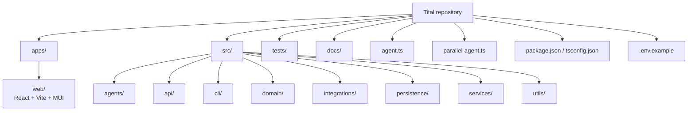
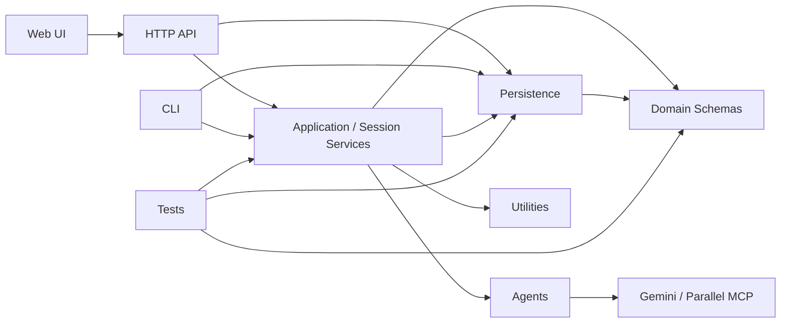

# Repository Structure

Status date: **2026-08-17**

This document describes the tracked structure of the current Tital governed web MVP and the responsibility of each major area.



## Root files

### `agent.ts`

Baseline ADK root-agent entry point used by the ADK CLI harness.

### `parallel-agent.ts`

Entry point for running the Parallel-enabled source-discovery agent through ADK tooling.

### `package.json`

Defines the current runtime/development dependencies and scripts, including:

```text
typecheck
typecheck:core
typecheck:web
test
web:dev
web:build
api:dev
mvp
adk:run
parallel:run
define
research-questions
```

### `.env.example`

Documents expected Google Cloud / Vertex AI environment variables. It is a configuration reference; the repository does not currently depend on one universal project-level dotenv loader.

## `apps/web/`

The human-facing React application.

Current responsibilities include:

- create a new scientific-film project;
- list/open persisted sessions;
- show current workflow state and next action;
- render readable pending records;
- selective approve/reject;
- run governed Continue actions through the API;
- show approved-chain progress/coverage;
- render final ProductionPackage content;
- show provenance/traceability;
- export JSON and readable text;
- open the styled print/save-PDF report.

The frontend consumes session/application views. It must not become the owner of workflow eligibility or scientific governance rules.

## `src/api/`

Contains the small Node HTTP adapter used by the web UI.

Current API routes include:

```text
GET  /api/health
GET  /api/sessions
POST /api/sessions
GET  /api/sessions/:id
POST /api/sessions/:id/review
POST /api/sessions/:id/continue
```

The API validates requests, loads/saves sessions, and calls existing governed services. It is intentionally thin.

## `src/agents/`

Contains specialized Google ADK `LlmAgent` definitions.

Agents propose structured scientific/creative content; they do not own trusted application IDs, approval state, or workflow progression.

Current agents cover:

```text
Define
Research Questions
Parallel Source Discovery
Evidence
Claims
Scientific Script
Scenes
Shots
Visual Decisions
```

## `src/domain/`

Contains Zod schemas and TypeScript types for:

- final governed records;
- model proposal payloads;
- audit structures;
- production-package structures;
- MVP workflow state;
- persisted session/event structures.

The domain layer is the schema-level source of truth for legal fields and status values.

## `src/services/`

Contains core application logic.

### Generation / assembly services

```text
defineFilm
generateResearchQuestions
discoverSourcesWithParallelMcp
extractEvidence
generateClaims
generateScriptLines
generateScenes
generateShots
generateVisualDecision
```

These validate upstream state, call agents where necessary, validate model output, enforce provenance, create application-owned records, and assign statuses.

### Review / session services

Examples:

```text
reviewCurrentMvpGate.ts
reviewMvpSession.ts
createMvpSession.ts
advanceMvpSession.ts
getMvpSessionView.ts
summarizeMvpSession.ts
getMvpWorkflowInsights.ts
```

These connect explicit human decisions to the persisted workflow and provide UI/API-facing read models.

### Workflow / orchestration services

```text
mvpWorkflowGuards.ts
evaluateMvpWorkflow.ts
executeNextMvpStep.ts
createRealMvpStepExecutors.ts
```

These implement coverage/provenance rules, stage evaluation, deterministic execution control, and real runtime wiring.

### Deterministic integrity / finalization services

```text
runScientificAudit.ts
buildProductionPackage.ts
selectApprovedProductionChain.ts
```

These are application-owned deterministic services rather than LLM agents.

## `src/persistence/`

Contains the current local MVP persistence adapter:

```text
jsonMvpSessionStore.ts
```

Default location:

```text
.tital/sessions/<session-id>.json
```

The store validates sessions on read/write and uses temporary-write + rename behavior. It is not yet a cloud database implementation.

## `src/integrations/`

Contains external integration configuration.

The current important partner integration is Parallel Search MCP, provided to `parallelSourceAgent` through ADK's MCP tooling.

## `src/cli/`

Contains direct/developer workflow commands.

`mvp.ts` supports persisted-session operations such as:

```text
start
status
continue
review
show
list
```

The CLI remains useful for debugging and scripted inspection even though the primary demonstrated product flow is now the web UI.

## `src/utils/`

Contains shared utilities such as model-response JSON parsing.

## `tests/`

Tests cover areas including:

- schema validation;
- proposal parsing;
- provenance constraints;
- human-review transitions;
- coverage-based progression;
- rejection recovery;
- agent/service assembly with injected callers;
- Parallel discovery assembly;
- audit behavior;
- production packaging;
- session persistence and migration;
- execution control;
- real executor wiring;
- Shot / VisualDecision trusted parent-ID behavior;
- workflow insights used by the UI.

Normal tests should remain deterministic and avoid paid/live Vertex AI or Parallel calls.

## `docs/`

Documentation is grouped by purpose:

```text
docs/
├─ CURRENT_STATUS.md
├─ ROADMAP.md
├─ PROJECT_HANDOFF.md
├─ MVP_E2E_VALIDATION.md
├─ POST_MVP_REVIEW.md
├─ overview/
├─ architecture/
├─ domain/
├─ execution/
├─ development/
└─ diagrams/
```

## Local runtime state

Local runtime/project data under `.tital/` is gitignored and is not tracked application source.

Build output under `apps/web/dist/` is generated output rather than source-of-truth application code.

## Dependency direction

The intended dependency direction is approximately:



Domain schemas should remain independent of agent execution. Agents should not own workflow state. The UI should not duplicate workflow governance. Persistence should remain an application boundary rather than leaking storage details into domain records.
