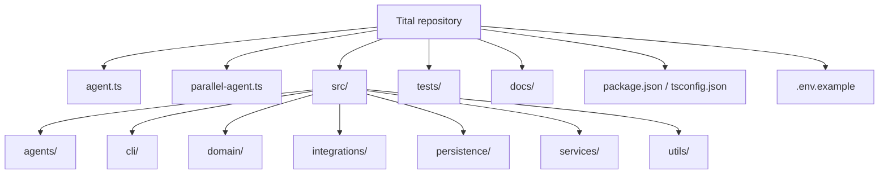
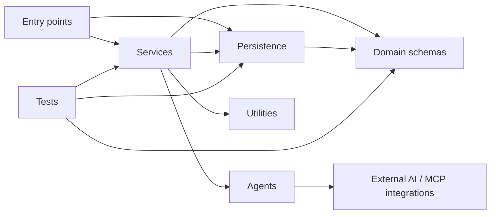

# Repository Structure

This document describes the tracked structure of the current Tital MVP and the responsibility of each major area.



## Root files

### `agent.ts`

Baseline ADK root-agent entry point used by the ADK CLI harness.

### `parallel-agent.ts`

Entry point for running the Parallel-enabled source-discovery agent through ADK tooling.

### `package.json`

Defines dependencies and scripts including:

```text
adk:run
parallel:run
define
research-questions
mvp
typecheck
test
```

### `.env.example`

Documents expected Google Cloud / Vertex AI environment variables. It is a configuration reference; the repository should not be assumed to contain a custom `.env` loader unless one is explicitly added.

## `src/agents/`

Contains specialized Google ADK `LlmAgent` definitions. Agents propose structured content; they do not own trusted application IDs, approval state, or workflow progression.

## `src/domain/`

Contains Zod schemas and TypeScript types for:

- final workflow records;
- model proposal payloads;
- scientific-audit structures;
- production-package structures;
- MVP workflow state;
- persisted MVP session/event structures.

The domain layer is the schema-level source of truth for legal fields and status values.

## `src/services/`

Contains core application logic.

### Generation / assembly services

```text
defineFilm
generateResearchQuestions
discoverSourcesWithParallelMcp
extractEvidence
generateClaims
generateScriptLines
generateScenes
generateShots
generateVisualDecision
```

These validate upstream state, call agents where necessary, validate model output, enforce provenance, create application-owned records, and assign statuses.

### Review services

Record-specific review services implement explicit transitions. The persisted workflow also adds:

```text
reviewCurrentMvpGate.ts
reviewMvpSession.ts
```

### Workflow/orchestration services

```text
mvpWorkflowGuards.ts
evaluateMvpWorkflow.ts
executeNextMvpStep.ts
createRealMvpStepExecutors.ts
createMvpSession.ts
advanceMvpSession.ts
summarizeMvpSession.ts
```

These form the function-based execution controller, provenance/coverage rules, real runtime wiring, and persisted session lifecycle.

### Deterministic integrity/finalization services

```text
runScientificAudit.ts
buildProductionPackage.ts
```

These are intentionally deterministic rather than LLM agents.

## `src/persistence/`

Contains the MVP persistence adapter:

```text
jsonMvpSessionStore.ts
```

The default local store writes schema-validated sessions to `.tital/sessions/` using temporary file + rename behavior. It is a local MVP store, not a production database abstraction.

## `src/integrations/`

Contains external integration configuration. The current important integration is Parallel Search MCP, which is provided to the source-discovery agent through ADK's MCP tooling.

## `src/cli/`

Contains command-line entry points for direct workflow operations. `mvp.ts` is the persisted governed-session interface and supports start/status/continue/review/show/list commands.

## `src/utils/`

Contains shared utilities such as model-response JSON parsing.

## `tests/`

Mirrors the domain and service architecture with unit tests for:

- schema validation;
- provenance constraints;
- human-review gates;
- proposal parsing;
- injected model callers;
- Parallel discovery assembly;
- scientific audit;
- production packaging;
- workflow evaluation/control;
- incremental real executor wiring;
- local session persistence;
- rejection recovery;
- provenance-connected coverage.

Tests should prefer dependency injection and deterministic fixtures so normal development does not require paid Vertex AI execution.

## `docs/`

Documentation is grouped by purpose:

```text
docs/
├─ CURRENT_STATUS.md
├─ ROADMAP.md
├─ overview/
├─ architecture/
├─ domain/
├─ execution/
├─ development/
└─ diagrams/
```

## Local runtime state

The default persisted session directory is:

```text
.tital/
```

It is gitignored and is not part of the tracked application architecture.

## Dependency direction

The intended dependency direction is approximately:



Domain schemas should remain independent of agent execution. Agents should not become owners of workflow state. Persistence should remain an application boundary rather than leaking file-system concerns into domain records.
