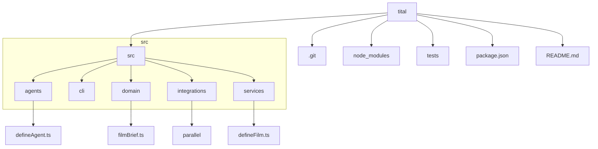

# Repository Structure

The Tital repository is organized into a modular structure that separates concerns between agents, domain models, services, and integrations.

## Top-Level Directories

-   **`.git`**: Git version control files.
-   **`node_modules`**: Third-party dependencies.
-   **`src`**: The main source code for the Tital application.
-   **`tests`**: Unit tests for the application.
-   **`package.json`**: Project metadata and dependencies.
-   **`README.md`**: The main entry point for new developers.

## `src` Directory

-   **`agents`**: Contains the `LlmAgent` definitions. Each agent is in its own file and is responsible for a single creative task.
-   **`cli`**: Contains the command-line interface for interacting with the Tital system.
-   **`domain`**: Contains the Zod schemas for all the data models in the system. This is the single source of truth for the shape of the data.
-   **`integrations`**: Contains the code for integrating with external systems, such as the Parallel Search MCP.
-   **`services`**: Contains the deterministic business logic that orchestrates the workflow. Each service is responsible for a single step in the workflow.
