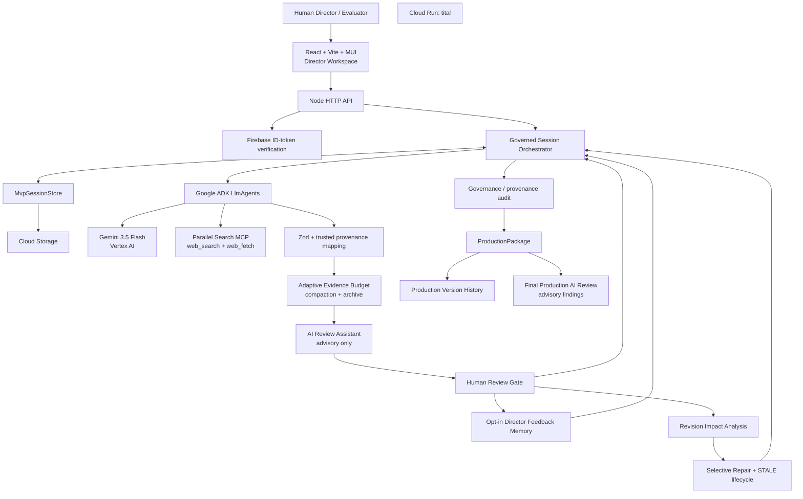

# System Architecture

Status date: **2026-08-24**

Tital is a hosted TypeScript/Node.js evidence-governed scientific-film application with a React Director Workspace, Node API, persisted project sessions, deterministic workflow control, specialized Google ADK agents, Gemini 3.5 Flash on Vertex AI, Parallel Search MCP discovery/full-source retrieval, Firebase authentication, Cloud Storage persistence, AI-assisted review, governed revision, and versioned production packages.

The architecture deliberately separates four kinds of authority:

```text
AI semantic proposal
≠ trusted application state
≠ human approval
≠ deterministic governance policy
```

## High-level architecture



## Human-facing web application

`apps/web/` provides:

- authenticated project creation/session selection;
- audience and production controls plus persistent Director Brief;
- readable human-review cards;
- AI-assisted Source/Evidence review with attention levels and recommendation reasons;
- adaptive Evidence Budget visibility: research candidates vs active review vs archive;
- selective approve/reject and explicit retry/waiver recovery;
- full-source grounding visibility;
- final Production Package inspection and export;
- AI-assisted final-package review;
- governed revision impact preview and selective repair;
- package version/history comparison;
- performance/runtime diagnostics;
- detached public read-only demo.

The frontend renders application decisions; it does not reimplement trusted workflow eligibility.

## HTTP API

`src/api/server.ts` exposes public health/config/demo routes and authenticated session routes for project creation, review, AI review assistance, continuation, revision preview/application/repair, and final production review through the shared review-assist endpoint.

Representative routes:

```text
GET  /api/health
GET  /api/public/config
GET  /api/public/demo
GET  /api/sessions
POST /api/sessions
GET  /api/sessions/:id
POST /api/sessions/:id/review
POST /api/sessions/:id/review-assist
POST /api/sessions/:id/continue
POST /api/sessions/:id/revisions/preview
POST /api/sessions/:id/revisions/apply
POST /api/sessions/:id/revisions/:revisionId/repair
```

Transport validates requests and invokes governed services; workflow policy remains in domain/application code.

## Authentication and persistence

Firebase Email/Password sign-in creates an ID token. Firebase Admin verifies it on protected API requests and the decoded `uid` selects a user-specific Cloud Storage namespace.

Conceptually:

```text
gs://<private-bucket>/<prefix>/users/<firebase-uid>/<session-id>.json
```

`MvpSession` now preserves more than a chat transcript:

```text
raw idea + projectInput + DirectorBrief
workflow records and status history
DirectorFeedback chosen explicitly for reuse
AI ReviewRecommendations
CoverageWaivers
RevisionRequests
ProductionReviews
ProductionVersions
performance/runtime events
audit and current ProductionPackage
```

No general optimistic locking exists yet, so concurrent mutation of the same session remains a production-hardening item.

## Research and Evidence architecture

### Discovery

```text
approved ResearchQuestion
→ Google ADK Source Agent
→ Parallel web_search
→ SourceRecord DISCOVERED
→ AI review assistance (optional)
→ human Source decision
```

### Full-source grounding

An approved Source does not feed discovery snippets directly into production Evidence. The Evidence Agent must call Parallel `web_fetch` on the exact approved URL.

```text
SourceRecord APPROVED
→ exact-URL Parallel web_fetch
→ compact full-source Evidence proposals
→ application grounding metadata
```

New full-source Evidence records carry `PARALLEL_WEB_FETCH`, provider, source URL, fetch timestamp, and `discoveryExcerptUsedAsGrounding: false`.

### Adaptive Evidence Budget

Full-source research breadth and human production review are separate concerns.

```text
Candidate Evidence Pool
→ deterministic duration/RQ-priority budget
→ source-diversity + strength + duplicate reduction
→ REVIEW_REQUIRED active subset
→ ARCHIVED_CANDIDATE preserved remainder
```

The archive is retained in project state but cannot enter the trusted production chain unless a future explicit promotion policy is added. AI Evidence review runs on the active subset only.

Current 5-minute automatic baseline is 24 active Evidence records. See [../ADAPTIVE_EVIDENCE_BUDGET.md](../ADAPTIVE_EVIDENCE_BUDGET.md).

## Agent layer

Implemented model/tool-assisted roles include:

```text
FilmBrief generation
Research Question generation
Source discovery via Parallel web_search
Full-source Evidence extraction via Parallel web_fetch
Source/Evidence Review Evaluator
Claim generation
Scientific Script generation
Scene direction
Shot direction
Visual Decision generation
Final Production Review
```

These are proposal/evaluation roles. Trusted IDs, statuses, coverage rules, Evidence compaction, revision impact, staleness, audit, package construction, and package versioning are application-owned.

## Human authority layer

The central trust path is:

```text
model/tool semantic output
→ schema/provenance validation
→ application-owned identity/status
→ optional AI recommendation
→ human decision
→ deterministic coverage eligibility
```

AI review never changes trusted approval status.

Director cinematic guidance is also explicitly lower precedence than science:

```text
approved science / provenance / uncertainty / visual-integrity constraints
> approved production constraints
> Director Brief + explicitly remembered feedback + scoped instruction
> AI cinematic preference
```

## Revision architecture

A production package is a versioned milestone rather than an immutable dead end.

```text
READY_FOR_PRODUCTION v1
→ RevisionRequest
→ deterministic impact preview
→ human applies revision
→ affected descendants become STALE
→ audit/current package invalidated
→ selective repair
→ human re-review
→ re-audit
→ READY_FOR_PRODUCTION v2
```

A Source revocation can invalidate dependent Evidence/Claim/Script/Scene/Shot/Visual records. A Shot revision should not invalidate unrelated scientific research. Old records remain history rather than being overwritten.

## Final Production AI Review

After `READY_FOR_PRODUCTION`, a separate Gemini review may inspect the whole package for semantic concerns such as scientific fidelity, uncertainty propagation, narrative/pacing, audience fit, visual-integrity risk, and Director Brief conflicts.

Its findings are advisory. The director decides whether any finding becomes a governed revision.

## Performance and serving architecture

True stage dependencies remain sequential, while independent calls inside an authorized stage may use bounded concurrency.

General external work defaults to:

```text
TITAL_EXTERNAL_CONCURRENCY=3
```

Full-source Evidence extraction uses a separate conservative default:

```text
TITAL_EVIDENCE_CONCURRENCY=1
```

because each approved Source now causes a Gemini turn plus a Parallel `web_fetch` tool call.

Transient provider rate limits receive bounded retry/backoff. Billing/auth/safety/schema/provenance failures fail closed rather than being blindly retried.

Cloud Run HTTP request concurrency is a separate concern from model-call concurrency. The deployment allows enough HTTP serving capacity for UI/read/health requests during long agent operations while maintaining a small max-instance cost guard.

See [../PERFORMANCE.md](../PERFORMANCE.md).

## Audit boundary

The deterministic Governance & Provenance Audit checks implemented structural integrity, trusted-chain membership, visual category/disclosure rules, and package readiness. It does **not** independently prove scientific truth or certify source authority.

Full-source retrieval improves grounding but does not turn the audit into peer review.

## Public demo boundary

A public demo is a detached, sanitized, read-only snapshot derived from a completed production package. It is not a direct view into the authenticated user's mutable session or feedback/revision history.

## Current production limitations

Implemented foundations are substantial, but current limits still include:

```text
optimistic locking for concurrent session mutation
general schema migration/version protocol
explicit archive-browser / archived-Evidence promotion UX
source-content caching and coverage-aware early stopping
independent scientific peer-review/source-authority verification
final video rendering
```

The architecture intentionally keeps those limits separate from claims already supported by the running system.
