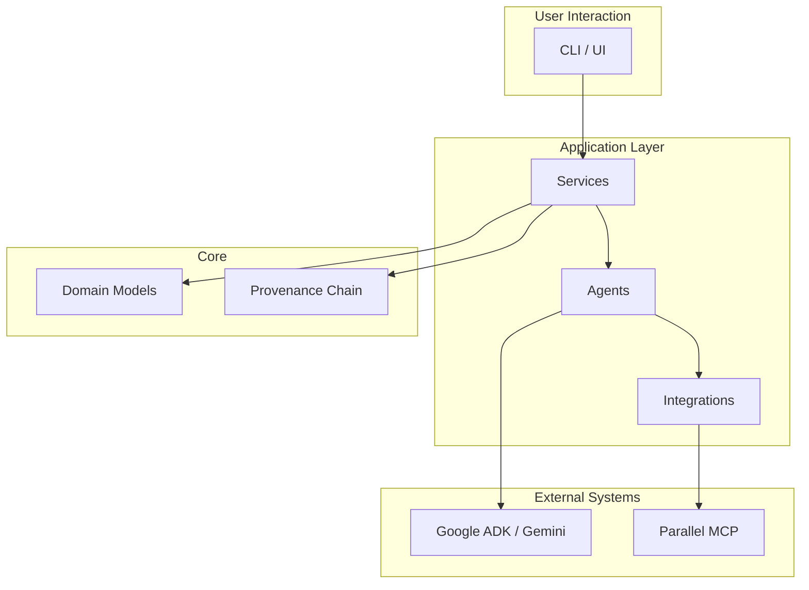

# System Architecture

The Tital system is designed as a modular, layered architecture that separates concerns between agentic capabilities, deterministic business logic, and data persistence.

## Layers

### User Interaction Layer

This is the entry point for users to interact with the Tital system. In the current MVP, this is primarily a command-line interface (CLI).

### Application Layer

This layer contains the core logic of the application.

-   **Services:** Deterministic, stateless functions that orchestrate the workflow. They are responsible for calling agents, validating their output, and assembling the final domain models.
-   **Agents:** AI-powered components built with the Google Agent Development Kit (ADK). They are responsible for creative tasks like generating ideas, writing script lines, and making visual decisions.
-   **Integrations:** Modules that connect to external systems, such as the Parallel Search MCP for evidence gathering.

### Core Layer

This layer defines the data structures and the governance model of the system.

-   **Domain Models:** Zod schemas that define the shape and validation rules for all data in the system.
-   **Provenance Chain:** The ordered sequence of domain models that represents the complete, auditable history of a film's creation.

### External Systems

These are the third-party systems that Tital integrates with.

-   **Google ADK / Gemini:** The framework and language models used to build and run the agents.
-   **Parallel MCP:** A remote tool server used for evidence gathering (e.g., web searches).
