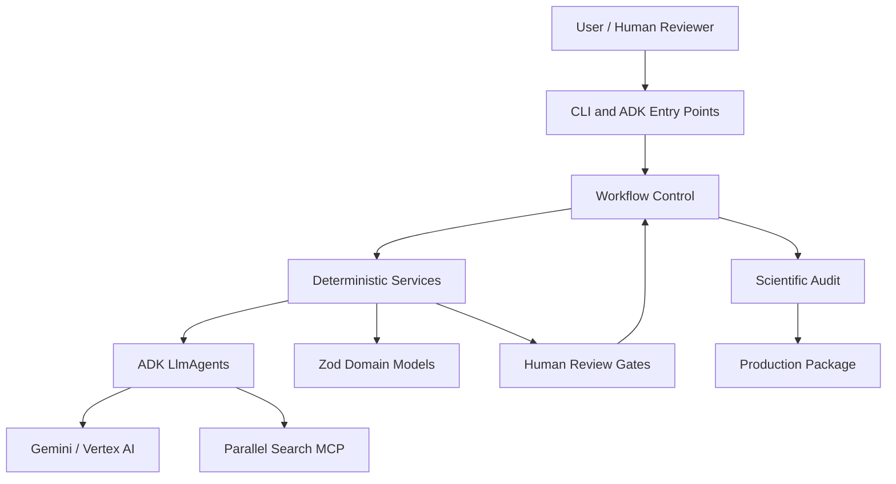
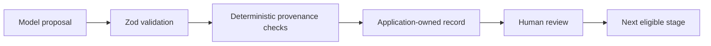

# System Architecture

Tital is currently a TypeScript/Node.js MVP organized around a governed scientific-production pipeline. The architecture deliberately separates model creativity from application trust and workflow control.

There is **no production frontend or persistent database yet**. The current executable surfaces are CLI/ADK-oriented, and workflow state is represented by strongly typed in-memory objects.

## High-Level Architecture



## Architectural Layers

### 1. Entry Points

Current entry points include:

- `agent.ts` for the baseline ADK root-agent harness;
- `parallel-agent.ts` for the Parallel-enabled ADK harness;
- CLI scripts under `src/cli/`, including the Define and research-question flows.

A web UI is a future application layer, not an implemented component of the current branch.

### 2. Workflow Control

Workflow control is deterministic and function-based.

Key modules:

```text
src/services/evaluateMvpWorkflow.ts
src/services/executeNextMvpStep.ts
src/services/createRealMvpStepExecutors.ts
```

Responsibilities are split as follows:

- `evaluateMvpWorkflow` inspects `MvpWorkflowState` and determines the current stage/next legal action.
- `executeNextMvpStep` is the execution controller. It executes one allowed automation step, stops at a human gate, runs the audit when eligible, or reports completion.
- `createRealMvpStepExecutors` wires the controller interface to the real Tital services.

This layer does not delegate workflow governance to Gemini.

### 3. Deterministic Service Layer

Services under `src/services/` own application trust. Depending on the stage, they:

- validate upstream domain records;
- enforce `APPROVED` requirements;
- verify provenance relationships;
- invoke an ADK agent where model reasoning is needed;
- parse and validate structured model output;
- reject invented or illegal upstream IDs;
- generate application-owned IDs;
- set application-owned statuses;
- validate final records;
- perform human-review transitions;
- run the deterministic scientific audit;
- build the deterministic production package.

### 4. Agent Layer

Agents under `src/agents/` are specialized `LlmAgent` instances. Their role is to propose scientific or creative content, not to control trusted workflow state.

Implemented model-assisted stages include:

```text
Define
Research Questions
Source Discovery
Evidence
Claims
Scientific Script
Scenes
Shots
Visual Decisions
```

Scientific audit and package construction are deterministic services rather than LLM agents.

### 5. Domain Layer

`src/domain/` contains Zod schemas and TypeScript types for the governed records. These schemas define legal field shapes and status values.

The main provenance chain is:

```text
FilmBrief
→ ResearchQuestion
→ SourceRecord
→ EvidenceRecord
→ ClaimRecord
→ ScriptLineRecord
→ SceneRecord
→ ShotRecord
→ VisualDecisionRecord
→ ScientificAuditReport
→ ProductionPackage
```

Status enums are model-specific. For example, `SourceRecord` includes `DISCOVERED` and is initially created in that state by Parallel source discovery.

### 6. External Runtime Layer

Tital currently integrates with two important external systems:

**Google ADK / Gemini / Vertex AI**

Used for model-assisted proposal generation. Services generally execute agents using ADK's `InMemoryRunner`.

**Parallel Search MCP**

Used by `parallelSourceAgent` through an ADK `MCPToolset` at:

```text
https://search.parallel.ai/mcp
```

The source-discovery service preserves provider provenance, including the actual `providerSearchId` when one is returned.

## Trust Boundary

The most important architectural boundary is:



The model may propose content. It does not independently decide that its output is scientifically approved.

## Current State Management

The MVP does not yet have a database or durable project store. `MvpWorkflowState` aggregates the records needed by the workflow controller in memory.

This is sufficient to prove governance, orchestration, agent/runtime integration, audit, and package construction, but persistence is still future work.

## Current System Boundary

Implemented today:

```text
CLI / ADK harnesses
+ domain contracts
+ agent services
+ Parallel MCP integration
+ human review functions
+ workflow evaluator
+ execution controller
+ real executor wiring
+ scientific audit
+ production package builder
```

Not implemented as production application layers yet:

```text
web UI
persistent database / project store
authentication / multi-user review queues
notifications
final video rendering
one persisted end-to-end CLI/application session
```

These distinctions are important when describing the current MVP accurately.
