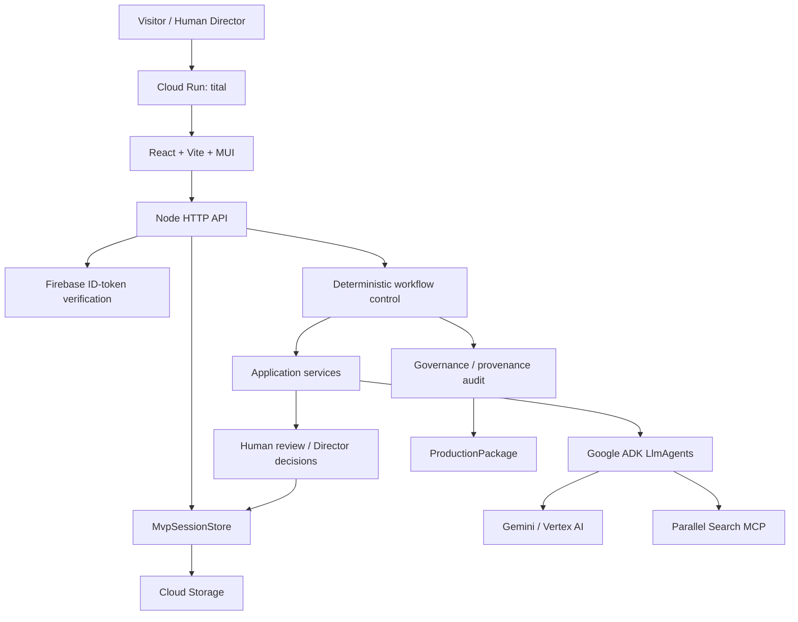
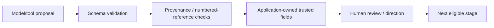

# System Architecture

Status date: **2026-08-20**

Tital is a hosted TypeScript/Node.js evidence-governed scientific-film application with a React UI, Node HTTP API, persisted project sessions, deterministic workflow control, specialized Google ADK agents, Gemini/Vertex AI execution, Parallel Search MCP source discovery, Firebase authentication, and Cloud Storage persistence.

The architecture separates model creativity from application trust, human artistic authority, and workflow control.

## High-level architecture



## Human-facing web application

`apps/web/` provides:

- authenticated project creation/session selection;
- project/audience/production controls;
- project-level Director Brief controls;
- readable human-review cards;
- selective approve/reject;
- coverage-aware Retry / Waive / Cancel recovery;
- governed Continue actions;
- workflow/coverage views;
- final ProductionPackage inspection and exports;
- public landing/read-only demo shell.

The frontend does not reimplement workflow eligibility rules.

## HTTP API

`src/api/server.ts` exposes public health/config/demo routes and authenticated session routes:

```text
GET  /api/health
GET  /api/public/config
GET  /api/public/demo
GET  /api/sessions
POST /api/sessions
GET  /api/sessions/:id
POST /api/sessions/:id/review
POST /api/sessions/:id/continue
```

The API validates payloads, authenticates protected requests, loads/saves the appropriate store, and calls governed application services. Workflow policy remains outside the transport layer.

## Authentication and session isolation

Firebase Email/Password sign-in produces an ID token. The backend verifies it with Firebase Admin. Decoded `uid` selects a user-specific session-store prefix.

Conceptual hosted layout:

```text
gs://<bucket>/<prefix>/users/<firebase-uid>/<session-id>.json
```

The Cloud Run endpoint can remain public at the network layer while live `/api/sessions*` behavior is application-authenticated.

## Session persistence

`MvpSession` preserves:

```text
raw idea
projectInput (+ optional DirectorBrief)
workflow state
approved/rejected history
CoverageWaivers
audit/package state
event history
optional performance traces
```

Local development can use `JsonMvpSessionStore`; hosted operation uses `CloudStorageMvpSessionStore` when configured.

No optimistic locking exists yet, so concurrent mutation of the same session remains a known limitation.

## Workflow control

Key deterministic modules:

```text
src/services/evaluateMvpWorkflow.ts
src/services/executeNextMvpStep.ts
src/services/createRealMvpStepExecutors.ts
src/services/advanceMvpSession.ts
src/services/resolveMvpReview.ts
src/services/retryMvpCoverage.ts
```

Responsibilities include stage evaluation, coverage evaluation, explicit rejection recovery, bounded execution, audit invalidation, and final package progression.

## Deterministic service boundary

```text
model/tool proposal
→ structured validation
→ deterministic provenance/reference checks
→ application-owned ID/status/parent mapping
→ optional application-owned cinematic provenance
→ human review
```

Rejected content is historical state, not authorization for automatic regeneration.

## Agent layer

Implemented model/tool-assisted stages:

```text
FilmBrief
Research Questions
Source Discovery
Evidence
Claims
Scientific Script
Scenes
Shots
Visual Decisions
```

Audit and ProductionPackage construction are deterministic, not LLM-driven.

Cinematic agents can consume a project Director Brief and scoped replacement instruction. Scientific constraints have higher precedence than style guidance.

## Director-control layer

Human cinematic direction is intentionally represented separately from scientific truth.

```text
approved science
→ scientific / uncertainty / representation constraints
→ project Director Brief
→ optional scoped director instruction
→ AI cinematic proposal
→ human approval/rejection
```

New Scene/Shot/Visual Decision records may carry optional `decisionProvenance` recording whether AI recommendations used human director guidance.

See [../DIRECTOR_CONTROL.md](../DIRECTOR_CONTROL.md).

## External runtime layer

### Google ADK / Gemini / Vertex AI

Used for proposal generation. Most services use ADK `InMemoryRunner`, accumulate structured model output, parse it and validate before domain assembly.

### Parallel Search MCP

Source discovery connects through ADK MCP tooling to:

```text
https://search.parallel.ai/mcp
```

Parallel Search MCP already uses its low-latency basic search mode for agent loops. Source discovery is not full-source verification.

## Performance execution layer

True workflow dependencies remain sequential, but independent external calls inside one stage now use bounded concurrency.

Examples:

```text
multiple Research Question searches
multiple Source evidence extractions
multiple per-RQ Claim/Script/Scene generations
multiple per-Scene Shot generations
multiple per-Shot Visual Decisions
```

Default external concurrency is 3, configurable through `TITAL_EXTERNAL_CONCURRENCY` within 1..8. Deterministic output order is preserved.

New automation events can persist per-step and per-external-call timings. This enables real hosted baseline measurement before further optimisation.

See [../PERFORMANCE.md](../PERFORMANCE.md).

## Trust boundary



## Coverage semantics

Progression uses required approved provenance-connected coverage or an explicit human waiver, not global counts.

Important correction:

```text
approved Source does not force approval of some Evidence from that Source
```

Evidence-stage readiness requires every required Research Question to have approved Evidence through approved Source provenance. Cinematic stages can be intentionally waived at supported coverage boundaries when the director explicitly accepts the omission.

## Audit boundary

The audit is a **Governance & provenance audit**. It checks implemented structural integrity and disclosure rules. It does not independently establish scientific truth or source authority.

## Deployment boundary

Implemented production infrastructure includes:

```text
Cloud Run
Cloud Storage session persistence
Firebase auth
per-user namespaces
GitHub Actions validation
Workload Identity Federation deployment identity
public landing/demo shell
```

Remaining infrastructure/product limitations include:

```text
safe promotion/sanitized snapshot for the anonymous completed demo
optimistic locking for concurrent session mutation
general schema migration strategy
general edit → downstream staleness lifecycle
reusable cross-project Director Profile persistence
final video rendering
```
