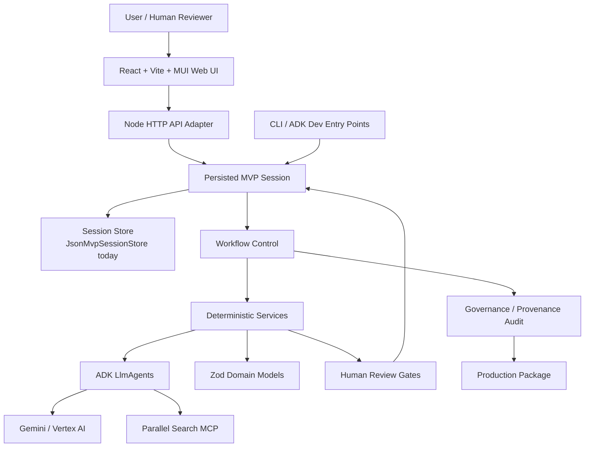
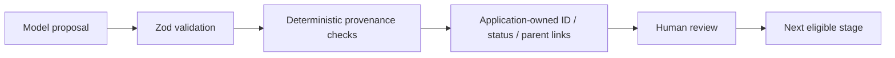

# System Architecture

Status date: **2026-08-17**

Tital is a TypeScript/Node.js evidence-governed scientific-film application with a React web interface, a small HTTP API adapter, persisted project sessions, deterministic workflow control, specialized Google ADK agents, real Gemini/Vertex AI execution, and Parallel Search MCP source discovery.

The architecture deliberately separates model creativity from application trust and workflow control.

## High-Level Architecture



## Architectural Layers

### 1. Human-facing web application

The product UI lives under `apps/web/` and uses React, Vite, and MUI.

It provides:

- new project creation;
- persisted session list/open behavior;
- current stage, blockers, counts, and next action;
- readable review cards;
- selective approve/reject;
- governed Continue actions;
- workflow progress and approved-chain coverage;
- final Production Package inspection;
- provenance / traceability navigation;
- JSON, text, and styled PDF-oriented exports.

The frontend does **not** re-implement workflow eligibility rules. It consumes application/session views from the API.

### 2. HTTP API adapter

`src/api/server.ts` is a small Node HTTP adapter around existing session/application services.

Current routes include:

```text
GET  /api/health
GET  /api/sessions
POST /api/sessions
GET  /api/sessions/:id
POST /api/sessions/:id/review
POST /api/sessions/:id/continue
```

Responsibilities:

- validate request payloads;
- load/save persisted sessions;
- call existing governed services;
- return session views suitable for the web UI;
- expose runtime errors without moving workflow governance into the HTTP layer.

It is currently a local-development server, not yet a production Cloud Run service.

### 3. Persisted session layer

Tital has a durable local MVP project-session layer.

Default storage:

```text
.tital/sessions/<session-id>.json
```

`JsonMvpSessionStore` validates the full session schema on read/write and uses temporary-write-plus-rename behavior.

The session layer preserves:

- workflow state;
- approved/rejected historical records;
- audit/package state;
- major session events;
- current stage and progression across process restarts.

This is a local MVP store, not a production cloud database.

### 4. Workflow control

Workflow control is deterministic and function-based.

Key modules:

```text
src/services/evaluateMvpWorkflow.ts
src/services/executeNextMvpStep.ts
src/services/createRealMvpStepExecutors.ts
src/services/advanceMvpSession.ts
```

Responsibilities:

- determine the current legal stage;
- detect missing approved provenance-connected coverage;
- run one allowed automated step;
- stop at human review gates;
- run the deterministic audit when eligible;
- build/finalize the package when eligible;
- prevent illegal stage skipping.

This layer does not delegate workflow governance to Gemini.

### 5. Deterministic service layer

Services under `src/services/` own application trust. Depending on the stage, they:

- validate upstream domain records;
- enforce approved-status requirements;
- verify provenance relationships;
- invoke an ADK agent where model reasoning is needed;
- parse and validate structured model output;
- reject invented/illegal upstream references;
- generate application-owned IDs;
- set application-owned statuses;
- assemble final domain records;
- perform human-review transitions;
- calculate approved-chain coverage;
- run the governance/provenance audit;
- build the production package.

A key invariant is:

```text
model proposal
→ validation
→ application-owned trusted metadata / IDs / provenance
→ human review
```

The Black-hole UI run exposed why this matters. Shot `sceneId` and VisualDecision `shotId` are now application-assigned rather than copied from model output.

### 6. Agent layer

Agents under `src/agents/` are specialized Google ADK `LlmAgent` instances. Their role is to propose scientific or creative content, not to control trusted workflow state.

Implemented model-assisted stages:

```text
Define
Research Questions
Source Discovery
Evidence
Claims
Scientific Script
Scenes
Shots
Visual Decisions
```

The governance/provenance audit and ProductionPackage construction are deterministic services, not LLM agents.

### 7. Domain layer

`src/domain/` contains Zod schemas and TypeScript types for governed records.

Main provenance chain:

```text
FilmBrief
→ ResearchQuestion
→ SourceRecord
→ EvidenceRecord
→ ClaimRecord
→ ScriptLineRecord
→ SceneRecord
→ ShotRecord
→ VisualDecisionRecord
→ Audit
→ ProductionPackage
```

Status enums are domain-specific. For example, source discovery initially creates `SourceRecord.status = DISCOVERED`.

### 8. External runtime layer

#### Google ADK / Gemini / Vertex AI

Used for model-assisted proposal generation. Services typically execute concrete agents through ADK runners and validate returned structures before domain assembly.

#### Parallel Search MCP

`parallelSourceAgent` connects through an ADK `MCPToolset` to:

```text
https://search.parallel.ai/mcp
```

The source-discovery path requires a real `web_search` call and preserves returned provider provenance when available.

Current limitation: evidence extraction uses approved source-record excerpts. A dedicated approved-source full-content retrieval step is future work.

## Trust Boundary



The model may propose content. It does not independently decide that its output is approved or scientifically authoritative.

## Human review and coverage

Progression is based on **approved provenance-connected coverage**, not a global record-count threshold.

Examples:

```text
every approved ResearchQuestion needs approved Source coverage
every approved Source needs approved Evidence coverage
every approved ResearchQuestion needs approved Claim coverage
every approved Scene needs approved Shot coverage
every approved Shot needs approved VisualDecision coverage
```

If a reviewer rejects a generated child record and coverage becomes incomplete, the workflow can generate replacement proposals for only the uncovered parent records.

## Audit boundary

The implemented audit is best described as a **Governance & provenance audit**.

It checks deterministic integrity conditions such as broken provenance, unapproved upstream records, unsupported claims, visual-category mismatches, and required visual disclosures.

It does not independently establish scientific truth or source authority.

## Current deployment boundary

Implemented today:

```text
React web UI
+ local Node API
+ persisted local sessions
+ CLI / ADK development harnesses
+ domain contracts
+ deterministic service layer
+ specialized ADK agents
+ Gemini / Vertex integration
+ Parallel MCP integration
+ human review
+ coverage-aware workflow
+ audit
+ final production package
+ readable final reports / exports
```

Not implemented as production infrastructure yet:

```text
public hosted deployment
cloud-durable session database
authentication / reviewer identity
multi-user concurrency
formal schema migrations
automatic downstream staleness after edits
final video rendering
```

The next major architectural milestone is to deploy the existing vertical slice without weakening these boundaries.
