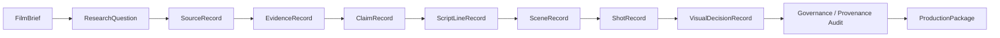
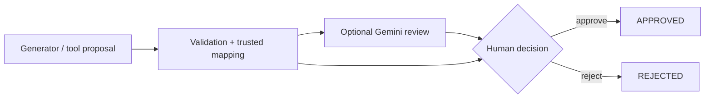
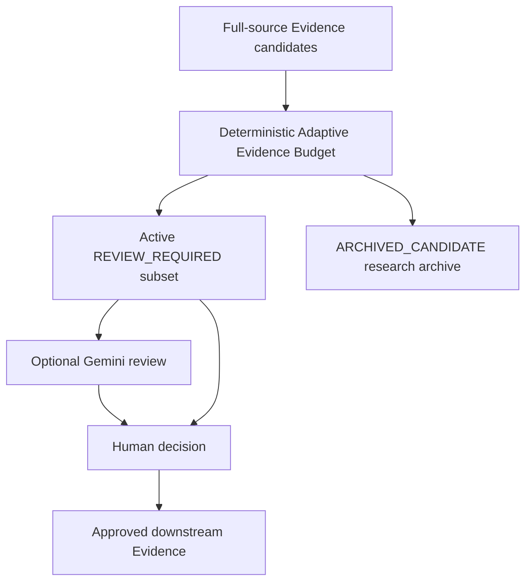
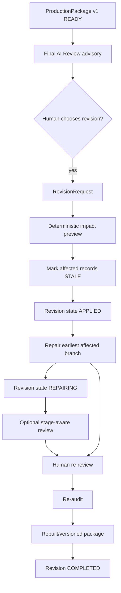

# Workflow Architecture

Status date: **2026-08-24**

Tital separates six concerns that must not collapse into one model conversation:

1. **provenance chain** — why a scientific/cinematic decision exists;
2. **execution stage machine** — what work may legally run next;
3. **governed coverage** — whether required branches are approved or explicitly waived;
4. **human attention policy** — where AI review helps without owning authority;
5. **director context** — creative guidance below scientific constraints;
6. **revision/version lifecycle** — how a completed production changes without starting over.

## Provenance chain



Only approved, provenance-connected active records enter the trusted downstream chain. Rejected, archived and stale records remain historical state rather than silently disappearing.

## Stage machine

```text
DEFINE
→ RESEARCH
→ EVIDENCE
→ CLAIMS
→ SCRIPT
→ SCENES
→ SHOTS
→ VISUAL_DECISIONS
→ AUDIT
→ PACKAGE
→ COMPLETE
```

`evaluateMvpWorkflow` derives the current stage from persisted state. Model/tool work advances one governed boundary at a time; audit/package construction is deterministic.

## Optional stage-aware AI review

Every active human gate follows the same authority pattern:



Supported review stages:

```text
FilmBrief
ResearchQuestion
SourceRecord
EvidenceRecord
ClaimRecord
ScriptLineRecord
SceneRecord
ShotRecord
VisualDecisionRecord
```

The evaluator uses a stage-specific rubric and relevant approved upstream context. Its output is advisory metadata only; `APPROVE_SUGGESTED` never becomes trusted `APPROVED` state without an explicit human action.

## Research → full-source Evidence → attention budget

```text
approved ResearchQuestion
→ Parallel web_search
→ SourceRecord DISCOVERED
→ optional AI Source review
→ human Source decision
→ approved Source
→ Parallel web_fetch exact approved URL
→ compact Evidence proposals
→ Candidate Evidence Pool
→ Adaptive Evidence Budget
→ active Evidence gate
→ optional AI Evidence review
→ human Evidence decision
```

Discovery excerpts assist source selection. New production Evidence must use the exact approved Source URL through `web_fetch` and carries grounding provenance.

### Adaptive Evidence Budget



The current policy considers film duration, Research Question priority, grounding, Evidence strength, source diversity and lightweight duplicate reduction.

A live five-minute Aurora run verified:

```text
123 research candidates
→ 24 active
→ 99 archived
→ 21 human-approved / 3 human-rejected
```

Archived Evidence remains persisted research history but is not pending review or approved production Evidence.

## Stage-aware review context

The reviewer does not receive the generator's hidden reasoning. Application code builds context from persisted state:

```text
Claim review
→ candidate + supporting approved Evidence

Script review
→ candidate + approved Claims/Evidence
→ audience / knowledge level / duration / tone / Director Brief

Scene review
→ candidate + approved Script + Director Brief

Shot review
→ candidate + approved Scene/Script
→ camera / representation controls + scientific constraints

Visual review
→ candidate + approved Shot
→ visual category / disclosure / risk / Director Brief
```

This makes the evaluation about the **transformation between stages**, not generic prose quality.

## Human rejection and governed coverage

Progression is based on required parent coverage, not raw record count.

```text
required RQ    → approved Source
required RQ    → approved active Evidence
required RQ    → approved Claim
required RQ    → approved ScriptLine
required RQ    → approved Scene or explicit waiver
required Scene → approved Shot or explicit waiver
required Shot  → approved VisualDecision or explicit waiver
```

A rejection that would remove required coverage opens an explicit recovery choice:

```text
Reject
→ coverage gap detected
→ Retry / Waive / Cancel
```

Rejected records remain terminal history. Tital never treats rejection as permission to silently regenerate a new ID.

## Final Production Review

After `READY_FOR_PRODUCTION`, a separate Gemini reviewer evaluates the **whole package**, not only one candidate-parent relationship.

Typical finding classes:

- scientific fidelity / uncertainty loss;
- duplication;
- missing cross-stage coverage;
- audience fit;
- narrative order / pacing;
- visual-integrity risk;
- Director Brief mismatch.

The deterministic audit and semantic Final Review intentionally answer different questions:

```text
Governance / provenance audit
→ Is the trusted package structurally valid?

Final Production AI Review
→ What semantic or narrative risks remain across the completed package?
```

Both can legitimately report different results; the AI review does not mutate trusted state.

## Governed revision targets

Current supported revision targets:

```text
PROJECT duration
SourceRecord
ClaimRecord
ScriptLineRecord
SceneRecord
ShotRecord
VisualDecisionRecord
```

Adding `ScriptLineRecord` and `SceneRecord` was a feedback-driven requirement discovered when Final Production Review found script duplication/narrative problems that could not be repaired safely through only Claim/Shot/Visual revision.

## Revision impact lifecycle



### Deterministic impact preview

The application calculates descendants before applying a revision. A live Script revision produced:

```text
Target: one ScriptLineRecord

Affected:
Script 1
Scene 1
Shots 2
Visuals 2

Preserved:
Research Questions
Sources
Evidence
Claims
```

This is the core selective-repair promise: a downstream narrative edit must not automatically discard valid upstream research.

### `STALE` semantics

`STALE` means trusted work was valid for an older production state but is no longer active after an explicit governed change.

```text
STALE ≠ REJECTED
STALE ≠ deleted
STALE ≠ active production
```

Stale records remain visible in history and version comparison but are excluded from the active package.

### Repair-before-audit guard

A critical invariant is now enforced:

> **An `APPLIED` revision waiting for repair cannot proceed to Audit, Package or Complete.**

After Apply:

```text
Revision = APPLIED
→ earliest affected stage becomes current
→ ordinary Continue is blocked
→ active revision offers Repair affected branch
→ direct advance API requests return REVISION_REPAIR_REQUIRED
```

Only after selective repair begins does the revision enter `REPAIRING`, allowing the repaired branch to progress through human review, downstream regeneration, re-audit and package rebuilding.

This guard was added after a live smoke test found that stale records plus an existing coverage waiver could otherwise make ordinary workflow evaluation appear complete before the revision was actually repaired.

## Selective repair routing

Repair starts from the earliest affected layer.

Examples:

```text
Script revision
→ replacement Script candidate
→ human review
→ dependent Scene regeneration
→ dependent Shots
→ dependent Visuals
→ re-audit

Scene revision
→ replacement Scene candidate
→ human review
→ dependent Shots
→ dependent Visuals
→ re-audit

Shot revision
→ replacement Shot candidate
→ human review
→ dependent Visual
→ re-audit
```

Unchanged upstream records remain active and are not regenerated.

## Version semantics

Completed packages are immutable milestones.

```text
v1 READY
→ governed revision
→ v1 SUPERSEDED
→ repaired + re-audited package
→ later version CURRENT
```

Revision records, activity events, old stale descendants and compact version comparisons remain inspectable.

## Director context and precedence

Scene/Shot/Visual generation and review can consume `DirectorBrief`, explicitly remembered project feedback and scoped replacement guidance.

```text
science / uncertainty / visual-integrity constraints
> approved production constraints
> Director Brief / explicit human guidance
> AI cinematic preference
```

Director guidance cannot relabel inference as observation or bypass Evidence/provenance requirements.

## Model-assisted vs deterministic responsibilities

### Model/tool-assisted

```text
FilmBrief proposals
Research Questions
Source discovery
Full-source Evidence extraction
Claims
Script Lines
Scenes
Shots
Visual Decisions
optional stage-aware review
Final Production Review
```

### Deterministic application code

```text
schema validation
trusted IDs / parent mapping
status assignment
review-context mapping
Adaptive Evidence Budget
human review transitions
coverage / Retry / Waive rules
revision impact calculation
STALE invalidation
repair-before-audit guard
selective repair routing
stage evaluation
bounded concurrency policy
audit
ProductionPackage construction
version history
session persistence
```

## Submission freeze

The workflow architecture is now feature-frozen for hackathon submission. Further changes should be limited to critical correctness/compliance fixes discovered by final validation.
