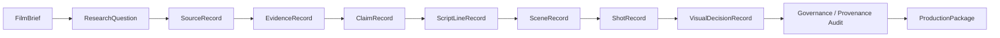
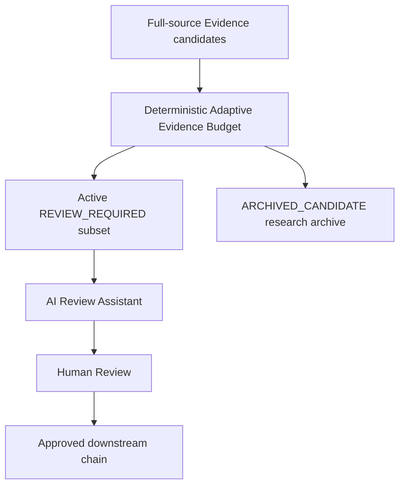
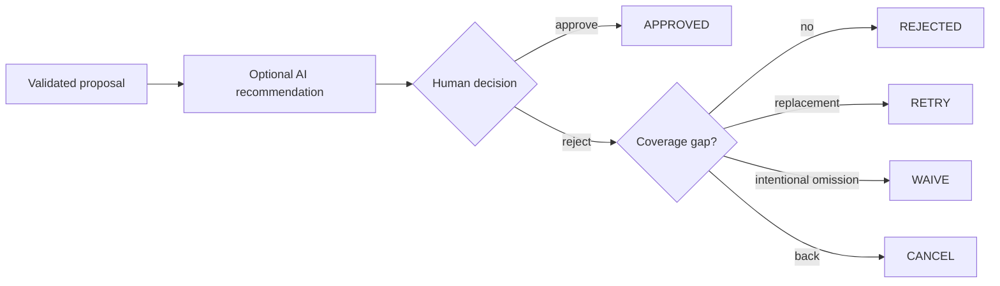
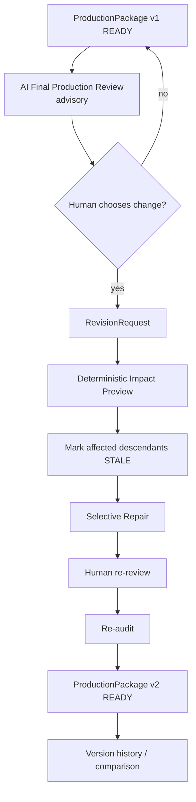

# Workflow Architecture

Status date: **2026-08-24**

Tital's workflow combines six structures that must remain distinct:

1. **provenance chain** — why a scientific/cinematic decision exists;
2. **execution stage machine** — what automation may legally run next;
3. **governed coverage** — whether required branches are approved or intentionally waived;
4. **human attention policy** — how broad research becomes a manageable review set;
5. **director context** — creative guidance below scientific constraints;
6. **revision/version lifecycle** — how completed productions change without starting over.

## Provenance chain



Only approved/locked provenance-connected records enter the trusted downstream chain.

## Execution stage machine

```text
DEFINE
→ RESEARCH
→ EVIDENCE
→ CLAIMS
→ SCRIPT
→ SCENES
→ SHOTS
→ VISUAL_DECISIONS
→ AUDIT
→ PACKAGE
→ COMPLETE
```

`evaluateMvpWorkflow` derives the current stage from persisted state. `executeNextMvpStep` selects the next legal action. `advanceMvpSession` applies one governed model/tool stage and stops at the next human boundary; the deterministic audit/package tail may continue automatically.

## Research-to-Evidence loop

```text
approved ResearchQuestion
→ Parallel web_search
→ SourceRecord DISCOVERED
→ optional AI Source review assistance
→ human Source decision
→ approved Source
→ Parallel web_fetch exact URL
→ compact Evidence proposals
→ Candidate Evidence Pool
→ Adaptive Evidence Budget
→ active Evidence human gate
→ optional AI Evidence review assistance
→ human Evidence decision
```

Discovery snippets orient source selection but are not the Evidence basis for new full-source records.

## Adaptive human-attention layer

A large scientific research pool is useful; a large mandatory review queue is not necessarily useful.



The current budget uses film duration and Research Question priority, then favors Evidence strength, full-source grounding, source diversity, and reduced duplication.

Archived candidates are persisted but not considered pending review, approved coverage, or trusted production Evidence.

See [../ADAPTIVE_EVIDENCE_BUDGET.md](../ADAPTIVE_EVIDENCE_BUDGET.md).

## Human review gate



AI review is advisory. It cannot convert `DISCOVERED`/`REVIEW_REQUIRED` into `APPROVED` or `REJECTED`.

## Governed coverage

Progression is based on required parent coverage through approved provenance or explicit human waiver, not raw counts.

```text
required RQ    → approved Source
required RQ    → approved active Evidence through approved Source
required RQ    → approved Claim
required RQ    → approved ScriptLine
required RQ    → approved Scene or waiver
required Scene → approved Shot or waiver
required Shot  → approved VisualDecision or waiver
```

Important semantics:

```text
approved Source ≠ every Evidence from that Source must be approved
ARCHIVED_CANDIDATE ≠ rejected
ARCHIVED_CANDIDATE ≠ approved
candidate count ≠ scientific coverage
waived gap ≠ approved content
```

## Rejection recovery

Rejected candidates remain terminal history and do not authorize silent regeneration.

```text
first automatic attempt
→ human rejects
→ REJECTED remains persisted
→ if required coverage is lost:
     explicit RETRY
     or explicit WAIVE where policy permits
```

`RETRY` is target-specific and duplicate-resistant. `WAIVE` records the intentional omission.

## Director-control context

Scene/Shot/Visual agents can consume `DirectorBrief`, explicitly remembered project feedback, and scoped replacement guidance.

```text
science / uncertainty / visual-integrity constraints
        ↓ hard boundary
Director Brief / remembered preference / scoped note
        ↓ creative guidance
AI proposal
        ↓
human review
```

Director guidance cannot turn inference into observation or bypass source/Evidence governance.

## Final-package review and revision loop

`COMPLETE / READY_FOR_PRODUCTION` is no longer treated as an irreversible endpoint.



Supported revision targets include project duration, approved Source, Claim, Shot, and Visual Decision. The impact graph prevents a cinematic-only change from unnecessarily discarding valid upstream science.

Example:

```text
Shot revision
→ Shot STALE
→ dependent Visual Decision STALE
→ Source/Evidence/Claim/Script/Scene preserved
```

A Source revocation may invalidate a much larger downstream branch. The preview tells the director before applying the revision.

## Version semantics

Old trusted work is not overwritten in place. Revised packages are stored as production-version milestones with change summaries and revision links.

```text
v1 → superseded by governed revision → v2
```

The current package is the active production result; prior versions remain inspectable history.

## Multi-record routing and concurrency

Provenance routing remains:

- Source discovery per required approved Research Question;
- full-source Evidence extraction per approved Source;
- Claim/Script/Scene generation grouped by Research Question;
- Shot generation per approved Scene;
- Visual Decision generation per approved Shot.

General independent calls inside an authorized stage may use bounded concurrency. Full-source Evidence is deliberately more conservative because each Source requires a Gemini + Parallel tool interaction.

```text
TITAL_EXTERNAL_CONCURRENCY=3
TITAL_EVIDENCE_CONCURRENCY=1
```

The rate-limit retry policy applies only to transient provider/runtime failures and does not weaken fail-closed validation.

## Model-assisted versus deterministic responsibilities

Model/tool-assisted:

```text
FilmBrief
Research Questions
Source discovery
Full-source Evidence extraction
Source/Evidence review recommendations
Claims
Script Lines
Scenes
Shots
Visual Decisions
Final Production Review findings
```

Deterministic application code:

```text
schema validation
trusted IDs / parent mapping
status assignment
Adaptive Evidence Budget / archive status
human review transitions
coverage evaluation
Retry/Waive policy
Director feedback persistence policy
revision impact / STALE invalidation
selective repair routing
stage evaluation
bounded concurrency policy
audit
ProductionPackage construction
production version history
session persistence
```

## Audit and package

The final audit validates implemented governance/provenance integrity and visual disclosure rules. It does not independently certify scientific truth or publisher authority.

If readiness passes:

```text
stage: COMPLETE
ProductionPackage.status: READY_FOR_PRODUCTION
```

The final AI reviewer is a separate advisory semantic layer after package readiness; it does not replace the deterministic audit.

## Hosted persisted session loop

```text
create authenticated project
→ model/tool stage
→ persist candidates
→ optional deterministic compaction
→ optional AI review assistance
→ human review
→ persist decision
→ Continue
→ ...
→ audit/package
→ optional final AI review
→ optional governed revision/repair
→ new version
```

Hosted state is durable in Cloud Storage under Firebase user namespaces.

## Current limits

Known remaining workflow work includes:

- optimistic locking for simultaneous session mutation;
- explicit UI to browse/promote `ARCHIVED_CANDIDATE` Evidence;
- source-content cache and coverage-aware research early stopping;
- richer semantic contradiction/source-authority modeling;
- final film rendering.
