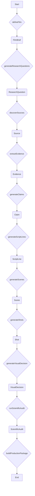

# Workflow Architecture

The Tital workflow is designed as a linear sequence of steps, where each step produces a new record in the provenance chain. The workflow is orchestrated by a central "Execution Controller" that calls deterministic services for each step.

## Key Concepts

### Execution Controller

The Execution Controller is the heart of the Tital workflow. It is responsible for:

-   Maintaining the state of the workflow.
-   Calling the appropriate service for the current step.
-   Passing the output of one step as the input to the next.

### Deterministic Services

Each step in the workflow is executed by a deterministic service. These services are responsible for:

-   Validating the input for the step.
-   Calling the appropriate agent (if necessary).
-   Validating the agent's output.
-   Assembling the final domain model for the step.
-   Setting the status of the new record to `REVIEW_REQUIRED`.

### Human Review Gates

After each step, the newly created record is set to `REVIEW_REQUIRED`. This indicates that a human needs to review and approve the record before the workflow can proceed. This is a critical part of Tital's governance model. The review workflow is simple:

-   **`REVIEW_REQUIRED`**: The default state for a newly created record.
-   **`APPROVED`**: A human reviewer has approved the record. The workflow can proceed to the next step.
-   **`REJECTED`**: A human reviewer has rejected the record. The workflow is paused until the record is revised and re-submitted for review.
