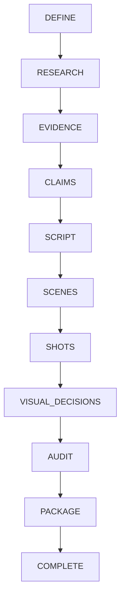
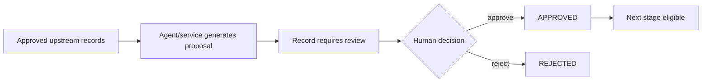

# Workflow Architecture

Tital has two related but different structures that should not be confused:

1. the **provenance chain**, which explains how scientific meaning is traced from evidence to production decisions; and
2. the **execution stage machine**, which explains what the application is allowed to do next.

## Provenance Chain


The core idea is that a downstream statement or visual choice should be explainable through its upstream records rather than being generated as an untraceable creative assertion.

## Execution Stage Machine

The current MVP workflow evaluator uses these stages:

```text
DEFINE
→ RESEARCH
→ EVIDENCE
→ CLAIMS
→ SCRIPT
→ SCENES
→ SHOTS
→ VISUAL_DECISIONS
→ AUDIT
→ PACKAGE
→ COMPLETE
```

Conceptually:



`evaluateMvpWorkflow` determines the current stage from `MvpWorkflowState`. `executeNextMvpStep` uses that evaluation to decide whether to run automation, wait for review, run the audit, or stop as complete.

## Human Review Gates

The stage diagram is not an unconditional automatic pipeline. Between most model-assisted stages, Tital inserts an explicit approval boundary.



The execution controller does not auto-approve records for the sake of completing a demo.

## Source Discovery Is a Special Case

Source discovery has a different initial state from many downstream generated records.

Parallel discovery creates:

```text
SourceRecord.status = DISCOVERED
```

`SourceRecord` supports:

```text
DISCOVERED
REVIEW_REQUIRED
APPROVED
REJECTED
```

Approved sources are required before evidence extraction can proceed. Therefore, do not simplify the whole workflow to a universal `REVIEW_REQUIRED → APPROVED` pattern.

## Model-Assisted vs Deterministic Stages

Model-assisted work includes:

```text
Film brief proposal
Research questions
Source discovery via Gemini + Parallel MCP
Evidence proposals
Claim proposals
Script lines
Scenes
Shots
Visual decisions
```

Deterministic application responsibilities include:

```text
schema validation
ID creation
status assignment
provenance validation
human-review transitions
workflow-stage evaluation
execution control
scientific audit
production-package construction
```

This division is deliberate: the model creates candidate content; application code decides whether that content can become trusted workflow state.

## Multi-Record Routing

The real MVP executor adapter does more than call one generic agent repeatedly. It routes records according to provenance:

- source discovery runs per approved research question;
- evidence extraction runs per source with the matching research question;
- claim, script, and scene generation group records by `researchQuestionId`;
- shot generation uses each approved scene and the approved script lines referenced by that scene;
- visual decisions are generated per approved shot.

This routing prevents downstream records from accidentally mixing unrelated research-question chains.

## Audit and Package

The scientific audit is deterministic. It checks implemented integrity rules such as broken provenance, unapproved upstream records, unsupported claims, visual-category mismatches, and missing visual disclosures.

The production package is also constructed deterministically. It becomes production-ready only when the package service's workflow and audit conditions are satisfied.

The current execution-controller contract includes the audit step. Final package construction is implemented as a separate deterministic service rather than an LLM agent.

## Current Execution Limitation

The repository contains the workflow evaluator, execution controller, real runtime adapters, review functions, audit, and package builder. It does **not** yet contain a durable project store or one persisted end-to-end user command that carries a project through every review cycle from raw idea to package.

That application shell is future work; the governed workflow core already exists.
