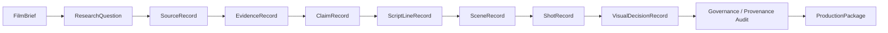
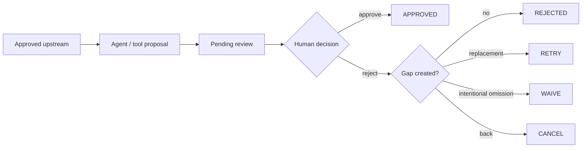

# Workflow Architecture

Status date: **2026-08-20**

Tital has four related structures that must not be confused:

1. **provenance chain** — why a scientific statement or visual exists;
2. **execution stage machine** — what the application may do next;
3. **governed coverage** — whether required branches are approved or intentionally waived;
4. **director context** — artistic guidance applied inside, not above, scientific constraints.

## Provenance chain



A downstream statement or visual choice can be traced through approved scientific context. Cinematic records can additionally preserve whether AI recommendation used project/scoped director guidance.

## Execution stage machine

```text
DEFINE
→ RESEARCH
→ EVIDENCE
→ CLAIMS
→ SCRIPT
→ SCENES
→ SHOTS
→ VISUAL_DECISIONS
→ AUDIT
→ PACKAGE
→ COMPLETE
```

`evaluateMvpWorkflow` derives current stage from persisted state. `executeNextMvpStep` selects the next legal action. `advanceMvpSession` applies it to a persisted session.

The controller intentionally stops after one model/tool-assisted automated stage so the next human gate is visible. The only automatic multi-step tail is deterministic audit → package.

## Hosted persisted session loop

```text
create authenticated project
→ Gemini proposes FilmBrief
→ save session
→ human review
→ save decision
→ Continue
→ next eligible model/tool stage
→ save proposals
→ human review
→ ...
→ audit
→ package
→ COMPLETE
```

Hosted sessions use Cloud Storage with Firebase-UID namespaces. Local development can use JSON-file persistence.

## Human review gate



Rejected records are terminal history. They are not silently regenerated.

## Governed coverage

Progression is not based on counts. It uses required parent coverage through approved provenance or an explicit `CoverageWaiver`.

Current high-level requirements:

```text
required ResearchQuestion → approved Source
required ResearchQuestion → approved Evidence through approved Source
required ResearchQuestion → approved Claim
required ResearchQuestion → approved ScriptLine
required ResearchQuestion → approved Scene OR Scene-stage waiver
required Scene            → approved Shot OR Shot-stage waiver
required Shot             → approved VisualDecision OR Visual-stage waiver
```

Evidence coverage is intentionally **not** `every approved Source → approved Evidence`. A Source can be acceptable for consideration while every candidate Evidence item from that source is rejected. Human evidence review must remain meaningful.

```text
count ≠ coverage
approved Source ≠ forced Evidence approval
waived gap ≠ approved content
```

The UI distinguishes approved coverage, intentional waivers, and unresolved gaps.

## Rejection recovery

Old behavior could regenerate rejected Evidence or Scenes with new UUIDs because only approved children were used to determine whether a parent had been attempted.

Current behavior:

```text
first automatic attempt
→ human rejects
→ record remains REJECTED
→ no silent regeneration
→ if gap matters: explicit RETRY or WAIVE
```

`RETRY` is target-specific and duplicate-filtered. `WAIVE` persists a `CoverageWaiver` and allows the branch to remain intentionally absent where policy permits.

## Director-control context

Scene, Shot, and Visual Decision generation can consume a project `DirectorBrief`. An explicit cinematic replacement retry can also consume a scoped director instruction.

```text
science / uncertainty / integrity constraints
        ↓ hard boundary
Director Brief / scoped note
        ↓ creative guidance
AI cinematic proposal
        ↓
human review
```

Director guidance does not affect scientific coverage rules and cannot turn reconstruction into observation.

See [../DIRECTOR_CONTROL.md](../DIRECTOR_CONTROL.md).

## Multi-record routing and concurrency

The real executor routes records according to provenance:

- Source discovery per required approved Research Question;
- Evidence extraction per approved Source;
- Claim/Script/Scene generation grouped by Research Question;
- Shot generation per approved Scene and its referenced Script Lines;
- Visual Decision generation per approved Shot.

True stage dependencies remain sequential, but independent calls **inside the same stage** now use bounded concurrency. The worker pool preserves deterministic result order and defaults to three concurrent external calls.

```text
RQ-A search ─┐
RQ-B search ─┼→ ordered source batch → review
RQ-C search ─┘
```

See [../PERFORMANCE.md](../PERFORMANCE.md).

## Source discovery special case

Parallel discovery creates `SourceRecord.status = DISCOVERED`. A source must be explicitly reviewed before Evidence extraction.

Parallel Search MCP is the current real discovery provider. Discovery excerpts are not equivalent to full approved-source retrieval/verification; that remains a scientific-quality milestone.

## Model-assisted versus deterministic responsibility

Model/tool-assisted:

```text
FilmBrief
Research Questions
Source discovery
Evidence
Claims
Script Lines
Scenes
Shots
Visual Decisions
```

Deterministic application code:

```text
schema validation
trusted IDs and parent mapping
status assignment
human review transitions
coverage evaluation
Retry/Waive policy
CoverageWaiver creation
cinematic decision provenance
stage evaluation
bounded concurrency/orchestration
audit
ProductionPackage construction
session persistence
```

## Audit and package

When required governed visual coverage is resolved, workflow reaches `AUDIT`. The audit validates implemented provenance/governance integrity and disclosure rules. It does not independently certify scientific truth or source authority.

If audit and readiness pass:

```text
stage: COMPLETE
ProductionPackage.status: READY_FOR_PRODUCTION
```

## Performance traces

New automation events may contain lightweight timing data for the automated step and individual external calls. This allows future optimisation to be based on live measurement rather than assumptions.

## Current editing limitation

Tital supports rejection, replacement, and intentional omission during the governed workflow, but does not yet implement a complete general post-approval editing/staleness system.

Future behavior should support:

```text
approved upstream record edited/replaced
→ dependent downstream records become STALE (or equivalent)
→ prior audit/package invalidated
→ affected chain regenerated/reviewed
```

General lock/unlock/version comparison must be designed together with that staleness lifecycle.

## Current deployment status

Tital is hosted on Cloud Run with Firebase-authenticated live routes and Cloud Storage persistence. The public landing/demo shell is implemented; publishing a completed authenticated project as anonymous demo still requires safe promotion/sanitized snapshot handling and live anonymous validation.
