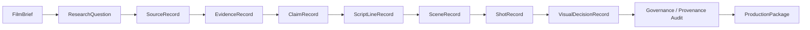
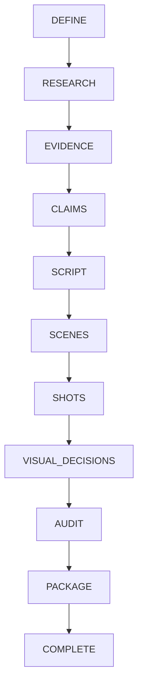
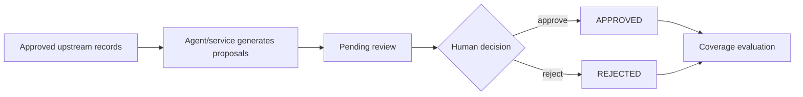

# Workflow Architecture

Status date: **2026-08-17**

Tital has two related but different structures that must not be confused:

1. the **provenance chain**, which explains why a scientific statement or visual decision exists; and
2. the **execution stage machine**, which determines what the application is allowed to do next.

A third concept now matters operationally:

3. **approved-chain coverage**, which determines whether a stage has enough approved, provenance-connected children to progress.

## Provenance Chain



The core product promise is that a downstream statement or visual choice can be traced back through approved scientific context rather than existing as an untraceable creative assertion.

## Execution Stage Machine

The persisted MVP uses these stages:

```text
DEFINE
→ RESEARCH
→ EVIDENCE
→ CLAIMS
→ SCRIPT
→ SCENES
→ SHOTS
→ VISUAL_DECISIONS
→ AUDIT
→ PACKAGE
→ COMPLETE
```



`evaluateMvpWorkflow` derives the current stage from persisted state. `executeNextMvpStep` decides whether the next legal action is automation, human review, audit, package construction, or completion. `advanceMvpSession` applies the legal next step to a persisted project session.

## Persisted Session Loop

The current product supports a real durable local session loop:

```text
create project
→ persist FilmBrief proposal
→ human review
→ persist decision
→ continue
→ generate next eligible proposals
→ persist
→ human review
→ ...
→ audit
→ package
→ COMPLETE
```

The React UI drives this same session/application layer through the local HTTP API. The CLI remains an alternate development/inspection surface.

## Human Review Gates

The stage machine is not an unconditional automatic pipeline.



The execution controller never auto-approves generated content just to reach `COMPLETE`.

## Approved-Chain Coverage

A stage does not advance merely because the application has generated a certain number of records.

The relevant condition is whether all required **approved parents** have at least one eligible **approved, provenance-connected child**.

Conceptual examples:

```text
ResearchQuestion → Source
Source           → Evidence
ResearchQuestion → Claim
ResearchQuestion → ScriptLine
ResearchQuestion → Scene
Scene            → Shot
Shot             → VisualDecision
```

This means:

```text
count ≠ coverage
```

Example:

```text
18 approved Sources
19 approved Evidence records
```

is still insufficient if those 19 Evidence records cover only 17 of the 18 approved Sources.

The web UI now exposes these coverage ratios directly so users can understand why a stage is complete or incomplete.

## Rejection Recovery

Rejected records remain persisted as history. They are not deleted and are not silently restored.

If a rejection leaves an approved parent uncovered, the next automated continuation can generate replacement proposals for the uncovered parent(s).

Example:

```text
approved Source
→ Evidence proposal rejected
→ Source has no approved Evidence coverage
→ continue
→ generate replacement Evidence proposal for that Source
→ human review again
```

This recovery behavior was exercised repeatedly during the Black-hole web E2E run.

## Source Discovery Is a Special Case

Parallel discovery initially creates:

```text
SourceRecord.status = DISCOVERED
```

`SourceRecord` supports:

```text
DISCOVERED
REVIEW_REQUIRED
APPROVED
REJECTED
```

Approved source records are required before Evidence extraction can proceed.

Source discovery is currently backed by real Parallel Search MCP. A future post-MVP step will add controlled approved-source content retrieval before Evidence extraction.

## Model-Assisted vs Deterministic Responsibilities

Model-assisted proposal generation includes:

```text
Film brief
Research questions
Source discovery through Gemini + Parallel MCP
Evidence
Claims
Script lines
Scenes
Shots
Visual decisions
```

Deterministic application responsibilities include:

```text
schema validation
trusted ID creation
trusted parent/provenance assignment
status assignment
human-review transitions
coverage calculation
workflow-stage evaluation
execution control
audit
production-package construction
session persistence
```

The Black-hole run exposed two reliability defects caused by asking Gemini to echo trusted IDs. Those paths were corrected so Shot `sceneId` and VisualDecision `shotId` are owned by application code.

## Multi-Record Routing

The real executor adapter routes records according to provenance rather than applying a generic global generator:

- source discovery runs per approved ResearchQuestion;
- evidence extraction runs per approved Source with its matching ResearchQuestion;
- claim/script/scene generation groups inputs by `researchQuestionId`;
- shot generation uses each approved Scene plus its approved referenced ScriptLines;
- visual decisions are generated per approved Shot.

This prevents unrelated chains from satisfying each other's coverage accidentally.

## Audit and Package

When all governed visual coverage is complete, the workflow reaches `AUDIT`.

The deterministic audit checks implemented governance/provenance rules such as:

```text
BROKEN_PROVENANCE
UNAPPROVED_UPSTREAM_RECORD
UNSUPPORTED_CLAIM
VISUAL_CATEGORY_MISMATCH
MISSING_VISUAL_DISCLOSURE
```

Human-facing output describes this accurately as a **Governance & provenance audit**. It does not independently certify scientific truth.

If the audit passes, deterministic package construction selects only the approved, provenance-connected production chain and creates the final `ProductionPackage`.

Final state:

```text
stage: COMPLETE
productionPackageStatus: READY_FOR_PRODUCTION
```

The web UI then exposes readable final results, traceability, and JSON/text/PDF-oriented exports.

## Current Editing Limitation

The persisted workflow can recover from rejection during generation/review, but it does not yet implement a complete post-approval editing and staleness lifecycle.

Future behavior should support:

```text
approved upstream record edited/replaced
→ dependent downstream records become STALE (or equivalent)
→ prior audit/package invalidated
→ affected coverage regenerated
→ human review required again
```

This is a post-MVP priority after the cloud deployment foundation.

## Current Deployment Limitation

The persisted application shell now exists and is web-driven, but it is still local:

```text
Web: 127.0.0.1:5173
API: 127.0.0.1:8787
Store: .tital/sessions/*.json
```

The next major milestone is a hosted deployment with durable cloud sessions while preserving the same deterministic workflow and human-gate semantics.
