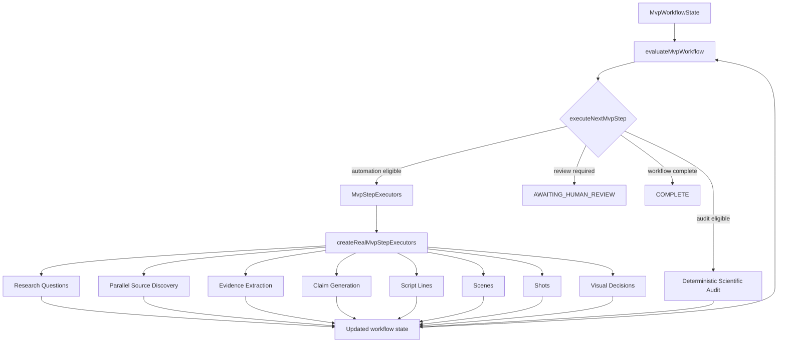

# Execution Controller Diagram

Tital has a real function-based Execution Controller. It is not implemented as a class; the controller function lives in:

```text
src/services/executeNextMvpStep.ts
```

Workflow evaluation is handled by:

```text
src/services/evaluateMvpWorkflow.ts
```

and the controller contract is connected to the real Tital services by:

```text
src/services/createRealMvpStepExecutors.ts
```

## Control flow



## Important behavior

The controller executes **one legal next step**. It does not run the entire project through every stage in one uncontrolled loop.

If a generated record reaches a human gate, execution stops and reports that review is required. Only after the relevant upstream records are approved does the next model-assisted or deterministic stage become eligible.

This is intentional. Human review is part of Tital's governance architecture, not an error condition to bypass.
