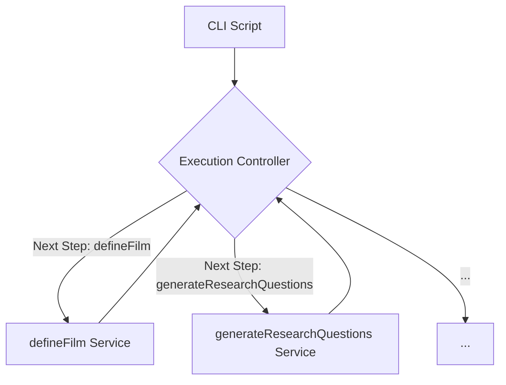

# Execution Controller Diagram

This diagram shows a conceptual view of the Execution Controller.

**Note:** In the current MVP, there is no single "Execution Controller" class or module. The orchestration is handled by a combination of CLI scripts and deterministic services. This diagram represents a conceptual model for how the orchestration works.

