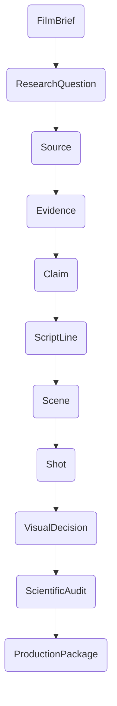

# Provenance Chain Diagram

This diagram shows the chain of domain models that make up the Tital provenance chain.

```mermaid
graph TD
    A(FilmBrief) --> B(ResearchQuestion);
    B --> C(Source);
    C --> D(Evidence);
    D --> E(Claim);
    E --> F(ScriptLine);
    F --> G(Scene);
    G --> H(Shot);
    H --> I(VisualDecision);
    I --> J(ScientificAudit);
    J --> K(ProductionPackage);
```
