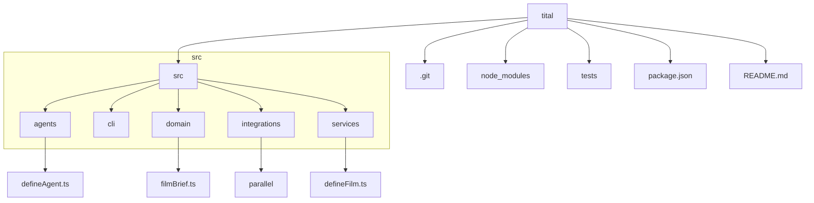

# Repository Map Diagram

This diagram shows the structure of the Tital repository.

```mermaid
graph TD
    A[tital]
    A --> B[.git]
    A --> C[node_modules]
    A --> D[src]
    A --> E[tests]
    A --> F[package.json]
    A --> G[README.md]

    subgraph src
        D --> H[agents]
        D --> I[cli]
        D --> J[domain]
        D --> K[integrations]
        D --> L[services]
    end

    H --> M[defineAgent.ts]
    J --> N[filmBrief.ts]
    K --> O[parallel]
    L --> P[defineFilm.ts]
```
