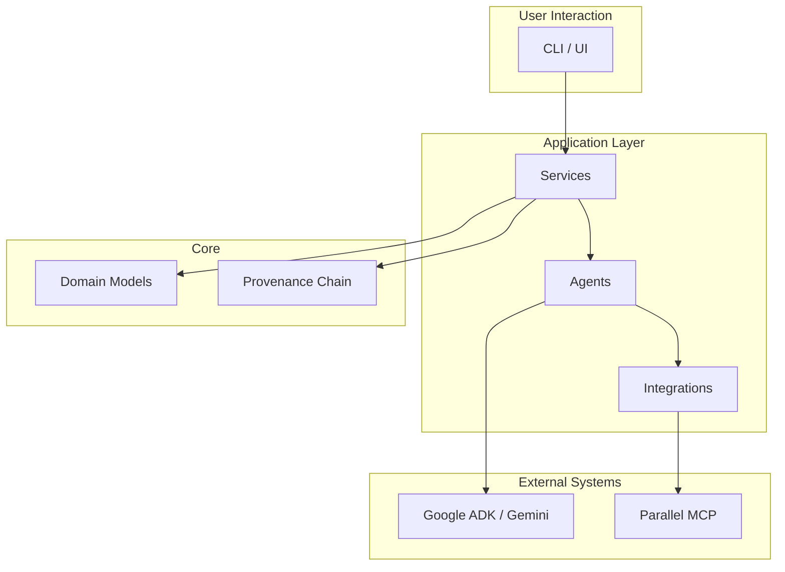

# System Overview Diagram

This diagram shows the high-level system architecture of Tital.

```mermaid
graph TD
    subgraph User Interaction
        A[CLI / UI]
    end

    subgraph Application Layer
        B[Services]
        C[Agents]
        D[Integrations]
    end

    subgraph Core
        E[Domain Models]
        F[Provenance Chain]
    end

    subgraph External Systems
        G[Google ADK / Gemini]
        H[Parallel MCP]
    end

    A --> B
    B --> C
    B --> E
    B --> F
    C --> G
    C --> D
    D --> H
```
