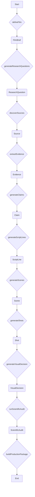

# Workflow Flow Diagram

This diagram shows the linear sequence of steps in the Tital workflow.

```mermaid
graph TD
    A[Start] --> B{defineFilm};
    B --> C(FilmBrief);
    C --> D{generateResearchQuestions};
    D --> E(ResearchQuestion);
    E --> F{discoverSources};
    F --> G(Source);
    G --> H{extractEvidence};
    H --> I(Evidence);
    I --> J{generateClaims};
    J --> K(Claim);
    K --> L{generateScriptLines};
    L --> M(ScriptLine);
    M --> N{generateScenes};
    N --> O(Scene);
    O --> P{generateShots};
    P --> Q(Shot);
    Q --> R{generateVisualDecision};
    R --> S(VisualDecision);
    S --> T{runScientificAudit};
    T --> U(ScientificAudit);
    U --> V{buildProductionPackage};
    V --> W[End];
```
