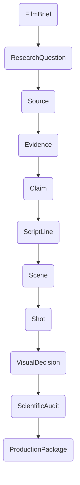

# Provenance and Governance

Provenance and governance are at the heart of the Tital system. Every piece of data and every creative decision is part of a verifiable and auditable provenance chain.

## The Provenance Chain

The provenance chain ensures that every claim made in a film can be traced back to its source. For example:

-   A `ScriptLine` is based on a `Claim`.
-   A `Claim` is supported by `Evidence`.
-   `Evidence` is extracted from a `Source`.
-   A `Source` was discovered to answer a `ResearchQuestion`.
-   A `ResearchQuestion` was generated from the `FilmBrief`.

This creates a complete, end-to-end audit trail from the final script back to the initial research.

## Governance Model

Tital's governance model is built on two key principles:

1.  **Deterministic Logic and AI Proposals:** The system distinguishes between deterministic business logic and AI-generated proposals.
    -   **Deterministic Logic:** The core workflow, data assembly, and validation are all handled by deterministic, auditable code.
    -   **AI Proposals:** AI agents are used for creative tasks, but they only ever *propose* a result. They do not have the ability to directly modify the state of the system.

2.  **Human Review Gates:** Every step that involves a creative decision or a factual claim is subject to a human review gate.
    -   When an agent generates a proposal (e.g., a `Claim`), the resulting record is saved with a status of `REVIEW_REQUIRED`.
    -   The workflow is paused until a human reviewer either `APPROVES` or `REJECTS` the record.
    -   This ensures that a human is always in the loop and has the final say on all creative and factual matters.
