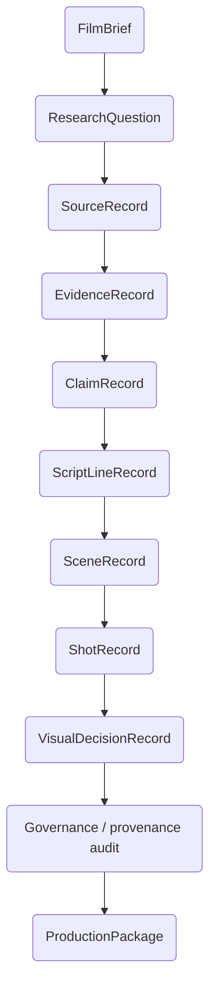

# Provenance and Governance

Provenance and governance are the core of Tital. Scientific statements, visual representations, and human coverage decisions should be traceable without pretending that every creative choice came directly from scientific evidence.



## Scientific provenance

The approved chain answers questions such as:

- Why does this Script Line exist?
- Which Claim supports it?
- Which Evidence supports that Claim?
- Which Source supplied the Evidence excerpt?
- Which Research Question was the Source meant to answer?

Trusted references are application-owned. Models normally select numbered approved inputs and deterministic code maps those selections back to trusted record IDs.

## Governance versus scientific truth

The deterministic audit checks structural integrity: broken provenance links, upstream approval, visual-category consistency, and required disclosures according to implemented rules.

It does **not** independently verify that a human-approved Source is authoritative or that every scientific interpretation is true.

```text
passed governance audit ≠ independent scientific peer review
```

## Human review provenance

Rejected records remain in persisted session history but are excluded from the approved production chain.

Rejection is terminal by default. Tital does not silently treat rejection as permission to regenerate a new UUID for the same semantic answer.

When rejection would create a required gap, the human must explicitly choose:

```text
RETRY → request targeted replacement
WAIVE → intentionally continue without that branch
CANCEL → keep the review unchanged
```

`CoverageWaiver` records preserve intentional omission, including stage, target, reason, rejected record IDs, and creation time.

## Cinematic provenance

Scientific evidence constrains a cinematic decision but often does not determine it uniquely. For example, evidence can require that a representation be labeled `SCIENTIFIC_RECONSTRUCTION`, while the choice between a restrained macro view and a wider explanatory composition may be artistic.

New Scene, Shot, and Visual Decision records can therefore carry optional application-owned `decisionProvenance`:

```text
recommendationSource: AI
evidenceGoverned: true
directorBriefApplied: true | false
directorInstruction: string | null
```

This distinguishes:

- scientific requirement;
- AI cinematic recommendation;
- persistent Director Brief influence;
- scoped director instruction;
- final human approval represented by record status.

The model does not author these provenance fields.

## Precedence

```text
approved evidence / uncertainty / visual-integrity constraint
> approved production constraint
> human Director Brief / scoped note
> AI cinematic preference
```

A director can choose among scientifically safe visual treatments but cannot convert an inference into observation or remove a required uncertainty disclosure merely as a style choice.

## Operational performance data is separate

Optional session-event performance traces record duration/call-count metadata. They are operational telemetry, not scientific or cinematic provenance, and must not be interpreted as evidence quality signals.

## Deterministic ownership

Application code owns:

- trusted IDs and parent references;
- statuses and legal review transitions;
- coverage evaluation;
- CoverageWaiver creation;
- cinematic decision-provenance metadata;
- audit execution and ProductionPackage construction.

Agents propose semantic content only.
