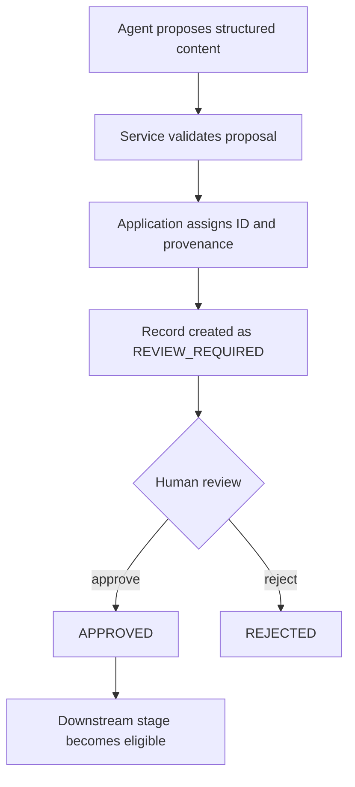

# Review Workflow

Human review is a hard governance boundary in Tital. AI-generated material is treated as a proposal until the application has validated it and a human has explicitly approved the resulting record where that record type requires approval.

Tital does **not** currently include a persistent database, review inbox, or notification service. Review state is represented in typed domain records and in `MvpWorkflowState`; the current MVP review operations are explicit application/service calls.

## Statuses Are Model-Specific

There is no single universal status enum shared by every record type. Common values include:

```text
DRAFT
REVIEW_REQUIRED
APPROVED
REJECTED
LOCKED
```

But individual schemas define their own legal states.

For example, `SourceRecord` uses:

```text
DISCOVERED
REVIEW_REQUIRED
APPROVED
REJECTED
```

Parallel source discovery initially creates a `SourceRecord` with:

```text
status = DISCOVERED
```

Therefore, documentation and new code should always consult the actual domain schema instead of assuming that every generated object starts in `REVIEW_REQUIRED`.

## Typical Review Pattern

For most model-generated downstream records, the pattern is:



The LLM does not get to set trusted provenance IDs, approval state, or workflow progression by itself.

## Review Services

The repository contains deterministic review functions for reviewable record types. Their job is intentionally narrow:

1. Validate the incoming record against its Zod schema.
2. Verify that the record is in a reviewable state.
3. Apply the explicit review decision.
4. Return a new validated record with an allowed status transition.

The exact legal transition depends on the record type. Review services should be treated as the source of truth for current transition behavior.

## Human Gates in Orchestration

`executeNextMvpStep` stops when records still require human review. It returns:

```text
AWAITING_HUMAN_REVIEW
```

rather than continuing automatically into the next model call.

This means an end-to-end governed run is intentionally iterative:

```text
automation
→ review boundary
→ human decision
→ automation
→ review boundary
→ ...
```

## What Rejection Means Today

`REJECTED` is represented by the domain models and review services, but the current MVP does not yet implement a complete revision/resubmission product experience. There is no automatic regeneration loop, reviewer notification system, or persistent review queue.

Those are future application-layer concerns; they should not be inferred from the existence of the status enum.

## Locking

Some models include `LOCKED`. In the current architecture, `LOCKED` expresses a stronger governance state than ordinary approval, but locking is not a universal state and should not be assumed for every record type.

## Core Rule

The governance boundary can be summarized as:

```text
model proposes
→ service validates and establishes provenance
→ human decides
→ deterministic workflow decides what can happen next
```
