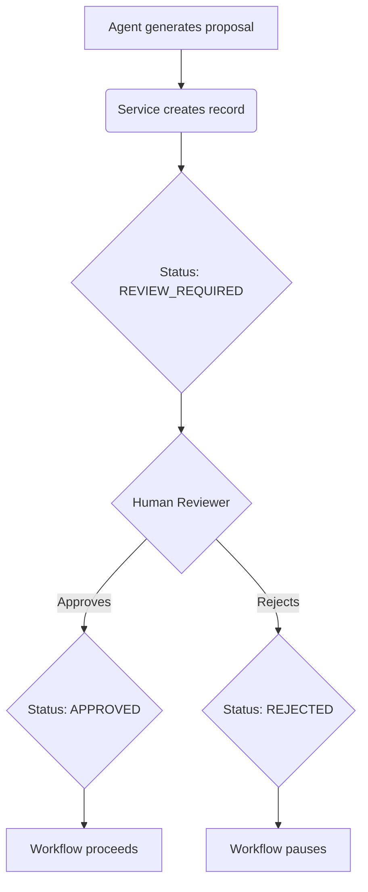

# Review Workflow

The human review workflow is a critical component of Tital's governance model. It ensures that a human is always in the loop and has the final say on all creative and factual matters.

## Workflow States

Most domain models in the provenance chain have a `status` field that tracks their progress through the review workflow. The possible states are:

-   **`DRAFT`**: The record is still being worked on and is not yet ready for review.
-   **`REVIEW_REQUIRED`**: The record has been completed by an agent or a service and is now ready for human review.
-   **`APPROVED`**: A human reviewer has approved the record. The workflow can now proceed to the next step.
-   **`REJECTED`**: A human reviewer has rejected the record. The workflow is paused until the record is revised and re-submitted for review.
-   **`LOCKED`**: The record has been approved and is now locked, meaning it cannot be changed. This is used for foundational records like the `FilmBrief`.

## The Review Process

1.  An AI agent generates a proposal for a new record (e.g., a `Claim`).
2.  A deterministic service validates the proposal and creates a new record in the database.
3.  The service sets the status of the new record to `REVIEW_REQUIRED`.
4.  A human reviewer is notified that a new record is ready for review.
5.  The reviewer can either `APPROVE` or `REJECT` the record.
6.  If the record is approved, the workflow proceeds to the next step.
7.  If the record is rejected, the workflow is paused. The record must be revised and re-submitted for review.
