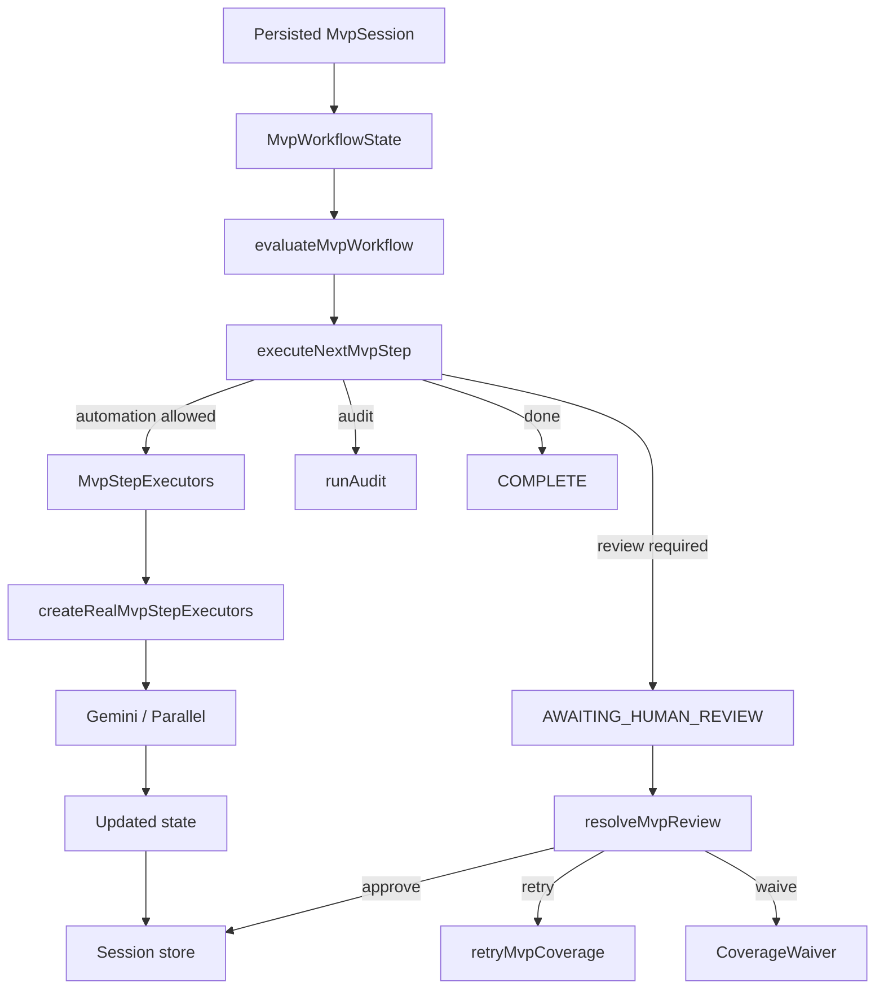

# Orchestration

Tital orchestration is deterministic TypeScript application code. ADK/Gemini and Parallel generate proposals; they do not control the state machine.

Key modules:

```text
src/services/evaluateMvpWorkflow.ts
src/services/executeNextMvpStep.ts
src/services/createRealMvpStepExecutors.ts
src/services/advanceMvpSession.ts
src/services/resolveMvpReview.ts
src/services/retryMvpCoverage.ts
src/services/getCurrentMvpReviewGate.ts
src/persistence/*MvpSessionStore.ts
```

## Control flow



## Stage evaluation

`evaluateMvpWorkflow` inspects validated state, approved provenance and applicable CoverageWaivers. It does not call external providers.

```text
DEFINE
→ RESEARCH
→ EVIDENCE
→ CLAIMS
→ SCRIPT
→ SCENES
→ SHOTS
→ VISUAL_DECISIONS
→ AUDIT
→ PACKAGE / COMPLETE
```

Progression is coverage-aware rather than count-based.

## Execution controller

`executeNextMvpStep(state, executors)` returns one of:

```text
EXECUTED_AUTOMATION
AWAITING_HUMAN_REVIEW
AUDIT_EXECUTED
COMPLETE
```

A normal model/tool-assisted continuation executes one eligible stage and then stops at the next human gate. Audit → package is the only automatic deterministic tail.

New automated generation invalidates a previous audit.

## Rejection and recovery

Rejected records remain historical state and are excluded from the approved chain.

Important current rule:

```text
REJECTED ≠ permission to regenerate
```

Automatic generation is first-attempt-only. If rejection removes required coverage, `resolveMvpReview` requires an explicit human choice:

- `RETRY` — targeted replacement through `retryMvpCoverage`;
- `WAIVE` — intentional omission recorded as `CoverageWaiver`;
- cancel — no state change.

Targeted retry filters duplicate candidates before they enter review.

## Director context in orchestration

`MvpSession.projectInput` can contain a project `DirectorBrief`. When `advanceMvpSession` constructs the real executors, it supplies this brief to cinematic stages only:

```text
Scene generation
Shot generation
Visual Decision generation
```

A cinematic `RETRY` can additionally carry a scoped director instruction. The retry service combines project, previously opted-in feedback, and current scoped guidance for that target without modifying the project-level brief.

If `rememberInstruction` is explicitly true, `resolveMvpReview` persists the current instruction as `DirectorFeedback` after the retry succeeds. The option is off by default. Later cinematic executors receive the accumulated project feedback; detached public demo promotion clears it.

Scientific/approved constraints remain higher priority than director guidance.

## Bounded concurrency inside stages

The old real executor used sequential loops for multiple independent external calls. The real executor now uses `mapWithConcurrency` for independent parent records inside the same stage.

Safe examples:

```text
RQ 1 source search ─┐
RQ 2 source search ─┼→ combine in deterministic order
RQ 3 source search ─┘
```

The same pattern applies to Evidence/Claim/Script/Scene/Shot/Visual Decision batches when their parent records are independent.

Default worker concurrency is `3`, configurable through `TITAL_EXTERNAL_CONCURRENCY` and clamped to `1..8`.

This is internal I/O concurrency. It does not relax workflow dependencies or Cloud Run session-write safety.

## Performance instrumentation

When `advanceMvpSession` creates the real executor, it receives timing callbacks for external operations. The resulting automation event can persist:

```text
performance.durationMs
performance.externalCallCount
performance.operations[]
```

This provides an evidence base for later optimisation. Custom test executors continue to work without external-call timing details.

See [../PERFORMANCE.md](../PERFORMANCE.md).

## Persisted session orchestration

`MvpSession` includes:

```text
session ID
raw film idea
projectInput (including optional DirectorBrief)
optional DirectorFeedback records
created / updated timestamps
MvpWorkflowState
optional ProductionPackage
event history (+ optional timing traces)
```

Local storage can use `.tital/sessions/*.json`; hosted production can use user-scoped Cloud Storage through `CloudStorageMvpSessionStore`.

Review/generation invalidates stale audit/package state.

## Production-package boundary

The final package selects the governed approved chain plus explicit CoverageWaivers. Rejected/orphaned history remains in session state but is not presented as approved production content.

The deterministic audit runs against the approved production chain. A passed audit verifies implemented governance/provenance integrity, not independent scientific truth.

## Why this design matters

Tital separates four authorities:

```text
external tools/models → propose
application services  → validate/map/orchestrate
human director/reviewer → approve/reject/retry/waive/direct/remember
persistence/audit      → record and verify governed state
```

That separation lets performance and creative control improve without giving the model control of evidence, identity, or workflow truth.
