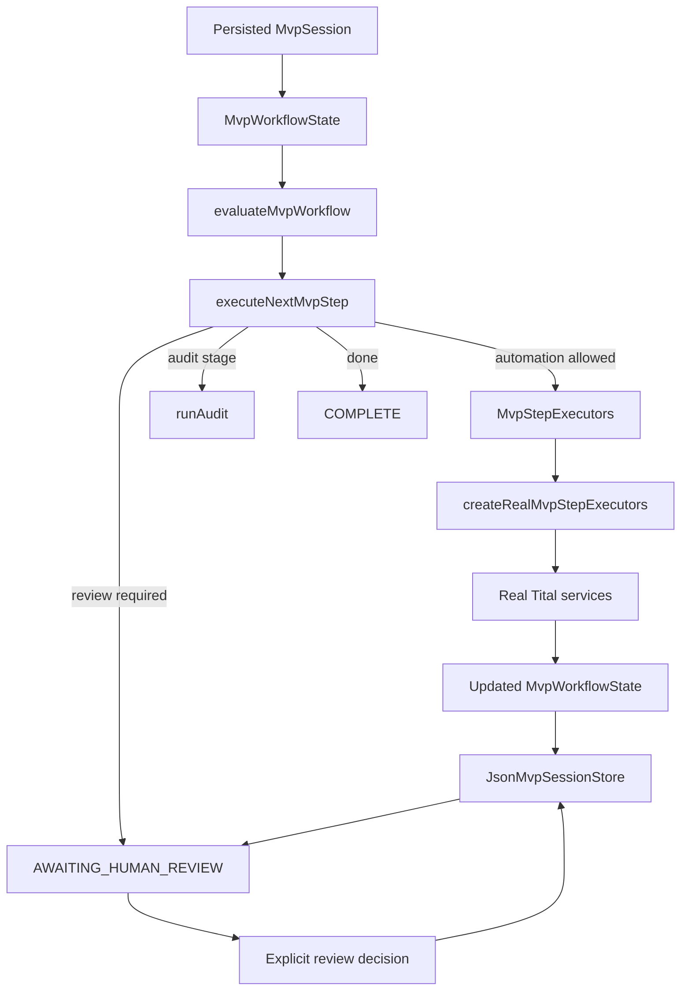
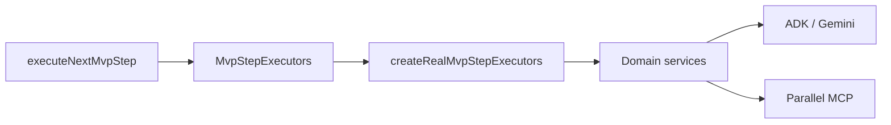

# Orchestration

Tital's MVP orchestration is implemented as deterministic TypeScript services. The central execution controller is **function-based rather than class-based**, and a persisted session layer now makes that governed state machine usable across separate CLI invocations.

The key modules are:

```text
src/services/evaluateMvpWorkflow.ts
src/services/executeNextMvpStep.ts
src/services/createRealMvpStepExecutors.ts
src/services/advanceMvpSession.ts
src/services/reviewCurrentMvpGate.ts
src/services/reviewMvpSession.ts
src/persistence/jsonMvpSessionStore.ts
```

Together they decide what stage the project is in, whether automation is legally allowed to run, when execution must stop for human review, which real service should be called next, and how the resulting state is persisted.

## Control Flow



## `evaluateMvpWorkflow`

`evaluateMvpWorkflow` is a deterministic state evaluator. It inspects the validated `MvpWorkflowState`, selects the approved provenance-connected chain, and determines the current workflow stage and next legal action.

The stage model is:

```text
DEFINE
→ RESEARCH
→ EVIDENCE
→ CLAIMS
→ SCRIPT
→ SCENES
→ SHOTS
→ VISUAL_DECISIONS
→ AUDIT
→ PACKAGE / COMPLETE
```

Progression is coverage-aware. For example, one approved source for one research question does not satisfy source coverage for a second approved research question. Likewise, an approved downstream record whose required upstream provenance is no longer approved does not count as valid coverage.

The evaluator does not call Gemini or Parallel.

## `executeNextMvpStep`

`executeNextMvpStep` is the execution controller. It receives:

```ts
state: MvpWorkflowState
executors: MvpStepExecutors
```

It can return:

```text
EXECUTED_AUTOMATION
AWAITING_HUMAN_REVIEW
AUDIT_EXECUTED
COMPLETE
```

It executes at most the next legally allowed automated model/tool stage. When newly generated records require review, the controller returns the updated state and stops. It never silently approves model output.

When every candidate at a required gate has been rejected, rejection remains historical state. If approved coverage is now missing, a later continuation can generate replacement candidates instead of treating the rejected record as permanently satisfying the workflow.

Any new automated generation invalidates the stored audit.

## Real runtime wiring

`createRealMvpStepExecutors.ts` implements `MvpStepExecutors` using the real Tital services. The adapter is incremental: it generates only missing approved coverage and preserves prior records/history.



Downstream model calls receive only approved, provenance-connected upstream records.

## Persisted session orchestration

`MvpSession` wraps the workflow state with:

```text
session ID
raw film idea
created / updated timestamps
MvpWorkflowState
optional ProductionPackage
event history
```

`advanceMvpSession` uses the execution controller and stops at the next human gate. It permits the deterministic tail to proceed from successful audit to package construction without inventing another human approval stage.

`reviewMvpSession` applies the explicit current-gate review decision and records an event. Review/generation invalidates prior audit/package state so a stale pass cannot be silently reused.

Default local persistence is:

```text
.tital/sessions/<session-id>.json
```

See [Persisted MVP Sessions](persisted-mvp-session.md) for CLI commands and storage behavior.

## Human gates

The normal pattern remains:

```text
automated proposal
→ validated application record
→ persisted pending state
→ explicit human review
→ APPROVED or REJECTED
→ next legal action
```

`SourceRecord` starts from:

```text
DISCOVERED
```

and requires explicit source review before evidence extraction.

## Production Package boundary

The final package contains the approved, provenance-connected chain used for production. Rejected or orphaned history remains in the persisted session but is excluded from the production package. The deterministic scientific audit is likewise run against the approved production chain.

## Why this design matters

Tital intentionally does not let an LLM control the workflow state machine. Models generate scientific and creative proposals; deterministic application code decides whether those proposals are valid, traceable, approved, persisted, and eligible to move downstream.
