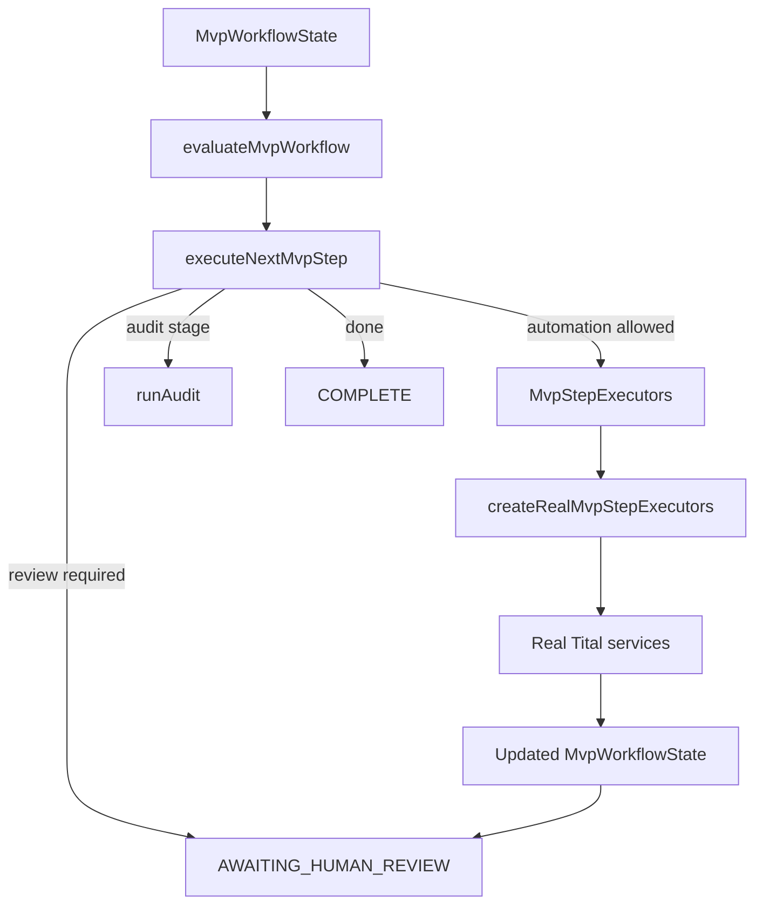
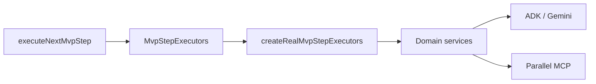

# Orchestration

Tital's MVP orchestration is implemented as deterministic TypeScript services. The central execution controller is **function-based rather than class-based**.

The key modules are:

```text
src/services/evaluateMvpWorkflow.ts
src/services/executeNextMvpStep.ts
src/services/createRealMvpStepExecutors.ts
```

Together they decide what stage the project is in, whether automation is legally allowed to run, when execution must stop for human review, and which real service should be called next.

## Control Flow



## `evaluateMvpWorkflow`

`evaluateMvpWorkflow` is a deterministic state evaluator. It inspects the current `MvpWorkflowState` and determines the current workflow stage and the next legal action.

The stage model is:

```text
DEFINE
→ RESEARCH
→ EVIDENCE
→ CLAIMS
→ SCRIPT
→ SCENES
→ SHOTS
→ VISUAL_DECISIONS
→ AUDIT
→ PACKAGE / COMPLETE
```

The evaluator does not call Gemini or Parallel. It only inspects validated application state.

## `executeNextMvpStep`

`executeNextMvpStep` is the execution controller. It receives:

```ts
state: MvpWorkflowState
executors: MvpStepExecutors
```

It can return one of four execution dispositions:

```text
EXECUTED_AUTOMATION
AWAITING_HUMAN_REVIEW
AUDIT_EXECUTED
COMPLETE
```

The important governance rule is that the controller executes **at most the next legally allowed automated step**. When newly generated records require review, the controller returns the updated state and stops.

It does not silently approve model output.

## `MvpStepExecutors`

`MvpStepExecutors` is the boundary between orchestration and implementation. It defines operations for:

- research-question generation
- source discovery
- evidence extraction
- claim generation
- script-line generation
- scene generation
- shot generation
- visual-decision generation
- scientific audit

This interface also makes orchestration testable with fake executors, so unit tests do not need live Vertex AI or Parallel calls.

## Real Runtime Wiring

`createRealMvpStepExecutors.ts` implements the `MvpStepExecutors` contract using the real Tital services.



The adapter also performs provenance-aware routing. For example, evidence and claims are grouped by `researchQuestionId`, shots are generated from the approved scene and its referenced script lines, and visual decisions are generated per approved shot.

## Human Gates

The controller treats review as a hard workflow boundary.

Typical pattern:

```text
automated proposal
→ validated application record
→ human review required
→ APPROVED
→ next automated stage becomes eligible
```

`SourceRecord` has a special discovery state. Parallel source discovery initially creates sources as:

```text
DISCOVERED
```

Source review must occur before evidence extraction can use those sources as approved upstream records.

## Production Package Boundary

The deterministic scientific audit is part of the execution-controller contract. `ProductionPackage` construction is implemented separately by the package-building service. The current repository therefore has the domain/service capability to produce the final package, but it does not yet expose one persisted end-to-end CLI command that drives the whole project from idea to final package while collecting human approvals.

## Why This Design Matters

Tital intentionally does not let an LLM control the workflow state machine. Models generate scientific and creative proposals; deterministic application code decides whether those proposals are valid, traceable, approved, and eligible to move downstream.
