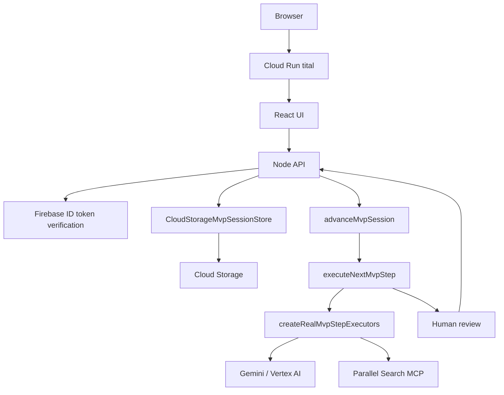
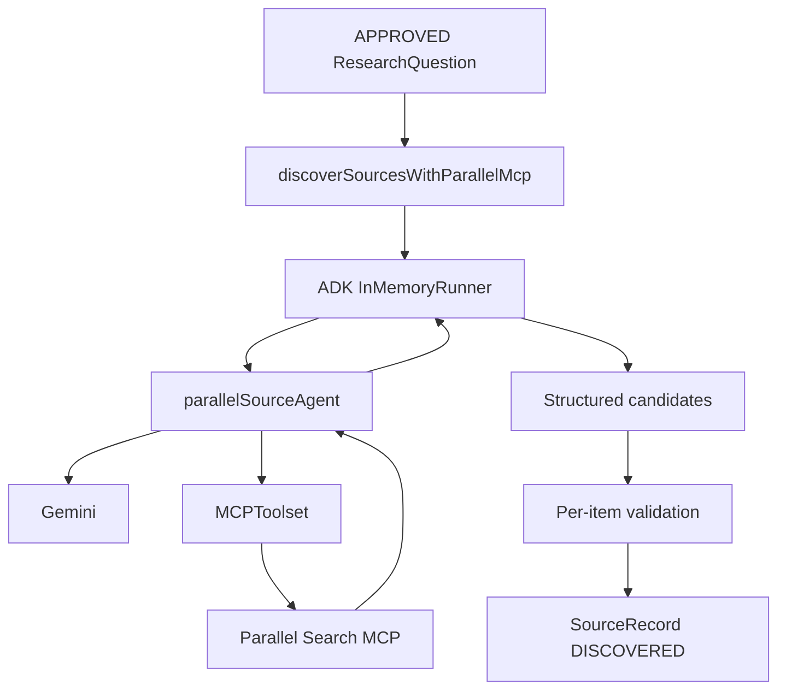

# Real Execution Paths

Status date: **2026-08-22**

Tital now has a complete persisted web execution path in addition to development CLI entry points. The hosted path uses the same deterministic workflow services as local development.

## Hosted application path



Protected live session routes are authenticated. User `uid` selects the hosted session namespace.

## Project creation

```text
POST /api/sessions
→ validate FilmProjectInput
→ defineFilm / Gemini
→ application assembles FilmBrief
→ create MvpSession
→ persist session
→ return FilmBrief review gate
```

`FilmProjectInput` can include an optional project Director Brief. That brief is persisted with the session but does not alter trusted scientific IDs/statuses.

## Governed continuation

```text
POST /api/sessions/:id/continue
→ authenticate
→ load user-scoped session
→ advanceMvpSession
→ evaluate stage
→ execute at most one model/tool-assisted stage
→ persist proposals + timing trace
→ return next human gate
```

The only automatic multi-step tail is deterministic audit → package.

## Real executor routing

`createRealMvpStepExecutors` maps stage needs to real services:

```text
Research Questions      → Gemini
Source discovery        → Gemini + Parallel MCP
Evidence extraction     → Gemini
Claims                  → Gemini
Script Lines            → Gemini
Scenes                  → Gemini + Director Brief + opted-in feedback
Shots                   → Gemini + Director Brief + opted-in feedback
Visual Decisions        → Gemini + Director Brief + opted-in feedback
Audit                   → deterministic TypeScript
```

## Parallel source-discovery path



Malformed individual candidates are discarded while valid candidates are preserved. Provider metadata is never fabricated.

## Bounded parallel execution inside a stage

The stage graph remains ordered, but multiple independent parents inside one stage no longer have to wait serially.

Example source discovery:

```text
RQ1 → Parallel ─┐
RQ2 → Parallel ─┼→ ordered validated SourceRecord batches
RQ3 → Parallel ─┘
```

Equivalent bounded concurrency applies to Evidence extraction, Claim/Script/Scene generation, Shots, and Visual Decisions. Default concurrency is 3 and can be tuned with `TITAL_EXTERNAL_CONCURRENCY` within 1..8.

The combine order follows input order even when completion order differs.

## Timing path

For real runtime calls, the executor records operation timing callbacks. `advanceMvpSession` attaches a performance trace to the automation event:

```text
stage duration
external call count
operation name
operation target ID
operation duration
success/failure
```

This data is designed for new live benchmarks. It does not exist retroactively for old sessions.

## Human review path

```text
GET session
→ current pending gate displayed
→ human selects records
→ POST /review
→ APPROVE or REJECT
```

If rejection does not create a required gap, the decision is persisted normally.

If it would create a gap:

```text
409 GAP_RESOLUTION_REQUIRED
→ UI asks for explicit choice
```

Resolution:

```text
RETRY
→ reject current candidate
→ targeted replacement generation
→ duplicate filtering
→ new candidate review

WAIVE
→ reject current candidate
→ persist CoverageWaiver
→ continue with intentional omission
```

Rejected content is never silently regenerated.

## Director-guided retry path

For Scene, Shot, or Visual Decision replacement, a scoped director instruction can be supplied with `RETRY`:

```text
project Director Brief
+ previously opted-in project feedback
+ scoped replacement instruction
+ approved scientific context
→ cinematic agent proposal
→ application-owned decisionProvenance
→ human review
```

The retry dialog includes the scoped instruction field and an off-by-default memory choice. When selected, the successful retry appends a project-scoped `DirectorFeedback` record; later cinematic proposals receive it as a learned preference and the Director Context rail makes the memory inspectable.

Public demo promotion removes this project-scoped feedback memory before the detached snapshot is written.

## Downstream trust pattern

```text
approved upstream records
→ precondition/provenance validation
→ ADK agent call
→ structured proposal
→ proposal Zod validation
→ numbered-reference mapping / trusted parent assignment
→ application-owned ID/status/provenance
→ final domain validation
→ human review
```

Cinematic guidance never changes this trust pattern.

## Audit path

```text
approved governed chain
→ runScientificAudit
→ provenance / approval / visual-integrity checks
→ ScientificAuditReport
```

The audit does not invoke Gemini and does not independently establish scientific truth/source authority.

## Production-package path

```text
approved chain + CoverageWaivers + audit
→ buildProductionPackage
→ BLOCKED or READY_FOR_PRODUCTION
```

The completed dinosaur run reached `READY_FOR_PRODUCTION` through this hosted path.

## Public demo path

Implemented detached snapshot path:

```text
anonymous browser
→ /api/public/config
→ demoAvailable?
→ /api/public/demo
→ read-only completed SessionView / results
```

Authenticated sessions are stored under `users/<uid>`, while `/api/public/demo` reads from the base public store. The implemented promotion service accepts only an authenticated `READY_FOR_PRODUCTION` session with a passing audit, constructs a detached snapshot, and removes private project input, event history, and Director Feedback Memory before publishing it anonymously.

## Local path

Local development can run the same API/application flow with JSON session persistence. CLI commands remain useful for focused agent/service testing but are no longer the only end-to-end surface.
