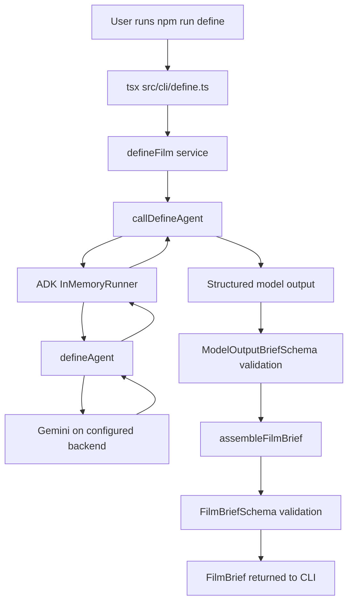
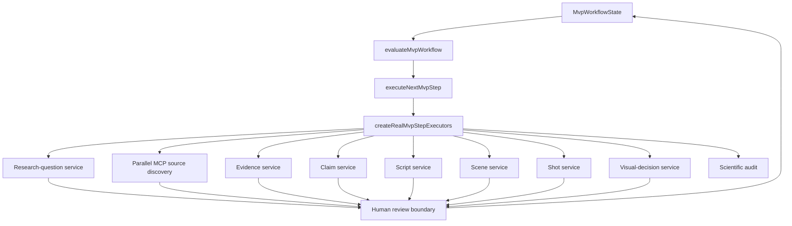
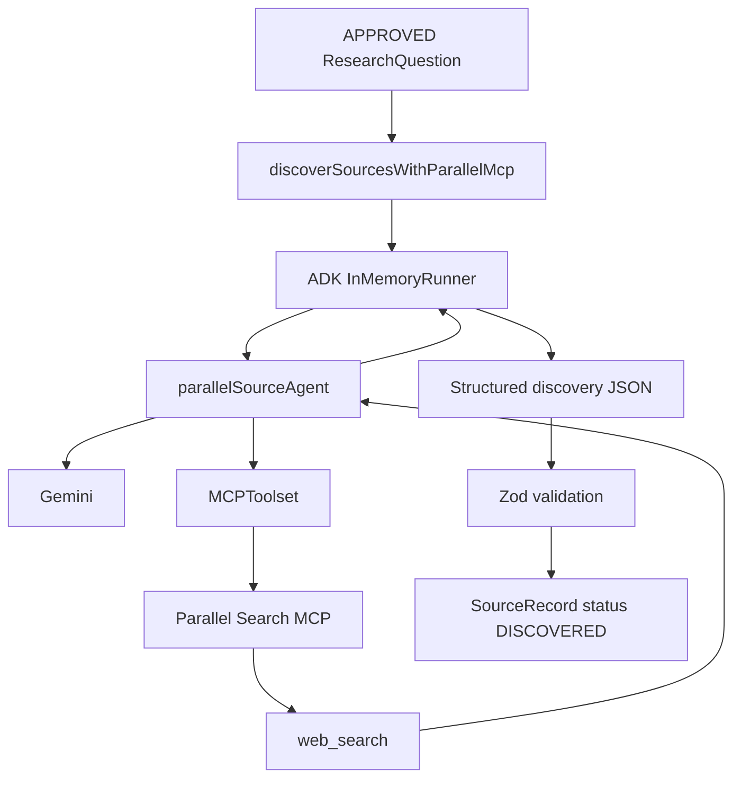

# Real Execution Paths

Tital currently exposes both direct CLI/ADK entry points for individual capabilities and a governed orchestration core for the multi-stage MVP. There is not yet one persisted end-to-end CLI session that carries a project through every human review cycle automatically.

## Direct Define CLI Path

The Define flow is a real executable path from a raw idea to a validated `FilmBrief`.



At this boundary the application adds trusted fields such as the record ID/status rather than asking the model to own those fields.

## Governed MVP Execution Path

The multi-stage architecture is driven by `MvpWorkflowState`, the workflow evaluator, the execution controller, and the real executor adapter.



The controller does not execute every box in one call. It executes the next eligible automated operation and returns an updated state. If the resulting records need review, the next call stops with `AWAITING_HUMAN_REVIEW` until the application receives explicit human decisions.

## Source Discovery Runtime Path

Source discovery is the main Partner MCP runtime path:



The provider search ID is preserved when returned by Parallel. The application does not fabricate a provider ID.

## Downstream Model-Assisted Pattern

Evidence, claims, script lines, scenes, shots, and visual decisions follow a common trust pattern even though each service has stage-specific validation rules:

```text
approved upstream records
→ deterministic precondition/provenance validation
→ ADK agent call
→ structured proposal
→ proposal Zod validation
→ application provenance validation
→ application-owned ID/status
→ final domain validation
→ human review
```

For example:

- claims may only cite evidence IDs supplied as approved evidence;
- script lines may only cite supplied approved claim IDs;
- scenes may only cite supplied approved script-line IDs;
- shots must match the approved scene and its script-line provenance;
- visual decisions must match the approved shot's visual-integrity category, and medium/high risk requires disclosure.

## Scientific Audit Path

The scientific audit is intentionally deterministic:

```text
approved workflow records
→ runScientificAudit
→ provenance / approval / visual-integrity checks
→ ScientificAuditReport
```

It does not invoke Gemini.

The implemented audit currently checks categories such as:

```text
BROKEN_PROVENANCE
UNAPPROVED_UPSTREAM_RECORD
VISUAL_CATEGORY_MISMATCH
MISSING_VISUAL_DISCLOSURE
UNSUPPORTED_CLAIM
```

Do not document additional audit rules as implemented until corresponding code/tests exist.

## Production Package Path

Package construction is also deterministic:

```text
workflow records + scientific audit
→ buildProductionPackage
→ BLOCKED or READY_FOR_PRODUCTION
```

This builder is separate from the current `MvpStepExecutors` contract. The repository therefore contains the package capability even though the current execution controller does not expose package construction as another LLM/executor stage.

## What Is Still Missing for a Full Application Run

The core pieces exist, but a complete user-facing project session still needs an application shell that can persist state and collect human decisions across calls.

Not yet implemented as a single application flow:

```text
raw film idea
→ persistent project state
→ repeated controller calls
→ interactive review UI/CLI decisions
→ durable provenance history
→ final downloadable production package
```

That distinction is important: Tital already has the governed engine and real agent/runtime wiring, but not yet the final persistent product experience around it.
