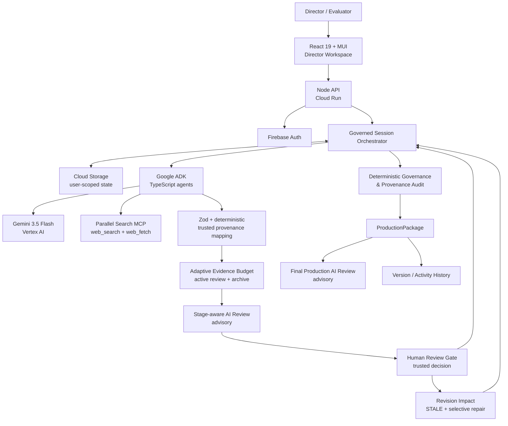
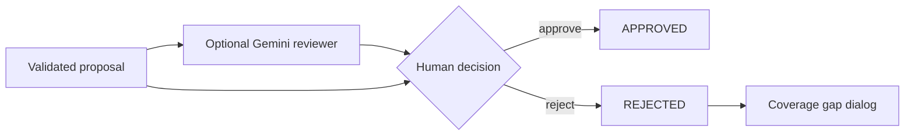
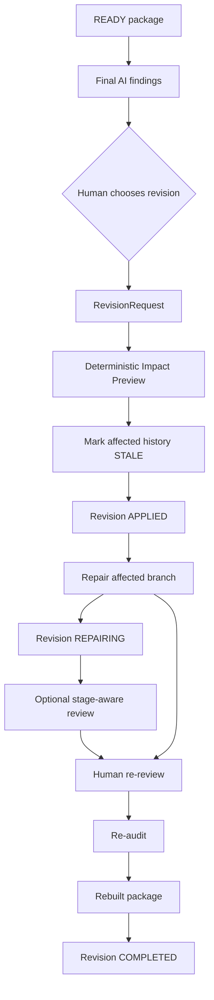

# Tital Architecture — All Things Agentic

Status date: **2026-08-24**

## Design goal

Tital is a **governed scientific-production system**, not a chain of prompts. Gemini performs bounded semantic generation/evaluation; application code owns trusted identity, provenance, Evidence-volume policy, coverage, revision impact, audit and package/version state; the human director owns approval and revision decisions.

## Hosted architecture



Static submission image: [`architecture.svg`](./architecture.svg)

## Production graph

```text
FilmBrief
  ↓
Research Questions
  ↓
Sources ← Parallel web_search
  ↓ human approval
Evidence candidates ← Parallel web_fetch exact approved URLs
  ↓ Adaptive Evidence Budget
Active Evidence + preserved archive
  ↓
Claims
  ↓
Script Lines
  ↓
Scenes
  ↓
Shots
  ↓
Visual Decisions
  ↓
Deterministic Governance / Provenance Audit
  ↓
Production Package
```

Every generative boundary is human-governed.

## Agent / evaluator roles

| Role | Responsibility | Authority boundary |
|---|---|---|
| Define Agent | idea + controls → FilmBrief proposal | app owns trusted fields/status |
| Research Question Agent | approved FilmBrief → RQs | human gate |
| Source Discovery Agent | approved RQ → Parallel source candidates | no Source approval authority |
| Evidence Extraction Agent | approved Source URL → `web_fetch` → Evidence proposals | app records grounding/provenance |
| Stage-aware Review Evaluator | current pending candidate + approved upstream context → attention/recommendation | advisory only |
| Claim Agent | approved active Evidence → Claims | human gate |
| Scientific Script Agent | approved Claims → Script | human gate |
| Scene Director | approved Script + Director Brief → Scenes | human gate |
| Shot Director | approved Scene/Script → Shots | human gate |
| Visual Decision Agent | approved Shot → visual treatment/disclosure/risk | human gate |
| Final Production Reviewer | completed package → cross-stage findings | advisory only |

The Review Evaluator is available at FilmBrief, ResearchQuestion, Source, Evidence, Claim, Script, Scene, Shot and Visual Decision gates. Its rubric/context change with the stage; it is not a generic self-approval loop.

## Trust contract

```text
model/tool proposes or evaluates
→ schema/provenance validation
→ application-owned IDs/parent mapping/status
→ optional AI recommendation
→ explicit human decision
→ deterministic eligibility/coverage
```

Consequences:

- AI cannot approve its own output;
- rejected records remain history;
- archived Evidence remains research history;
- `STALE` records remain revision history;
- no silent regeneration after rejection;
- trusted IDs/provenance are application-owned;
- package construction is deterministic.

## Adaptive Evidence Budget

Live Aurora acceptance:

```text
21 approved Sources
→ 123 full-source Evidence candidates
→ 24 active for review
→ 99 ARCHIVED_CANDIDATE
→ 21 human-approved / 3 human-rejected
```

The selector is deterministic and duration/RQ-priority aware. It favors grounded, strong, diverse and less-duplicative Evidence. Nothing is auto-approved and the archive is not deleted.

## Stage-aware collaboration loop



The reviewer returns recommendation, confidence, risks, flags and `LOW/MEDIUM/HIGH` attention. Assisted selection can check boxes but cannot commit the human decision.

## Final Review is separate from deterministic audit

```text
Governance / Provenance Audit
→ structural trusted-chain correctness

Final Production AI Review
→ cross-stage semantic / narrative / audience / visual risks
```

The live acceptance run demonstrated that audit can report `0 issues` while Final Review still finds meaningful duplication or mapping/narrative gaps. That is intentional separation, not a contradiction.

## Governed revision architecture

Current revision targets:

```text
project duration
Source
Claim
Script Line
Scene
Shot
Visual Decision
```

`Script Line` and `Scene` revision were added after live Final Review exposed Script/Narrative findings that the earlier revision target set could not safely repair.



### Verified selective impact

A live completed Script revision produced:

```text
Affected
  Script 1
  Scene 1
  Shots 2
  Visuals 2

Preserved
  Research Questions
  Sources
  Evidence
  Claims
```

This is the strongest proof that a downstream creative/narrative revision does not automatically discard valid upstream science.

### Repair-before-audit invariant

After Apply, an active revision in `APPLIED` state **cannot** proceed directly to Audit, Package or Complete.

```text
APPLIED
→ earliest affected workflow stage
→ Repair affected branch required
→ direct advance blocked: REVISION_REPAIR_REQUIRED
→ REPAIRING only after repair starts
```

This guard was added after the live acceptance run exposed a real state-machine path that could otherwise complete with stale descendants before selective repair.

### Completion after repair

The live repaired branch returned replacement Script candidates to AI-assisted Human Review. After explicit decisions, activity history showed:

```text
REVISION COMPLETED
AUDIT EXECUTED
PACKAGE BUILT
```

and the rebuilt package returned to `READY_FOR_PRODUCTION` with audit `0 issues`.

## Full-source grounding boundary

```text
web_search = candidate discovery
web_fetch exact approved URL = Evidence grounding
```

Grounding improves traceability; it does not equal independent peer review or scientific proof.

## Performance / resilience

```text
TITAL_EXTERNAL_CONCURRENCY=3
TITAL_EVIDENCE_CONCURRENCY=1
```

Live testing converted production failures into architecture hardening:

- Vertex/ADK Evidence 429 → classified bounded retry/backoff;
- Cloud Run request starvation → HTTP serving capacity separated from model-call concurrency;
- Evidence overproduction → deterministic Adaptive Evidence Budget;
- revision completion before repair → repair-before-audit/package guard.

## Persistence

Hosted sessions are stored in Firebase-authenticated, user-scoped Cloud Storage state. Persisted state includes scientific/cinematic records, review recommendations, coverage decisions, Director feedback, revision requests, stale history, activity events and package/version state.

A detached public demo is sanitized and read-only.

## Demo proof points

Prefer showing product behavior rather than architecture slides:

1. `21/21 active Parallel web_fetch`;
2. `123 research / 24 active / 99 archived`;
3. stage-aware Script review with pending Human Gate;
4. coverage-gap dialog;
5. audit `0 issues` beside a Final AI Review finding;
6. Script revision impact `1 / 1 / 2 / 2` with upstream science preserved;
7. `Repair affected branch` and human re-review;
8. `REVISION COMPLETED / AUDIT EXECUTED / PACKAGE BUILT`;
9. rebuilt `READY_FOR_PRODUCTION` package;
10. Gemini 3.5 / Google ADK / Vertex / Cloud Run runtime proof.
