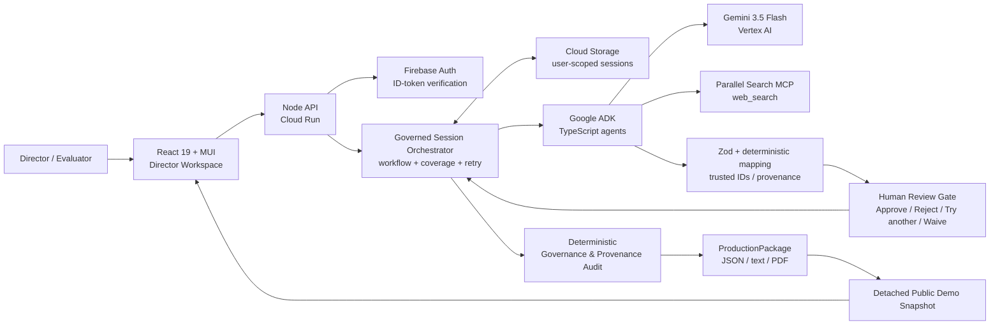

# Tital Architecture — All Things Agentic

## Design goal

Tital is designed as a **governed agentic workflow**, not a chat transcript. Semantic generation is separated from trusted application state, and every generative stage is bounded by deterministic validation and human authority.

## Hosted architecture



Static submission image: [`architecture.svg`](./architecture.svg)

## Governed production graph

```text
FilmBrief
  ↓ human approval
Research Questions
  ↓ human approval
Sources          ← Parallel Search MCP
  ↓ human approval
Evidence
  ↓ human approval
Claims
  ↓ human approval
Script Lines
  ↓ human approval
Scenes
  ↓ human approval
Shots
  ↓ human approval
Visual Decisions
  ↓
Governance / provenance audit
  ↓
Production Package
```

## Agent responsibilities

| Agent | Input boundary | Action | Trusted output handling |
|---|---|---|---|
| Define Agent | raw idea + authoritative production controls | proposes FilmBrief fields | app enforces selected controls and assigns ID/status |
| Research Question Agent | approved FilmBrief | proposes research questions | app assigns IDs/status |
| Source Discovery Agent | approved Research Question | must call Parallel MCP `web_search` | candidate sources validated and mapped to app-owned SourceRecords |
| Evidence Extraction Agent | approved SourceRecord excerpt + linked RQ | extracts supported evidence | app owns source/RQ provenance |
| Claim Agent | approved evidence list | synthesizes bounded scientific claims | numbered evidence references mapped back to trusted IDs |
| Script Agent | approved claims | proposes narration/explanatory lines | numbered claim references mapped to trusted IDs |
| Scene Director Agent | approved script lines + Director Brief | proposes scene concepts | human review + app-owned provenance |
| Shot Director Agent | approved scene/script + Director Brief | proposes production shots and scientific constraints | visual category/parent mapping validated |
| Visual Decision Agent | approved shot + Director Brief | proposes what production should show + disclosure/risk | trusted shot/category/scientific constraint remain application-owned |

## Why the trust boundary exists

A model is useful for semantic reasoning but should not be the authority for workflow identity, approval, or provenance. Tital uses this contract:

```text
model/tool proposes semantic content
        ↓
domain schema validates
        ↓
application maps trusted IDs/provenance/status
        ↓
human reviews
        ↓
coverage engine decides whether the workflow may advance
```

Consequences:

- a model cannot approve its own output;
- rejected content remains history;
- opaque UUIDs do not need to be copied by the model;
- a rejected branch cannot silently regenerate;
- intentional omissions are explicit `CoverageWaiver` records;
- revised upstream data can invalidate stale downstream records;
- the final package contains only approved, provenance-connected production content plus explicit waivers.

## Human collaboration loop

Tital's primary hackathon track is **Collaborative Partner** because feedback changes future agent behaviour.

```text
Director Brief
    ↓
AI proposal
    ↓
Human review
 ┌───────┬────────┬────────────────────┐
Approve  Reject   Reject & try another
 │        │              │
advance   terminal       scoped instruction
                         ↓
                  targeted replacement
```

If a rejection removes the last required coverage for a branch, the human must explicitly choose retry or intentional waiver.

## State and persistence

Hosted sessions are stored in Cloud Storage under user-specific namespaces selected after Firebase ID-token verification. The application persists the full governed state rather than relying on model conversation memory.

Conceptually:

```text
gs://<private-bucket>/sessions/users/<firebase-uid>/<session-id>.json
```

A public demo is generated as a detached read-only snapshot from a completed production package. It does not expose the authenticated user's mutable session or private event history.

## Failure handling

Tital treats malformed model/provider output as data to validate, not trusted state.

Examples already converted into deterministic hardening:

- malformed Parallel candidates are discarded while valid candidates survive;
- semantic-null uncertainty strings are rejected for new EvidenceRecords;
- application owns trusted parent IDs instead of relying on model UUID echoing;
- MEDIUM/HIGH-risk visual decisions require viewer disclosure;
- rejected evidence cannot enter an automatic regeneration loop;
- explicit replacement retry is duplicate-filtered;
- stale dependent records are excluded from the trusted production chain.

## Performance architecture

Independent calls **within one already-authorized stage** use bounded concurrency. True stage dependencies remain sequential because human approval is part of correctness.

```text
Research Question A ─┐
Research Question B ─┼─ concurrent source discovery (bounded)
Research Question C ─┘
          ↓
      human gate
          ↓
Evidence calls across approved sources (bounded)
```

The runtime records wall-clock time, external-call timing, failures, stage executions, configured concurrency, and internal vs external work. The UI reports external-work overlap but does not mislabel it as before/after speedup.

## Google Cloud proof points for the demo video

Show at least two of these in the final recording:

1. the public `run.app` Tital URL in the browser;
2. Cloud Run service/revision in Google Cloud Console;
3. Vertex AI / Gemini activity or logs for the deployed project;
4. GitHub Actions deployment run showing `Deploy to Cloud Run` succeeded.

Recommended sequence: public URL first, then a 5–8 second Cloud Run Console proof shot near the end of the video.
