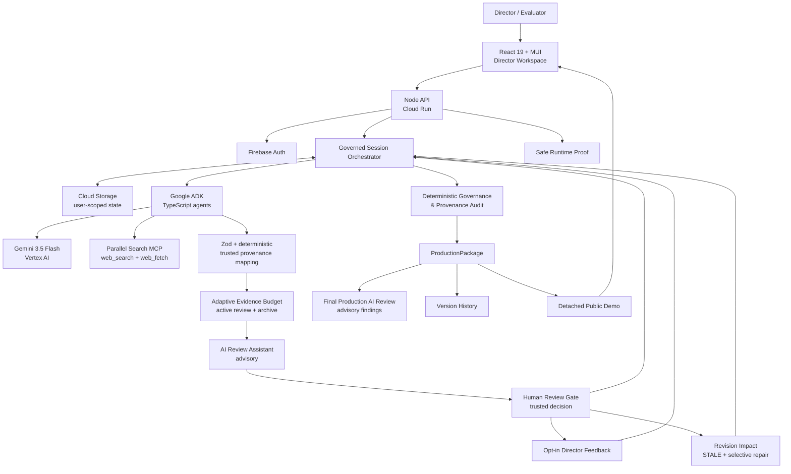
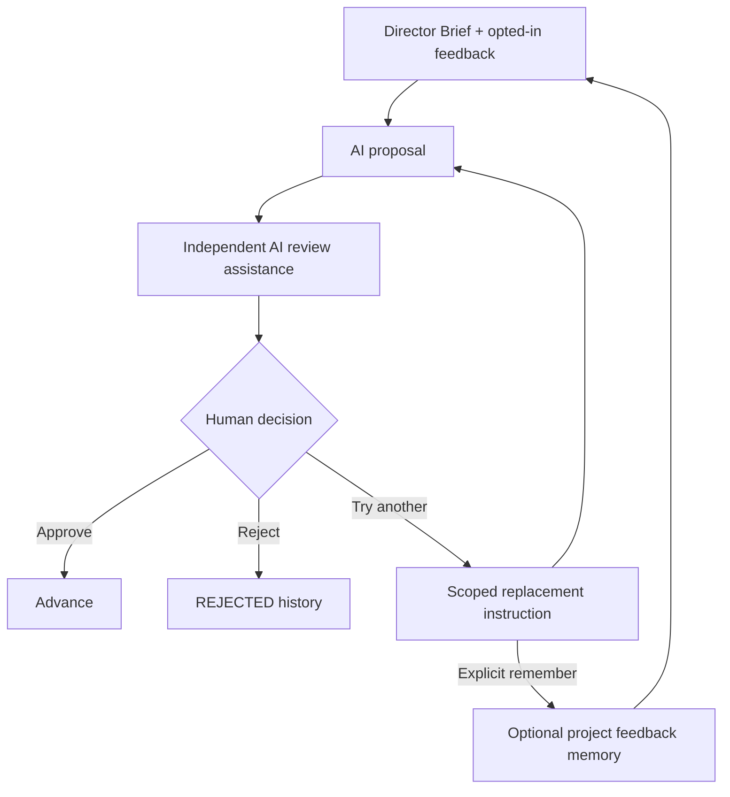

# Tital Architecture — All Things Agentic

Status date: **2026-08-24**

## Design goal

Tital is a **governed scientific-production system**, not a chain of prompts. Gemini performs bounded semantic work; application code owns trusted identity, provenance, coverage, Evidence-volume policy, revision impact, audit, and package history; the human director owns approval and revision decisions.

## Hosted architecture



Static submission image: [`architecture.svg`](./architecture.svg)

## Governed production graph

```text
FilmBrief
  ↓ human approval
Research Questions
  ↓ human approval
Sources ← Parallel web_search
  ↓ AI assistance + human approval
Full-source Evidence candidates ← Parallel web_fetch exact approved URLs
  ↓ Adaptive Evidence Budget
Active Evidence + preserved archive
  ↓ AI assistance + human approval
Claims
  ↓ human approval
Script Lines
  ↓ human approval
Scenes
  ↓ human approval
Shots
  ↓ human approval
Visual Decisions
  ↓
Deterministic Governance / Provenance Audit
  ↓
Production Package v1
  ↓ optional final AI review + human revision
Impact Preview → selective repair → re-audit
  ↓
Production Package v2 + history
```

## Agent responsibilities

| Agent / role | Input boundary | Action | Trusted output handling |
|---|---|---|---|
| Define Agent | raw idea + production controls | proposes FilmBrief | app assigns trusted fields/status |
| Research Question Agent | approved FilmBrief | proposes RQs | app assigns IDs/status |
| Source Discovery Agent | approved RQ | must call Parallel `web_search` | candidates validated into SourceRecords |
| Evidence Extraction Agent | approved Source URL + RQ | must call Parallel `web_fetch`; proposes strongest Evidence | app records grounding/provenance; caps per-source output |
| Review Evaluator | pending Source/Evidence set | recommends attention/approve/reject/review | advisory only; human status unchanged |
| Claim Agent | approved active Evidence | synthesizes Claims | numbered references map to trusted Evidence IDs |
| Script Agent | approved Claims | proposes narration | numbered Claim references mapped by app |
| Scene Director | approved Script + Director Brief | proposes Scenes | human review + app provenance |
| Shot Director | approved Scene/Script + Director Brief | proposes Shots/constraints | application owns parent mapping |
| Visual Decision Agent | approved Shot | proposes treatment/disclosure/risk | human review + validated constraints |
| Final Production Reviewer | completed package | identifies semantic production risks | advisory findings only |

Deterministic services own Adaptive Evidence Budget, coverage policy, human status transitions, revision impact, `STALE` invalidation, selective repair routing, audit, package building, and version history.

## Why this is more than a chat

A chat can generate similar individual artifacts. Tital keeps them as governed state and can answer:

> **Why does this shot exist, what evidence supports it, who approved it, and what becomes invalid if we change the science or directing decision?**

The core contract is:

```text
model/tool proposes or evaluates
→ schema/provenance validation
→ application-owned trusted fields
→ optional AI recommendation
→ human decision
→ deterministic eligibility
```

Consequences:

- AI cannot approve its own output;
- rejection remains history;
- no silent regeneration after rejection;
- trusted IDs/provenance are not delegated to model UUID copying;
- source/evidence review can be AI-assisted without removing human authority;
- revisions invalidate only affected dependencies;
- old production versions remain inspectable.

## Adaptive Evidence Budget: production-scale collaboration

A 5-minute live Aurora smoke test produced 123 Evidence candidates from 21 approved Sources. Sending all of them to Gemini review, the human director, and downstream generation would turn rich research into excessive review/cost.

Tital now separates:

```text
Broad scientific research
        ↓
Candidate Evidence Pool
        ↓
Adaptive Evidence Budget
   ↙                  ↘
Active production     ARCHIVED_CANDIDATE
Evidence              preserved research
   ↓
AI Review Assistant
   ↓
Human Review
```

Current 5-minute baseline: 24 active Evidence items. The deterministic selector uses film duration, RQ priority, full-source grounding, strength, source diversity, and duplicate reduction. Nothing is auto-approved and non-promoted research is not deleted.

This is the hackathon-ready explanation:

> **Tital keeps broad machine research while budgeting human attention and downstream computation.**

The V1 controller reduces Evidence output/review/downstream context, but still full-fetches approved Sources before global compaction. Caching and coverage-aware early stopping remain later optimizations; no unsupported percentage cost saving is claimed.

## Human collaboration loop



If rejection removes required coverage, Tital requires explicit retry or allowed waiver.

## Final review and governed revision

After `READY_FOR_PRODUCTION`, Gemini can perform a whole-package advisory review. A human may accept a finding as a revision request.

```text
Package v1
→ AI findings
→ human chooses revision
→ deterministic impact preview
→ affected descendants STALE
→ selective regeneration
→ human re-review
→ re-audit
→ Package v2
```

This turns production completion into a versioned milestone instead of a dead end.

## Full-source grounding boundary

Source discovery and Evidence grounding are distinct:

```text
web_search = candidate discovery
web_fetch exact approved URL = Evidence grounding
```

Search snippets are not the basis for new full-source Evidence. Grounding still does not equal independent peer review or proof of scientific truth.

## Performance / resilience architecture

General external calls can use bounded concurrency after upstream approval:

```text
TITAL_EXTERNAL_CONCURRENCY=3
```

Full-source Evidence is intentionally conservative:

```text
TITAL_EVIDENCE_CONCURRENCY=1
```

Live smoke testing converted two different 429 failures into architecture hardening:

- transient Vertex/ADK Evidence rate limits → classified bounded retry/backoff;
- Cloud Run request starvation → HTTP serving capacity separated from model-call concurrency.

The runtime records wall time, external operations, safe failure categories, configured concurrency, model/runtime metadata, and release SHA. No performance percentage is claimed without controlled comparable runs.

## State and persistence

Hosted sessions persist in Cloud Storage under Firebase-user namespaces. The workflow state contains review recommendations, feedback memory, revision requests, version history, performance events, and all scientific/cinematic records rather than relying on conversational memory.

A detached public demo is sanitized and read-only.

## Google Cloud proof points for the demo

Show at least two:

1. public `run.app` application;
2. Cloud Run service/revision;
3. visible runtime metadata proving Gemini 3.5 Flash / Vertex AI / Google ADK;
4. GitHub Actions `Deploy to Cloud Run` success.

The stronger product demo moment is not simply “Gemini generated another stage.” Show **AI triage/attention control and a governed revision** so the architectural difference from ordinary chat is visible.
